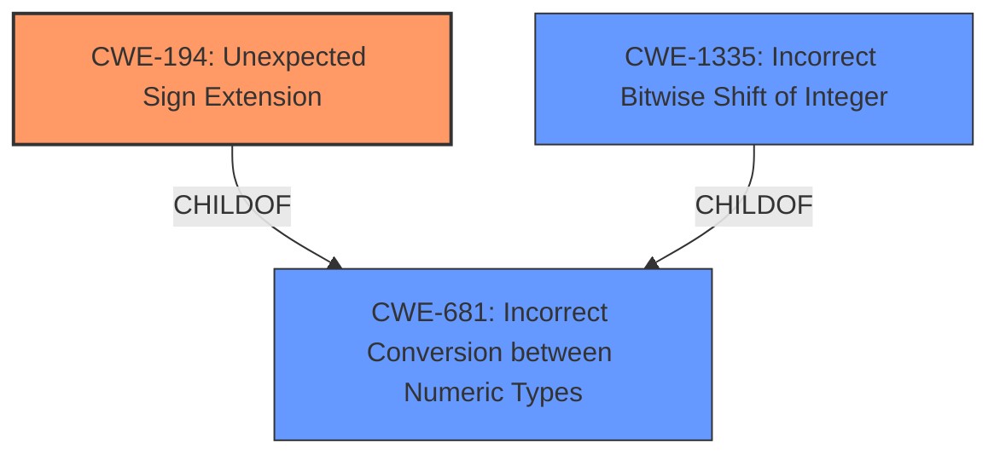

# Raw Analyzer Response for CVE-2024-45056

# Summary
| CWE ID  | CWE Name                                                                                                                                                                                                     | Confidence | CWE Abstraction Level | CWE Vulnerability Mapping Label | CWE-Vulnerability Mapping Notes |
|---------|--------------------------------------------------------------------------------------------------------------------------------------------------------------------------------------------------------------|------------|-----------------------|---------------------------------|---------------------------------|
| CWE-194 | Unexpected Sign Extension                                                                                                                                                                                    | 0.9        | Variant               | Primary                           | Allowed                         |
| CWE-681 | Incorrect Conversion between Numeric Types                                                                                                                                                                  | 0.7        | Base                  | Secondary                         | Allowed                         |
| CWE-1335 | Incorrect Bitwise Shift of Integer                                                                                                                                                                         | 0.5        | Base                  | Secondary                         | Allowed                         |

## Evidence and Confidence

*   **Confidence Score:** 0.8
*   **Evidence Strength:** HIGH

## Relationship Analysis
The primary relationship influencing the CWE selection is the hierarchical structure. CWE-194 (Unexpected Sign Extension) is a Variant of CWE-681 (Incorrect Conversion between Numeric Types). The vulnerability description points directly to a sign extension issue, making CWE-194 the more specific and appropriate choice. CWE-1335 (Incorrect Bitwise Shift of Integer) is related because the sign extension impacts the bitwise shift operation.

## Vulnerability Chain
The vulnerability chain starts with the **incorrect sign extension** during the LLVM constant folding optimization (CWE-194). This leads to the production of `rotl 2^64 - 1, x` instead of `rotl 2^256 - 1, x`, which results in an incorrect bitwise shift operation (CWE-1335) and ultimately, incorrect program behavior. The root cause is the incorrect sign extension, making it the primary CWE.

## Summary of Analysis
The analysis strongly supports CWE-194 (Unexpected Sign Extension) as the primary CWE due to the vulnerability's direct description of an **incorrect sign extension** issue. The "Vulnerability Description Key Phrases" highlights the "**rootcause:** **incorrect sign extension of LLVM constant folding optimization**". The "CVE Reference Links Content Summary" reinforces this by stating that "the compiler incorrectly handles type extension (zero-extension instead of sign-extension) for constant values when translating it to the target architecture." This evidence makes CWE-194 the most accurate and specific representation of the vulnerability's root cause. CWE-681 is a parent of CWE-194 and therefore less descriptive, but still relevant. CWE-1335 is relevant because the sign extension directly impacts a bitwise shift.

Relevant CWE Information:

# Enhanced Context (25 CWEs)
The following CWEs were identified as potentially relevant to this vulnerability:

## CWE-194: Unexpected Sign Extension
**Abstraction Level**: Variant
**Similarity Score**: 0.73
**Source**: dense

**Description**:
The product performs an operation on a number that causes it to be sign extended when it is transformed into a larger data type. When the original number is negative, this can produce unexpected values that lead to resultant weaknesses.

**Mapping Guidance**:
- Usage: Allowed
- Rationale: This CWE entry is at the Variant level of abstraction, which is a preferred level of abstraction for mapping to the root causes of vulnerabilities.

**Explanation**: The vulnerability description explicitly mentions an incorrect sign extension, directly aligning with the description of CWE-194. The root cause involves an LLVM optimization performing sign extension incorrectly when targeting EraVM.

## CWE-681: Incorrect Conversion between Numeric Types
**Abstraction Level**: Base
**Similarity Score**: 0.69
**Source**: dense

**Description**:
When converting from one data type to another, such as long to integer, data can be omitted or translated in a way that produces unexpected values. If the resulting values are used in a sensitive context, then dangerous behaviors may occur.

**Mapping Guidance**:
- Usage: Allowed
- Rationale: This CWE entry is at the Base level of abstraction, which is a preferred level of abstraction for mapping to the root causes of vulnerabilities.

**Explanation**: While the core issue is sign extension (CWE-194), it falls under the broader category of numeric type conversion problems. The compiler's **incorrect** handling of type extension relates to how it converts numeric values, causing an unexpected result.

## CWE-1335: Incorrect Bitwise Shift of Integer
**Abstraction Level**: base
**Similarity Score**: 2.40
**Source**: graph

**Description**:
CWE-1335: Incorrect Bitwise Shift of Integer

**Mapping Guidance**:
- Usage: Allowed
- Rationale: This CWE entry is at the Base level of abstraction, which is a preferred level of abstraction for mapping to the root causes of vulnerabilities.

**Relationships**:
- CHILDOF -> CWE-682
- PARENTOF -> CWE-1335

**Explanation**: The **incorrect sign extension** ultimately results in an incorrect bitwise shift operation, as the `rotl` instruction is used with an incorrect value due to the sign extension issue.

**CWEs Considered but Not Used:**

*   CWE-190 (Integer Overflow or Wraparound): While numeric issues are present, the core problem is not an overflow or wraparound but the incorrect sign extension.
*   CWE-197 (Numeric Truncation Error): Truncation is not the primary issue; the focus is on the incorrect sign extension during type conversion.
*   CWE-839 (Numeric Range Comparison Without Minimum Check): This is not relevant as there are no range comparisons involved in the vulnerability.
*   CWE-770 (Allocation of Resources Without Limits or Throttling): This is irrelevant to the described vulnerability.
*   CWE-476 (NULL Pointer Dereference): This is irrelevant to the described vulnerability.
*   CWE-124 (Buffer Underwrite ('Buffer Underflow')): This is irrelevant to the described vulnerability.
*   CWE-703 (Improper Check or Handling of Exceptional Conditions): This is too general and doesn't accurately capture the specific type conversion issue.
*   CWE-252 (Unchecked Return Value): This is irrelevant to the described vulnerability.
*   CWE-824 (Access of Uninitialized Pointer): This is irrelevant to the described vulnerability.
*   CWE-755 (Improper Handling of Exceptional Conditions): This is too general and doesn't accurately capture the specific type conversion issue.
*   CWE-208 (Observable Timing Discrepancy): This is irrelevant to the described vulnerability.
*   CWE-330 (Use of Insufficiently Random Values): This is irrelevant to the described vulnerability.
*   CWE-1204 (Generation of Weak Initialization Vector (IV)): This is irrelevant to the described vulnerability.
*   CWE-1333 (Inefficient Regular Expression Complexity): This is irrelevant to the described vulnerability.
*   CWE-347 (Improper Verification of Cryptographic Signature): This is irrelevant to the described vulnerability.
*   CWE-863 (Incorrect Authorization): This is irrelevant to the described vulnerability.
*   CWE-916 (Use of Password Hash With Insufficient Computational Effort): This is irrelevant to the described vulnerability.
*   CWE-201 (Insertion of Sensitive Information Into Sent Data): This is irrelevant to the described vulnerability.
*   CWE-337 (Predictable Seed in Pseudo-Random Number Generator (PRNG)): This is irrelevant to the described vulnerability.