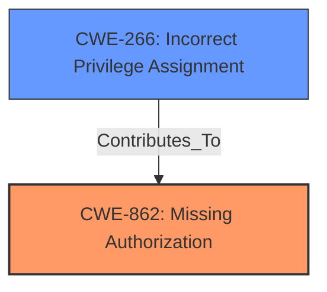

# Analysis Report for CVE-2024-45058

# Vulnerability Analysis Report: CVE-2024-45058

## Description

i-Educar is free, fully online school management software that can be used by school secretaries, teachers, coordinators, and area managers. Prior to the 2.9 branch, an attacker with only minimal viewing privileges in the settings section is able to change their user type to Administrator (or another type with super-permissions) through a specifically crafted POST request to `/intranet/educar_usuario_cad.php`, modifying the `nivel_usuario_` parameter. The vulnerability occurs in the file located at `ieducar/intranet/educar_usuario_cad.php`, which does not check the users current permission level before allowing changes. Commit c25910cdf11ab50e50162a49dd44bef544422b6e contains a patch for the issue.

## Vulnerability Description Key Phrases

- **Rootcause:** improper access control
- **Impact:** change user type to Administrator
- **Vector:** specifically crafted POST request
- **Attacker:** attacker with minimal viewing privileges
- **Product:** i-Educar
- **Version:** prior to 2.9 branch
- **Component:** /intranet/educar_usuario_cad.php

## Analysis (with Relationship Data)

# Summary
| CWE ID | CWE Name | Confidence | CWE Abstraction Level | CWE Vulnerability Mapping Label | CWE-Vulnerability Mapping Notes |
|---|---|---|---|---|---|
| CWE-862 | Missing Authorization | 1 | Class | Primary | Allowed-with-Review |
| CWE-266 | Incorrect Privilege Assignment | 0.7 | Base | Secondary Candidate | Allowed |

## Evidence and Confidence

*   **Confidence Score:** 0.9
*   **Evidence Strength:** HIGH

## Relationship Analysis
The primary CWE is CWE-862, which represents the **missing authorization** check that allows unauthorized privilege escalation. CWE-862 is a Class-level CWE. CWE-266, a Base-level CWE, provides a more specific view of how privileges are incorrectly assigned, which can be seen as a contributing factor. CWE-862 is a parent of other more specific CWEs, but none of them fit the description as well.



## Vulnerability Chain
The chain of events starts with the **missing authorization** check (CWE-862) in the `educar_usuario_cad.php` file. This allows an attacker with minimal privileges to send a crafted POST request, manipulating the `nivel_usuario_` parameter. By doing so, they can escalate their privileges to an administrator, gaining full control of the system.

## Summary of Analysis
The primary weakness is the **missing authorization** check, as emphasized in the vulnerability description and CVE reference summary. The `educar_usuario_cad.php` file **does not check** if the user has the necessary permissions to modify their user type, allowing for unauthorized privilege escalation.

The analysis concludes that CWE-862 (Missing Authorization) is the most appropriate primary classification because the application lacks the necessary checks to ensure that the user is authorized to change their user type. CWE-266 (Incorrect Privilege Assignment) is a secondary consideration as it explains the nature of how the privilege is incorrectly assigned and provides a deeper understanding of the vulnerability.

Relevant CWE Information:

# Enhanced Context (25 CWEs)
The following CWEs were identified as potentially relevant to this vulnerability:

## CWE-266: Incorrect Privilege Assignment
**Abstraction Level**: Base
**Similarity Score**: 0.76
**Source**: dense

**Description**:
A product incorrectly assigns a privilege to a particular actor, creating an unintended sphere of control for that actor.

**Mapping Guidance**:
- Usage: Allowed
- Rationale: This CWE entry is at the Base level of abstraction, which is a preferred level of abstraction for mapping to the root causes of vulnerabilities.

## CWE-862: Missing Authorization
**Abstraction Level**: Class
**Similarity Score**: 2804.94
**Source**: sparse

**Description**:
The product does not perform an authorization check when an actor attempts to access a resource or perform an action.

**Mapping Guidance**:
- Usage: Allowed-with-Review
- Rationale: This CWE entry is a Class and might have Base-level children that would be more appropriate


## CWE Relationship Analysis

Current CWEs represent these abstraction levels: .


### Vulnerability Chain Analysis

**Chain starting from CWE-266:**
- 266 (Incorrect Privilege Assignment) - ROOT


**Chain starting from CWE-862:**
- 862 (Missing Authorization) - ROOT


### CWE Relationship Diagram

```mermaid
graph TD
    classDef primary fill:#f96,stroke:#333,stroke-width:2px
    classDef secondary fill:#69f,stroke:#333
    classDef tertiary fill:#9e9,stroke:#333
```


*Report generated on 2025-07-13 15:59:42*
