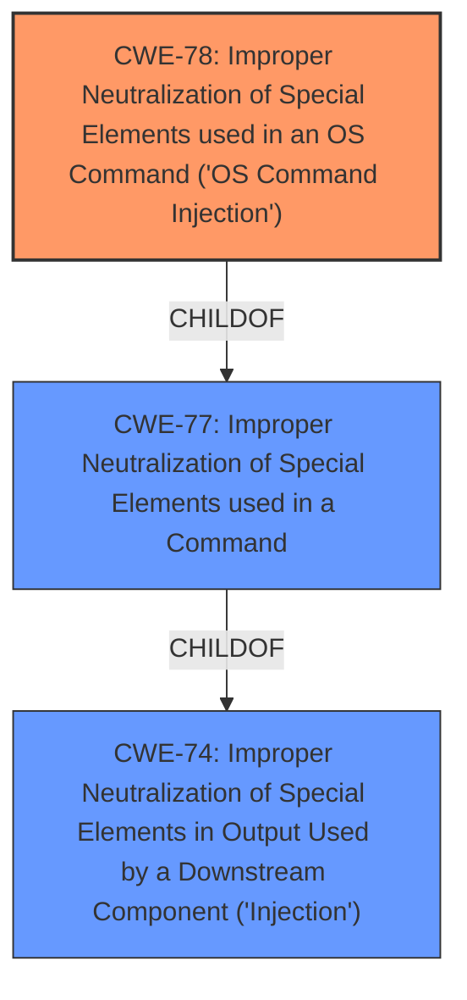

# Analysis for CVE-2024-45066

# Summary
| CWE ID | CWE Name | Confidence | CWE Abstraction Level | CWE Vulnerability Mapping Label | CWE-Vulnerability Mapping Notes |
|---|---|---|---|---|---|
| CWE-78 | Improper Neutralization of Special Elements used in an OS Command ('OS Command Injection') | 1.0 | Base | Allowed | Primary CWE. The vulnerability allows for arbitrary command injection via a crafted POST request, directly matching the CWE description. |

## Evidence and Confidence

*   **Confidence Score:** 1.0
*   **Evidence Strength:** HIGH

## Relationship Analysis
The primary relationship that influenced the decision was the direct match between the vulnerability description and CWE-78. While other CWEs like CWE-89 (SQL Injection) and CWE-22 (Path Traversal) were considered, the evidence clearly pointed to OS Command Injection. CWE-78 is a base level CWE which is the preferred level of abstraction.

## Vulnerability Chain
The vulnerability chain consists of the following:
1.  **Root Cause:** **Improper Neutralization** of special elements in a POST request (CWE-78).
2.  **Impact:** Arbitrary command execution leading to full system control.

## Summary of Analysis
The initial analysis, based on the vulnerability description and CVE reference summary, strongly pointed towards command injection. The evidence from the "CVE Reference Links Content Summary" section clearly states that the root cause of the vulnerability is a command injection flaw due to a specially crafted POST request, allowing remote attackers to inject arbitrary commands. This aligns perfectly with the description of CWE-78. The retriever results also listed CWE-78 as the top candidate.

The selection of CWE-78 is at the optimal level of specificity because it directly describes the **improper neutralization** of special elements in OS commands, which is the **root cause** of the vulnerability.

Relevant CWE Information:

# Enhanced Context (25 CWEs)
The following CWEs were identified as potentially relevant to this vulnerability:

## CWE-74: Improper Neutralization of Special Elements in Output Used by a Downstream Component ('Injection')
**Abstraction Level**: Class
**Similarity Score**: 0.75
**Source**: dense

**Description**:
The product constructs all or part of a command, data structure, or record using externally-influenced input from an upstream component, but it does not neutralize or incorrectly neutralizes special elements that could modify how it is parsed or interpreted when it is sent to a downstream component.

**Mapping Guidance**:
- Usage: Discouraged
- Rationale: CWE-74 is high-level and often misused when lower-level weaknesses are more appropriate.

## CWE-78: Improper Neutralization of Special Elements used in an OS Command ('OS Command Injection')
**Abstraction Level**: Base
**Similarity Score**: 750.13
**Source**: sparse

**Description**:
The product constructs all or part of an OS command using externally-influenced input from an upstream component, but it does not neutralize or incorrectly neutralizes special elements that could modify the intended OS command when it is sent to a downstream component.

**Mapping Guidance**:
- Usage: Allowed
- Rationale: This CWE entry is at the Base level of abstraction, which is a preferred level of abstraction for mapping to the root causes of vulnerabilities.

**Relationships**:
- CANFOLLOW -> CWE-184
- CANALSOBE -> CWE-88
- CHILDOF -> CWE-77
- CHILDOF -> CWE-77
- CHILDOF -> CWE-74

I considered CWE-74, but it is too high-level as it is a class, and CWE-78 is a child of CWE-74 and more specific. Other CWEs considered but deemed less appropriate include CWE-89 (SQL Injection), as the vulnerability description explicitly mentions command injection, not SQL injection. CWE-22 (Path Traversal) was also considered but is not relevant as the vulnerability does not involve path manipulation.