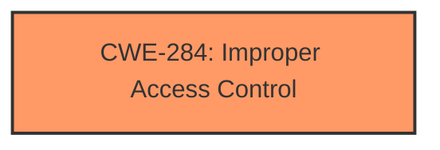

# Analysis for CVE-2024-45121

# Summary
| CWE ID | CWE Name | Confidence | CWE Abstraction Level | CWE Vulnerability Mapping Label | CWE-Vulnerability Mapping Notes |
|---|---|---|---|---|---|
| CWE-284 | Improper Access Control | 0.75 | Pillar | Allowed | General access control issue where the root cause is unclear. |
  
## Evidence and Confidence

*   **Confidence Score:** 0.75
*   **Evidence Strength:** MEDIUM

## Relationship Analysis
The primary relationship that influenced the CWE selection was the hierarchical relationship between CWE-284 (Improper Access Control) and its potential children. While the description indicates an access control issue, the lack of specific details regarding the root cause (authentication or authorization) led to the selection of the more general CWE-284. The guidance suggests using more specific children like CWE-285, CWE-862, or CWE-863 if the root cause were clearer, but the current evidence does not support that.

## Vulnerability Chain
The vulnerability chain starts with an **Improper Access Control** issue. This leads to a Security feature bypass. The specific steps and technical details on how the access control is bypassed are not available.

## Summary of Analysis
The initial assessment identified **Improper Access Control** as the primary weakness based on the vulnerability description. The description mentions that a low-privileged attacker can bypass security measures, indicating an access control issue. However, the description lacks specific details about whether the issue stems from missing authentication, incorrect authorization, or other access control flaws.

The selection of CWE-284 is based on the guidance provided, which suggests using CWE-284 when the root cause of the access control failure is unclear. Without more information, choosing a more specific CWE like CWE-285 (Improper Authorization) or CWE-306 (Missing Authentication for Critical Function) would be speculative.

Relevant CWE Information:

# Enhanced Context (25 CWEs)
The following CWEs were identified as potentially relevant to this vulnerability:

## CWE Classification Guidance

The following guidance has been automatically included because relevant keywords were detected in the vulnerability description:

### Authentication vs Authorization vs Access Control Guidance

## ===Guidance===

### Level Set – Authentication vs Authorization vs Access Control

**Authentication**:
Determines *who* the actor is (identity validation). This is typically the *first step* in access control.

* Example phrases: "user must log in", "lack of login check", "bypasses login"
* CWE relevance: authentication is usually mapped to CWE-306 or its children.

  * **CWE-306**: *Missing Authentication for Critical Function* – used when no identity validation is enforced for sensitive functionality (e.g., password reset, user deletion).

**Authorization**:
Determines *what* an authenticated actor is allowed to do. It decides access *after* identity is verified.

* Example phrases: "unauthorized access", "regular user can access admin panel", "role checks are missing"
* CWE relevance: use CWEs like 862, 863, 285 for authorization errors:

  * **CWE-862**: *Missing Authorization* – the application doesn't check whether the user is authorized at all.
  * **CWE-863**: *Incorrect Authorization* – the application checks authorization, but does it incorrectly (e.g., flawed logic).
  * **CWE-285**: *Improper Authorization* – general category for any flawed authorization logic or design.

**Access Control**:
A broader term that includes both authentication and authorization. Governs how resources are protected and who can access them under what conditions.

* CWE relevance:

  * **CWE-284**: *Improper Access Control* – top-level category used when access control failure exists but root cause is unclear.
  * This should be avoided **if** a more specific child CWE like 285, 862, 863, or 306 is appropriate.

---

## Mapping Discussion – Common Misclassification Patterns

### 1. **CWE-306 vs CWE-862**:

* **306** is about lack of **authentication** (e.g., *no login required at all*).
* **862** is about lack of **authorization** *after* authentication (e.g., *admin check missing*).
* ✅ Example CWE-306: *“An unauthenticated attacker can invoke the password reset API.”*
* ✅ Example CWE-862: *“An authenticated user without admin privileges can delete any user account.”*

### 2. **CWE-285 vs CWE-284**:

* **285** is specific to authorization flaws – it's a better choice than 284 **if** the issue involves *improper or missing role checks*.
* **284** should be reserved for general access control issues when it’s unclear whether the issue lies in authn or authz.

---

## Technical Impact vs Root Cause Clarification

**Phrase like "unauthorized access" is not enough.**

* If you **cannot determine whether identity was checked**, assume it’s **authorization** and consider 862 or 863.
* If you **know no login happened**, lean toward **authentication** → CWE-306.
* If the **access control policy is unclear or inconsistently enforced**, but it's not due to missing checks, consider **CWE-284**.

---

## Good Mapping Examples

* ✅ **CWE-306**: “The endpoint `/admin/deleteUser` does not require any authentication.”
* ✅ **CWE-862**: “Any logged-in user can change any other user's email without being an admin.”
* ✅ **CWE-863**: “An admin check exists but incorrectly grants access to non-admin users.”
* ✅ **CWE-285**: “Application uses a static role check that fails when roles change dynamically.”
* ✅ **CWE-284**: “Inconsistent enforcement of access rules across services with unclear policy source.”

---

## Summary – Quick LLM Rules of Thumb

| **Indicator**                                              | **Likely CWE** |
| ---------------------------------------------------------- | -------------- |
| No identity check (no login)                               | CWE-306        |
| No role/privilege check after login                        | CWE-862        |
| Role check is present but flawed                           | CWE-863        |
| General or ambiguous authorization failure                 | CWE-285        |
| High-level access control problem with no clear root cause | CWE-284        |

The retriever results also list CWE-285 (Improper Authorization), CWE-863 (Incorrect Authorization), and CWE-306 (Missing Authentication for Critical Function) as potential candidates. However, based on the available information, it is not possible to determine whether the **improper access control** is due to **missing authorization checks**, **incorrect authorization checks**, or **missing authentication**. Therefore, CWE-284 remains the most appropriate choice.

Other CWEs like CWE-22 (Improper Limitation of a Pathname to a Restricted Directory) and CWE-73 (External Control of File Name or Path) were considered but deemed less relevant as the vulnerability description does not point towards path traversal or file handling issues.

The confidence level is 0.75 because while the evidence strongly suggests an access control issue, the lack of specific details introduces some uncertainty.