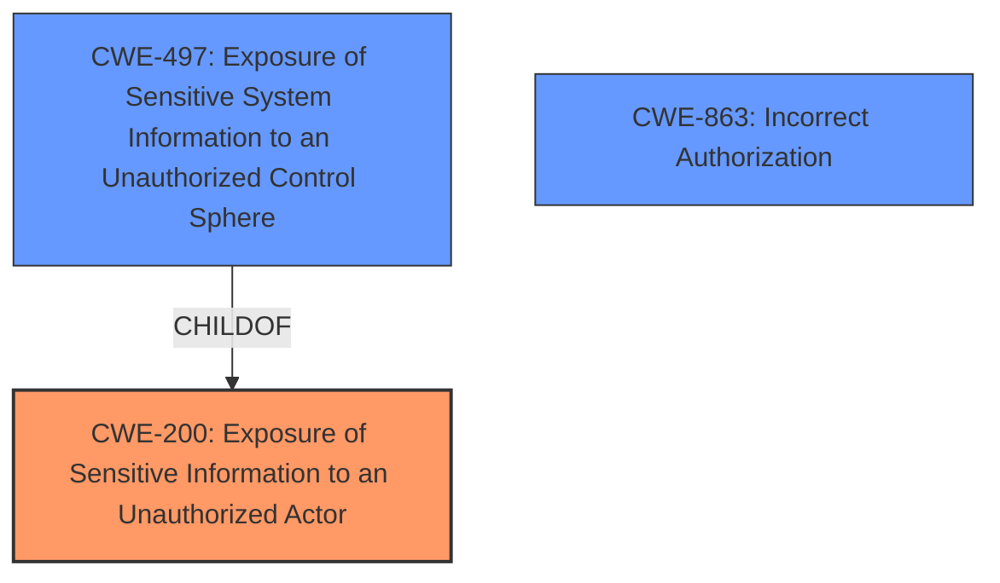

# Analysis Report for CVE-2024-45134

# Vulnerability Analysis Report: CVE-2024-45134

## Description

Adobe Commerce versions 2.4.7-p2, 2.4.6-p7, 2.4.5-p9, 2.4.4-p10 and earlier are affected by an **Information Exposure** vulnerability that could result in a security feature bypass. An admin attacker could leverage this vulnerability to have a low impact on confidentiality which may aid in further attacks. Exploitation of this issue does not require user interaction.

## Vulnerability Description Key Phrases

- **Weakness:** Information Exposure
- **Impact:** security feature bypass
- **Attacker:** admin attacker
- **Product:** Adobe Commerce
- **Version:** 2.4.7-p2, 2.4.6-p7, 2.4.5-p9, 2.4.4-p10 and earlier

## Analysis (with Relationship Data)

# Summary
| CWE ID | CWE Name | Confidence | CWE Abstraction Level | CWE Vulnerability Mapping Label | CWE-Vulnerability Mapping Notes |
|---|---|---|---|---|---|
| CWE-200 | Exposure of Sensitive Information to an Unauthorized Actor | 0.8 | Class | Primary | Discouraged due to high level of abstraction, but appropriate given the available information. |
| CWE-497 | Exposure of Sensitive System Information to an Unauthorized Control Sphere | 0.6 | Base | Secondary | Allowed. More specific than CWE-200, but less supported by provided evidence. |
| CWE-863 | Incorrect Authorization | 0.5 | Class | Secondary | Allowed-with-Review. A possible contributing factor, but not the primary issue. |

## Evidence and Confidence

*   **Confidence Score:** 0.7
*   **Evidence Strength:** MEDIUM

## Relationship Analysis
The primary CWE is CWE-200, which is a Class-level CWE. A more specific option is CWE-497, a Base-level CWE and child of CWE-200. CWE-863, while related to authorization, is a separate Class-level CWE. The evidence supports CWE-200 directly, but CWE-497 is a reasonable secondary consideration.



## Vulnerability Chain
The vulnerability chain starts with **Information Exposure** (CWE-200), leading to a security feature bypass. The root cause is the **Information Exposure**, with the bypass being the resulting impact.

## Summary of Analysis
The primary focus of the vulnerability is on **Information Exposure**, making CWE-200 the most relevant. The CVE description clearly states that the vulnerability is an **Information Exposure** vulnerability that could result in a security feature bypass. The CVE Reference Links Content Summary also indicates that the Root Cause of Vulnerability is **Information Exposure** ([CWE-200](https://cwe.mitre.org/data/definitions/200.html)).

CWE-497 is a more specific base-level CWE, which focuses on the exposure of sensitive system information. While the description does not explicitly detail whether the exposed information is system-level, it is a plausible scenario given the context of Adobe Commerce, making it a secondary candidate.

CWE-863, **Incorrect Authorization**, could be related, as the **Information Exposure** may stem from an authorization flaw. However, the description primarily focuses on the exposure itself rather than the authorization mechanism, making it less directly relevant.

I am overriding the "Discouraged" usage for CWE-200 because the description specifically mentions **Information Exposure** as the primary **weakness**, and a more specific CWE is not definitively supported by the available evidence. I considered other CWEs from the Retriever Results, but they were either too high-level (like CWE-285 and CWE-284), or focused on aspects not directly supported by the description, such as input validation (CWE-20) or file handling (CWE-73). The selected CWEs are at an appropriate level of specificity based on the provided information.


## CWE Relationship Analysis

Current CWEs represent these abstraction levels: .


### Vulnerability Chain Analysis

**Chain starting from CWE-863:**
- 863 (Incorrect Authorization) - ROOT


**Chain starting from CWE-73:**
- 73 (External Control of File Name or Path) - ROOT


### CWE Relationship Diagram

```mermaid
graph TD
    classDef primary fill:#f96,stroke:#333,stroke-width:2px
    classDef secondary fill:#69f,stroke:#333
    classDef tertiary fill:#9e9,stroke:#333
```


*Report generated on 2025-07-13 16:05:54*
