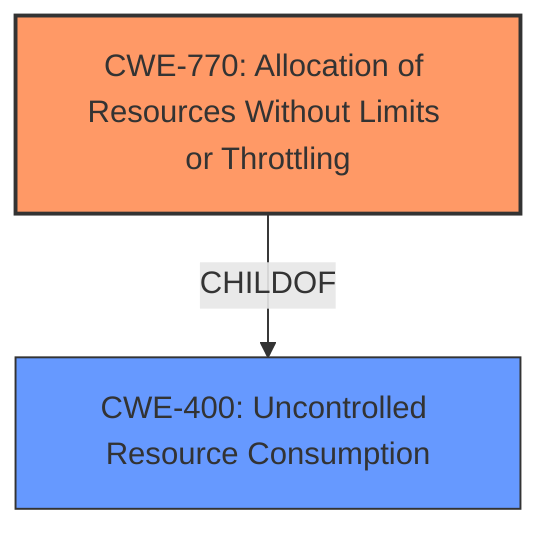

# Enhanced Analysis for CVE-2024-45163

# Summary
| CWE ID | CWE Name | Confidence | CWE Abstraction Level | CWE Vulnerability Mapping Label | CWE-Vulnerability Mapping Notes |
|---|---|---|---|---|---|
| CWE-770 | Allocation of Resources Without Limits or Throttling | 0.9 | Base | Allowed | Primary CWE: The CNC server allocates resources without limiting concurrent connections.|
| CWE-400 | Uncontrolled Resource Consumption | 0.7 | Class | Discouraged | Secondary Candidate: The lack of limits leads to resource exhaustion, but CWE-400 is too general.|

## Evidence and Confidence

*   **Confidence Score:** 0.8
*   **Evidence Strength:** HIGH

## Relationship Analysis
The primary relationship influencing the CWE selection is the parent-child relationship between CWE-400 (Uncontrolled Resource Consumption) and CWE-770 (Allocation of Resources Without Limits or Throttling). CWE-770 is a more specific Base-level weakness that describes the root cause, while CWE-400 represents the resulting resource consumption. While CWE-400 is a plausible consequence, the description focuses on the **lack of limits** on resource allocation, making CWE-770 a better fit for the root cause.



## Vulnerability Chain
The vulnerability chain starts with **improper session management** due to the **lack of limits** on concurrent connections (CWE-770), leading to resource exhaustion (CWE-400) and ultimately resulting in a denial-of-service (DoS) impact.

## Summary of Analysis
The initial analysis considered both CWE-400 and CWE-770. While CWE-400 (Uncontrolled Resource Consumption) aligns with the impact of the vulnerability (resource exhaustion), the root cause is the **lack of limits** on resource allocation. Therefore, CWE-770 (Allocation of Resources Without Limits or Throttling) is the most appropriate primary CWE because it accurately reflects the root cause.

Evidence:
- "The Mirai botnet through 2024-08-19 **mishandles simultaneous TCP connections** to the CNC (command and control) server."
- "**Lack of Concurrent Connection Management:** The server does not limit or properly manage multiple simultaneous connection requests."
- "**Resource Exhaustion:** The server's session buffer can be overwhelmed by a large number of connection attempts, leading to resource exhaustion and a crash."

The graph relationships reinforce the understanding that CWE-770 is a more specific cause of CWE-400. The selection of CWE-770 is at the optimal level of specificity because it directly identifies the **missing limit** on resource allocation, which is the core weakness.

Relevant CWE Information:

# Enhanced Context (25 CWEs)

## CWE-770: Allocation of Resources Without Limits or Throttling
**Abstraction Level**: Base
**Similarity Score**: 976.05
**Source**: sparse

**Description**:
The product allocates a reusable resource or group of resources on behalf of an actor without imposing any restrictions on the size or number of resources that can be allocated, in violation of the intended security policy for that actor.

**Mapping Guidance**:
- Usage: Allowed
- Rationale: This CWE entry is at the Base level of abstraction, which is a preferred level of abstraction for mapping to the root causes of vulnerabilities.

## CWE-400: Uncontrolled Resource Consumption
**Abstraction Level**: Class
**Similarity Score**: 933.25
**Source**: sparse

**Description**:
The product does not properly control the allocation and maintenance of a limited resource, thereby enabling an actor to influence the amount of resources consumed, eventually leading to the exhaustion of available resources.

**Mapping Guidance**:
- Usage: Discouraged
- Rationale: CWE-400 is intended for incorrect behaviors in which the product is expected to track and restrict how many resources it consumes, but CWE-400 is often misused because it is conflated with the "technical impact" of vulnerabilities in which resource consumption occurs. It is sometimes used for low-information vulnerability reports. It is a level-1 Class (i.e., a child of a Pillar).

CWEs considered but not used:

*   CWE-772: Missing Release of Resource after Effective Lifetime - This CWE is related to resource management, but it focuses on failing to release resources after use, not the absence of limits on allocation, so it is not applicable.
*   CWE-799: Improper Control of Interaction Frequency - While related to limiting interactions, this is a broader category and less specific than the resource allocation issue.
*   CWE-306: Missing Authentication for Critical Function - Although the sessions are unauthenticated, the root cause is not the missing authentication itself but the mishandling of connections regardless of authentication status.
*   CWE-755: Improper Handling of Exceptional Conditions - This is too generic; the issue is more specific than a general error handling problem.
*   CWE-401: Missing Release of Memory after Effective Lifetime - This is a specific type of resource leak (memory), whereas the issue is about general resource allocation without limits.
*   CWE-390: Detection of Error Condition Without Action - The issue is not about detecting an error but about the fundamental lack of resource limits.
*   CWE-497: Exposure of Sensitive System Information to an Unauthorized Control Sphere - Not relevant as the vulnerability is not directly about exposing information.


## CWE Relationship Analysis

Current CWEs represent these abstraction levels: .


### Vulnerability Chain Analysis

**Chain starting from CWE-390:**
- 390 (Detection of Error Condition Without Action) - ROOT


**Chain starting from CWE-400:**
- 400 (Uncontrolled Resource Consumption) - ROOT


### CWE Relationship Diagram

```mermaid
graph TD
    classDef primary fill:#f96,stroke:#333,stroke-width:2px
    classDef secondary fill:#69f,stroke:#333
    classDef tertiary fill:#9e9,stroke:#333
```