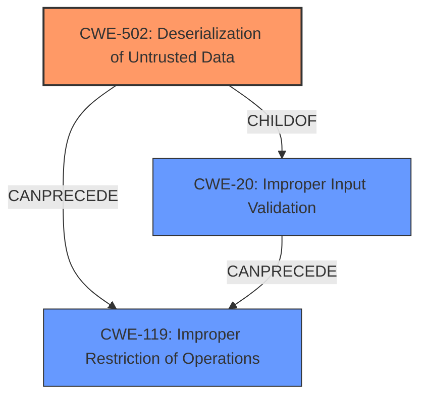

# Analysis Report for CVE-2024-45169

# Vulnerability Analysis Report: CVE-2024-45169

## Description

An issue was discovered in UCI IDOL 2 (aka uciIDOL or IDOL2) through 2.12. Due to **improper input validation**, **improper **deserialization****, **and improper restriction of operations within the bounds of a memory buffer**, IDOL2 is vulnerable to Denial-of-Service (DoS) attacks and possibly remote code execution via the \xB0\x00\x3c byte sequence.

## Vulnerability Description Key Phrases

- **Rootcause:** ['improper input validation', 'improper deserialization', 'and improper restriction of operations within the bounds of a memory buffer']
- **Weakness:** deserialization
- **Impact:** Denial-of-Service (DoS) attacks and possibly remote code execution
- **Vector:** the \xB0\x00\x3c byte sequence
- **Product:** UCI IDOL 2
- **Version:** through 2.12

## Analysis (with Relationship Data)

# Summary
| CWE ID  | CWE Name                                                        | Confidence | CWE Abstraction Level | CWE Vulnerability Mapping Label | CWE-Vulnerability Mapping Notes |
| :-------- | :-------------------------------------------------------------- | :--------- | :---------------------- | :------------------------------ | :------------------------------ |
| CWE-502   | Deserialization of Untrusted Data                               | 0.9        | Base                    | Primary CWE                   | Allowed                       |
| CWE-119   | Improper Restriction of Operations within the Bounds of a Memory Buffer | 0.8        | Class                     | Secondary Candidate             | Discouraged                    |
| CWE-20    | Improper Input Validation                                       | 0.7        | Class                     | Secondary Candidate             | Discouraged                    |

## Evidence and Confidence

*   **Confidence Score:** 0.8
*   **Evidence Strength:** HIGH

## Relationship Analysis
The primary CWE is CWE-502, which describes the **improper deserialization** of untrusted data. This can lead to other weaknesses like CWE-119, which is a more general description of buffer handling issues. CWE-20 highlights the **improper input validation** aspect. The relationships show that **improper input validation** and **improper deserialization** (CWE-502) can lead to buffer handling issues (CWE-119), and thus the potential for DoS and RCE. CWE-502 is a specific type of input validation issue and is therefore preferred over the more general CWE-20.



## Vulnerability Chain
The vulnerability chain starts with **improper input validation** and **improper deserialization** (CWE-502), leading to **improper restriction of operations within the bounds of a memory buffer** (CWE-119). This ultimately results in Denial-of-Service (DoS) and potentially remote code execution (RCE).

## Summary of Analysis
The vulnerability description highlights three key weaknesses: **improper input validation**, **improper deserialization**, and **improper restriction of operations within the bounds of a memory buffer**. The primary root cause is identified as **improper deserialization**, which maps to CWE-502. This is because the vulnerability involves processing untrusted data without proper validation during deserialization. The **improper input validation** aspect is also relevant but is more general. The **improper restriction of operations within the bounds of a memory buffer** (CWE-119) is a consequence of the root cause, where the deserialized data leads to memory corruption.

The retriever results and the vulnerability description both point to CWE-502 as a strong candidate for the **improper deserialization** aspect. The description explicitly mentions "**improper deserialization**" as a contributing factor, making CWE-502 the most accurate representation of the vulnerability's root cause. The graph relationships support this by showing how **improper deserialization** can lead to further issues like CWE-119 (buffer handling issues).

The selection of CWE-502 is at the optimal level of specificity because it directly addresses the **improper deserialization** aspect of the vulnerability, which is the initial flaw in the chain of events. While CWE-20 (**improper input validation**) is also relevant, CWE-502 is more specific to the deserialization context and therefore a better fit.

Other CWEs considered but not used:

*   CWE-20: Improper Input Validation - Considered but deemed too general as CWE-502 provides a more specific classification.
*   CWE-119: Improper Restriction of Operations within the Bounds of a Memory Buffer - Considered as a secondary weakness resulting from the deserialization issue, but not the primary root cause.
*   CWE-125: Out-of-bounds Read, CWE-190: Integer Overflow or Wraparound, CWE-122: Heap-based Buffer Overflow, CWE-1284: Improper Validation of Specified Quantity in Input, CWE-193: Off-by-one Error, CWE-1285: Improper Validation of Specified Index, Position, or Offset in Input, CWE-126: Buffer Over-read, CWE-121: Stack-based Buffer Overflow - These were all considered based on retriever results, but ultimately deemed less relevant than CWE-502, CWE-119, and CWE-20. They represent potential consequences of the root cause but do not directly describe the initial vulnerability.


## CWE Relationship Analysis

Current CWEs represent these abstraction levels: .


### Vulnerability Chain Analysis

**Chain starting from CWE-502:**
- 502 (Deserialization of Untrusted Data) - ROOT


**Chain starting from CWE-1284:**
- 1284 (Improper Validation of Specified Quantity in Input) - ROOT


### CWE Relationship Diagram

```mermaid
graph TD
    classDef primary fill:#f96,stroke:#333,stroke-width:2px
    classDef secondary fill:#69f,stroke:#333
    classDef tertiary fill:#9e9,stroke:#333
```


*Report generated on 2025-07-13 16:08:36*
