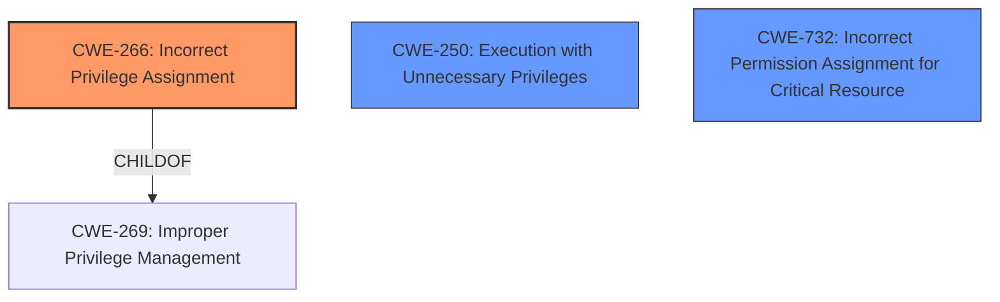

# Analysis Report for CVE-2024-45173

# Vulnerability Analysis Report: CVE-2024-45173

## Description

An issue was discovered in za-internet C-MOR Video Surveillance 5.2401. Due to **improper privilege management concerning sudo privileges**, C-MOR is vulnerable to a privilege escalation attack. The Linux user www-data running the C-MOR web interface can execute some OS commands as root via Sudo without having to enter the root password. These commands, for example, include cp, chown, and chmod, which enable an attacker to modify the systems sudoers file in order to execute all commands with root privileges. Thus, it is possible to escalate the limited privileges of the user www-data to root privileges.

## Vulnerability Description Key Phrases

- **Rootcause:** improper privilege management concerning sudo privileges
- **Impact:** privilege escalation
- **Attacker:** Linux user www-data running the C-MOR web interface
- **Product:** za-internet C-MOR Video Surveillance
- **Version:** 5.2401

## Analysis (with Relationship Data)

# Summary
| CWE ID | CWE Name | Confidence | CWE Abstraction Level | CWE Vulnerability Mapping Label | CWE-Vulnerability Mapping Notes |
|---|---|---|---|---|---|
| CWE-266 | Incorrect Privilege Assignment | 0.9 | Base | Primary CWE | Allowed |
| CWE-250 | Execution with Unnecessary Privileges | 0.7 | Base | Secondary Candidate | Allowed |
| CWE-732 | Incorrect Permission Assignment for Critical Resource | 0.6 | Class | Secondary Candidate | Allowed-with-Review |

## Evidence and Confidence

*   **Confidence Score:** 0.9
*   **Evidence Strength:** HIGH

## Relationship Analysis
The primary relationship that influenced the CWE selection was the parent-child relationship. CWE-266 is at the Base level, which is more specific than its parent, CWE-269, and accurately reflects the vulnerability: an incorrect assignment of privileges. The privilege escalation is a consequence of this **incorrect privilege assignment**. CWE-250 was considered due to the unnecessary privileges granted, but CWE-266 more precisely identifies the root cause.



## Vulnerability Chain
The vulnerability chain starts with the **improper privilege assignment** to the `www-data` user, allowing them to execute specific OS commands as root via `sudo` without a password. This leads to the ability to modify the `/etc/sudoers` file, ultimately resulting in privilege escalation to root.

CWE-266 (Incorrect Privilege Assignment) -> Privilege Escalation (Impact)

## Summary of Analysis
The initial assessment focused on identifying the root cause of the vulnerability, which is the **improper privilege management** that allows the `www-data` user to execute certain OS commands as root without authentication.

The evidence from the vulnerability description and CVE Reference Links Content Summary clearly points to **incorrect privilege assignment**:
*   "Due to **improper privilege management concerning sudo privileges**, C-MOR is vulnerable to a privilege escalation attack."
*   "The software grants the `www-data` user excessive privileges by allowing it to run certain commands as root using `sudo` without password authentication."
*   "The `sudo` configuration permits specific commands like `cp`, `chown`, and `chmod` to be executed by the `www-data` user as root."

Based on the provided evidence and the CWE mapping guidance, CWE-266 (Incorrect Privilege Assignment) is the most appropriate primary CWE because it directly addresses the root cause of the vulnerability.

The selected CWE is at the optimal level of specificity because it's a Base level CWE that accurately describes the **incorrect privilege assignment**, which is the root cause of the issue.

Relevant CWE Information:

# Enhanced Context (25 CWEs)
The following CWEs were identified as potentially relevant to this vulnerability:

## CWE-266: Incorrect Privilege Assignment
**Abstraction Level**: Base
**Similarity Score**: 0.80
**Source**: dense

**Description**:
A product incorrectly assigns a privilege to a particular actor, creating an unintended sphere of control for that actor.

**Mapping Guidance**:
- Usage: Allowed
- Rationale: This CWE entry is at the Base level of abstraction, which is a preferred level of abstraction for mapping to the root causes of vulnerabilities.

**Why Selected:** The core issue is that the `www-data` user was granted more privileges than necessary, allowing for the subsequent privilege escalation. The **improper configuration** of `sudo` is the direct cause.

## CWE-250: Execution with Unnecessary Privileges
**Abstraction Level**: Base
**Similarity Score**: 0.75
**Source**: dense

**Description**:
The product performs an operation at a privilege level that is higher than the minimum level required, which creates new weaknesses or amplifies the consequences of other weaknesses.

**Mapping Guidance**:
- Usage: Allowed
- Rationale: This CWE entry is at the Base level of abstraction, which is a preferred level of abstraction for mapping to the root causes of vulnerabilities.

**Why Considered:** The `www-data` user is running commands as root when it shouldn't be.

**Why Not Primary:** While related, this is more of a symptom. The root cause is the assignment, not the execution.

## CWE-732: Incorrect Permission Assignment for Critical Resource
**Abstraction Level**: Class
**Similarity Score**: 2020.76
**Source**: sparse

**Description**:
The product specifies permissions for a security-critical resource in a way that allows that resource to be read or modified by unintended actors.

**Mapping Guidance**:
- Usage: Allowed-with-Review
- Rationale: While the name itself indicates an assignment of permissions for resources, this is often misused for vulnerabilities in which "permissions" are not checked, which is an "authorization" weakness (CWE-285 or descendants) within CWE's model [REF-1287].

**Why Considered:** The sudoers file is a critical resource that's being incorrectly configured.

**Why Not Primary:** The root cause is the assignment of privilege to the user and not the permissions of the file.

## CWE-269: Improper Privilege Management
**Abstraction Level**: Class
**Similarity Score**: 2088.36
**Source**: sparse

**Description**:
The product does not properly assign, modify, track, or check privileges for an actor, creating an unintended sphere of control for that actor.

**Mapping Guidance**:
- Usage: Discouraged
- Rationale: CWE-269 is commonly misused. It can be conflated with "privilege escalation," which is a technical impact that is listed in many low-information vulnerability reports [REF-1287]. It is not useful for trend analysis.

**Why Not Selected:** This is a more general CWE. The vulnerability is specifically about the **incorrect assignment** of privileges. As such, CWE-266 is a better fit.


## CWE Relationship Analysis

Current CWEs represent these abstraction levels: .


### Vulnerability Chain Analysis

**Chain starting from CWE-732:**
- 732 (Incorrect Permission Assignment for Critical Resource) - ROOT


**Chain starting from CWE-269:**
- 269 (Improper Privilege Management) - ROOT


### CWE Relationship Diagram

```mermaid
graph TD
    classDef primary fill:#f96,stroke:#333,stroke-width:2px
    classDef secondary fill:#69f,stroke:#333
    classDef tertiary fill:#9e9,stroke:#333
```


*Report generated on 2025-07-13 16:09:34*
