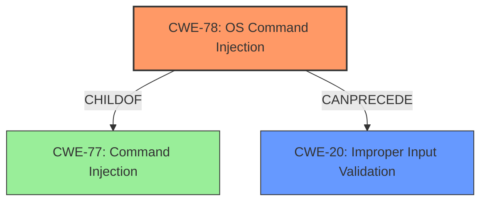

# Analysis Report for CVE-2024-45179

# Vulnerability Analysis Report: CVE-2024-45179

## Description

An issue was discovered in za-internet C-MOR Video Surveillance 5.2401 and 6.00PL01. Due to **insufficient input validation**, the C-MOR web interface is vulnerable to **OS command injection** attacks. It was found out that different functionality is vulnerable to **OS command injection** attacks, for example for generating new X.509 certificates, or setting the time zone. These **OS command injection** vulnerabilities in the script generatesslreq.pml can be exploited as a low-privileged authenticated user to execute commands in the context of the Linux user www-data via shell metacharacters in HTTP POST data (e.g., the city parameter). The **OS command injection** vulnerability in the script settimezone.pml or setdatetime.pml (e.g., via the year parameter) requires an administrative user for the C-MOR web interface. By also exploiting a privilege-escalation vulnerability, it is possible to execute commands on the C-MOR system with root privileges.

## Vulnerability Description Key Phrases

- **Rootcause:** insufficient input validation
- **Weakness:** OS command injection
- **Impact:** execute commands
- **Vector:** shell metacharacters in HTTP POST data
- **Attacker:** low-privileged authenticated user
- **Product:** za-internet C-MOR Video Surveillance
- **Version:** 5.2401 and 6.00PL01
- **Component:** ['generatesslreq.pml', 'settimezone.pml', 'setdatetime.pml']

## Analysis (with Relationship Data)

# Summary
| CWE ID | CWE Name | Confidence | CWE Abstraction Level | CWE Vulnerability Mapping Label | CWE-Vulnerability Mapping Notes |
|---|---|---|---|---|---|
| CWE-78 | Improper Neutralization of Special Elements used in an OS Command ('OS Command Injection') | 1.0 | Base | Allowed | Primary CWE. The vulnerability allows execution of arbitrary OS commands due to **insufficient input validation**. |
| CWE-20 | Improper Input Validation | 0.7 | Class | Discouraged | Secondary CWE. The **root cause** is the **insufficient input validation**.|

## Evidence and Confidence

*   **Confidence Score:** 0.9
*   **Evidence Strength:** HIGH

## Relationship Analysis
The primary weakness is CWE-78, which is a base-level CWE describing **OS command injection**. This stems from the **broader class of improper input validation**, CWE-20. CWE-78 is a child of CWE-77 (Improper Neutralization of Special Elements used in a Command ('Command Injection')), which is a more general class. The vulnerability description clearly indicates **OS command injection** as the **weakness**, making CWE-78 the most specific and appropriate choice.



## Vulnerability Chain
The vulnerability chain starts with **insufficient input validation** (CWE-20), which leads to **OS command injection** (CWE-78). This allows an attacker to execute arbitrary commands on the system, potentially leading to privilege escalation and full system compromise.

## Summary of Analysis
The primary CWE is CWE-78 because the vulnerability description explicitly states that the C-MOR web interface is vulnerable to **OS command injection** attacks. This is due to **insufficient input validation** (CWE-20), which allows attackers to inject malicious commands via shell metacharacters in HTTP POST data. The vulnerability can be exploited by low-privileged authenticated users (for some scripts) or administrative users (for others). By exploiting a privilege-escalation vulnerability, it is possible to execute commands with root privileges.

The retriever results confirm CWE-78 as the top candidate. While CWE-20 is also relevant, it is a higher-level class that describes the root cause of the vulnerability, but CWE-78 describes the specific type of injection. Therefore, CWE-78 is more specific and suitable.

Other CWEs were considered, but they were not selected because they did not accurately reflect the nature of the vulnerability. For example, CWE-89 (SQL Injection) was considered but rejected because the vulnerability involves **OS command injection**, not SQL injection. Similarly, CWE-22 (Path Traversal) was considered but rejected because the vulnerability does not involve manipulating file paths to access restricted directories. CWE-73 (External Control of File Name or Path) was also considered since the attack vector involves HTTP POST data, but the attack is more directly related to command injection, not path manipulation.

Relevant CWE Information:
# Enhanced Context (25 CWEs)
The following CWEs were identified as potentially relevant to this vulnerability:

## CWE-266: Incorrect Privilege Assignment
**Abstraction Level**: Base
**Similarity Score**: 0.79
**Source**: dense

**Description**:
A product incorrectly assigns a privilege to a particular actor, creating an unintended sphere of control for that actor.

**Mapping Guidance**:
- Usage: Allowed
- Rationale: This CWE entry is at the Base level of abstraction, which is a preferred level of abstraction for mapping to the root causes of vulnerabilities.

## CWE-267: Privilege Defined With Unsafe Actions
**Abstraction Level**: Base
**Similarity Score**: 0.78
**Source**: dense

**Description**:
A particular privilege, role, capability, or right can be used to perform unsafe actions that were not intended, even when it is assigned to the correct entity.

**Mapping Guidance**:
- Usage: Allowed
- Rationale: This CWE entry is at the Base level of abstraction, which is a preferred level of abstraction for mapping to the root causes of vulnerabilities.

## CWE-74: Improper Neutralization of Special Elements in Output Used by a Downstream Component ('Injection')
**Abstraction Level**: Class
**Similarity Score**: 0.77
**Source**: dense

**Description**:
The product constructs all or part of a command, data structure, or record using externally-influenced input from an upstream component, but it does not neutralize or incorrectly neutralizes special elements that could modify how it is parsed or interpreted when it is sent to a downstream component.

**Mapping Guidance**:
- Usage: Discouraged
- Rationale: CWE-74 is high-level and often misused when lower-level weaknesses are more appropriate.

## CWE-41: Improper Resolution of Path Equivalence
**Abstraction Level**: Base
**Similarity Score**: 0.77
**Source**: dense

**Description**:
The product is vulnerable to file system contents disclosure through path equivalence. Path equivalence involves the use of special characters in file and directory names. The associated manipulations are intended to generate multiple names for the same object.

**Mapping Guidance**:
- Usage: Allowed
- Rationale: This CWE entry is at the Base level of abstraction, which is a preferred level of abstraction for mapping to the root causes of vulnerabilities.

## CWE-274: Improper Handling of Insufficient Privileges
**Abstraction Level**: Base
**Similarity Score**: 0.77
**Source**: dense

**Description**:
The product does not handle or incorrectly handles when it has insufficient privileges to perform an operation, leading to resultant weaknesses.

**Mapping Guidance**:
- Usage: Discouraged
- Rationale: This CWE entry could be deprecated in a future version of CWE.

## CWE-280: Improper Handling of Insufficient Permissions or Privileges
**Abstraction Level**: Base
**Similarity Score**: 0.77
**Source**: dense

**Description**:
The product does not handle or incorrectly handles when it has insufficient privileges to access resources or functionality as specified by their permissions. This may cause it to follow unexpected code paths that may leave the product in an invalid state.

**Mapping Guidance**:
- Usage: Allowed
- Rationale: This CWE entry is at the Base level of abstraction, which is a preferred level of abstraction for mapping to the root causes of vulnerabilities.

## CWE-668: Exposure of Resource to Wrong Sphere
**Abstraction Level**: Class
**Similarity Score**: 0.76
**Source**: dense

**Description**:
The product exposes a resource to the wrong control sphere, providing unintended actors with inappropriate access to the resource.

**Mapping Guidance**:
- Usage: Discouraged
- Rationale: CWE-668 is high-level and is often misused as a catch-all when lower-level CWE IDs might be applicable. It is sometimes used for low-information vulnerability reports [REF-1287]. It is a level-1 Class (i.e., a child of a Pillar). It is not useful for trend analysis.

## CWE-472: External Control of Assumed-Immutable Web Parameter
**Abstraction Level**: Base
**Similarity Score**: 0.76
**Source**: dense

**Description**:
The web application does not sufficiently verify inputs that are assumed to be immutable but are actually externally controllable, such as hidden form fields.

**Mapping Guidance**:
- Usage: Allowed
- Rationale: This CWE entry is at the Base level of abstraction, which is a preferred level of abstraction for mapping to the root causes of vulnerabilities.

## CWE-59: Improper Link Resolution Before File Access ('Link Following')
**Abstraction Level**: Base
**Similarity Score**: 0.76
**Source**: dense

**Description**:
The product attempts to access a file based on the filename, but it does not properly prevent that filename from identifying a link or shortcut that resolves to an unintended resource.

**Mapping Guidance**:
- Usage: Allowed
- Rationale: This CWE entry is at the Base level of abstraction, which is a preferred level of abstraction for mapping to the root causes of vulnerabilities.

## CWE-73: External Control of File Name or Path
**Abstraction Level**: Base
**Similarity Score**: 0.76
**Source**: dense

**Description**:
The product allows user input to control or influence paths or file names that are used in filesystem operations.

**Mapping Guidance**:
- Usage: Allowed
- Rationale: This CWE entry is at the Base level of abstraction, which is a preferred level of abstraction for mapping to the root causes of vulnerabilities.

## CWE-269: Improper Privilege Management
**Abstraction Level**: Class
**Similarity Score**: 2233.64
**Source**: sparse

**Description**:
The product does not properly assign


## CWE Relationship Analysis

Current CWEs represent these abstraction levels: .


### Vulnerability Chain Analysis

**Chain starting from CWE-274:**
- 274 (Improper Handling of Insufficient Privileges) - ROOT


**Chain starting from CWE-89:**
- 89 (Improper Neutralization of Special Elements used in an SQL Command ('SQL Injection')) - ROOT


### CWE Relationship Diagram

```mermaid
graph TD
    classDef primary fill:#f96,stroke:#333,stroke-width:2px
    classDef secondary fill:#69f,stroke:#333
    classDef tertiary fill:#9e9,stroke:#333
```


*Report generated on 2025-07-13 16:09:57*
