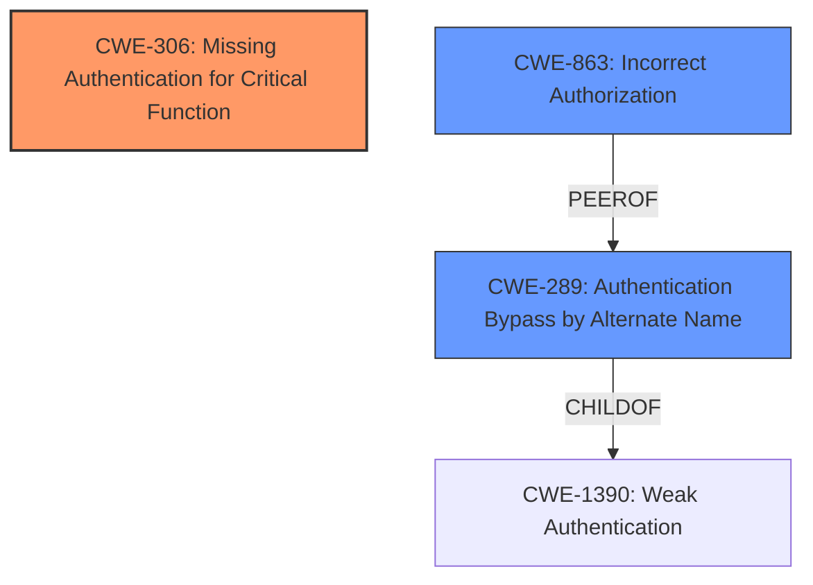

# Raw Analyzer Response for CVE-2024-45216

# Summary
| CWE ID | CWE Name | Confidence | CWE Abstraction Level | CWE Vulnerability Mapping Label | CWE-Vulnerability Mapping Notes |
|---|---|---|---|---|---|
| **CWE-306** | **Missing Authentication for Critical Function** | 0.9 | Base | Primary | Allowed |
| CWE-289 | Authentication Bypass by Alternate Name | 0.7 | Base | Secondary Candidate | Allowed |
| CWE-863 | Incorrect Authorization | 0.6 | Class | Secondary Candidate | Allowed-with-Review |

## Evidence and Confidence

*   **Confidence Score:** 0.9
*   **Evidence Strength:** HIGH

## Relationship Analysis
The primary CWE is CWE-306, which is a base-level CWE. CWE-289 and CWE-863 are secondary candidates. CWE-289 is related to bypassing authentication using alternate names, which aligns with the "fake ending" aspect of the vulnerability. CWE-863 represents a broader class of authorization issues. The relationship analysis supports selecting CWE-306 as the primary cause due to the **missing authentication** issue, with CWE-289 and CWE-863 potentially providing additional context.

## Vulnerability Chain
The vulnerability chain starts with the **missing authentication** check for certain API paths due to the "fake ending" trick. This leads to authentication bypass, allowing unauthorized access to Solr API endpoints.
  - Root Cause: **CWE-306 Missing Authentication for Critical Function**
  - Mechanism: Fake URL endings leading to bypassed authentication.
  - Impact: Unauthorized access to Solr API endpoints.

## Summary of Analysis
The analysis strongly points to **CWE-306 Missing Authentication for Critical Function** as the primary CWE. The "fake ending" allows requests to bypass authentication, directly matching the CWE description. The evidence includes the vulnerability description stating "**Improper Authentication vulnerability**" and the CVE reference summary highlighting that requests can "skip Authentication." The guidance on authentication vs. authorization clearly indicates that when no identity validation is performed, CWE-306 is the appropriate choice.

CWE-289 Authentication Bypass by Alternate Name was considered because the vulnerability uses a "fake ending" in the URL to bypass authentication. This aligns with the concept of using an alternate name to circumvent authentication. However, CWE-306 is a more direct representation of the root cause which is **missing authentication**.

CWE-863 Incorrect Authorization was also considered, but the primary issue is the lack of authentication, not an incorrect authorization check after authentication.

Therefore, **CWE-306** is selected as the primary CWE due to the **missing authentication** check, while CWE-289 and CWE-863 are secondary candidates that provide additional context. The selected CWEs are at the optimal level of specificity, with CWE-306 being a base-level CWE directly addressing the root cause.