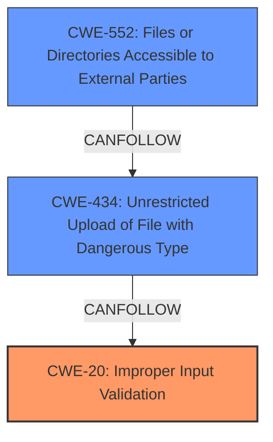

# Raw Analyzer Response for CVE-2024-45219

# Summary
| CWE ID | CWE Name | Confidence | CWE Abstraction Level | CWE Vulnerability Mapping Label | CWE-Vulnerability Mapping Notes |
|---|---|---|---|---|---|
| CWE-20 **[CWE-20: Improper Input Validation]** | Improper Input Validation | 0.9 | Class | Allowed | Primary CWE. The **missing validation checks** for KVM-compatible templates or volumes is directly related to improper input validation.|
| CWE-434 **[CWE-434: Unrestricted Upload of File with Dangerous Type]** | Unrestricted Upload of File with Dangerous Type | 0.7 | Base | Allowed | Secondary CWE. The vulnerability allows users to upload templates and volumes, which can be exploited to upload malicious files.|
| CWE-552 **[CWE-552: Files or Directories Accessible to External Parties]** | Files or Directories Accessible to External Parties | 0.6 | Base | Allowed | Secondary CWE. Successful exploitation of the vulnerability leads to access to host filesystems, which constitutes making files accessible to external parties.|

## Evidence and Confidence

*   **Confidence Score:** 0.8
*   **Evidence Strength:** HIGH

## Relationship Analysis
The primary weakness is **Improper Input Validation (CWE-20)**, as the root cause lies in the **missing validation checks**. **Unrestricted Upload of File with Dangerous Type (CWE-434)** is a secondary weakness, detailing the attack vector. **Files or Directories Accessible to External Parties (CWE-552)** is another secondary weakness, describing one potential impact of a successful exploit.

## Vulnerability Chain
The vulnerability chain starts with **missing validation checks (CWE-20)**, leading to **unrestricted file upload (CWE-434)**, which can result in **files or directories accessible to external parties (CWE-552)** and ultimately compromise the system.

## Summary of Analysis
The primary root cause of this vulnerability is the **missing validation checks** on uploaded templates and volumes. This leads to the ability to upload malicious files and potentially gain access to the host filesystem. Therefore, **CWE-20 [CWE-20: Improper Input Validation]** is the most appropriate primary CWE. The ability to upload any file type without restrictions points to **CWE-434 [CWE-434: Unrestricted Upload of File with Dangerous Type]**. Finally, the ability to access host filesystems after exploitation corresponds to **CWE-552 [CWE-552: Files or Directories Accessible to External Parties]**. These CWEs are at the appropriate level of specificity and accurately represent the vulnerability.

The vulnerability description clearly states the **missing validation checks**, this is the root cause evidence:
> Due to **missing validation checks** for KVM-compatible templates or volumes in CloudStack 4.0.0 through 4.18.2.3 and 4.19.0.0 through 4.19.1.1, an attacker that can upload or register templates and volumes, can use them to deploy malicious instances or attach uploaded volumes to their existing instances on KVM-based environments and exploit this to gain access to the host filesystems

**CWE Considerations:**

*   **CWE-20 [CWE-20: Improper Input Validation]**: This is the primary CWE because the root cause is the **missing validation checks**.
*   **CWE-434 [CWE-434: Unrestricted Upload of File with Dangerous Type]**: This CWE is applicable as the vulnerability allows uploading any file type without proper validation.
*   **CWE-552 [CWE-552: Files or Directories Accessible to External Parties]**: This CWE is applicable as successful exploitation can lead to access to the host filesystem.

**CWEs Considered but Not Used:**

*   **CWE-863 [CWE-863: Incorrect Authorization]** and **CWE-285 [CWE-285: Improper Authorization]**: These CWEs were considered but not selected because the primary issue is not with authorization, but with the **missing validation checks** of uploaded files.
*   **CWE-770 [CWE-770: Allocation of Resources Without Limits or Throttling]**: This CWE was considered but not selected because the primary issue is not related to resource allocation.
*   **CWE-367 [CWE-367: Time-of-check Time-of-use (TOCTOU) Race Condition]**: This CWE was considered but not selected as there is no evidence of a race condition.
*   **CWE-611 [CWE-611: Improper Restriction of XML External Entity Reference]** and **CWE-1336 [CWE-1336: Improper Neutralization of Special Elements Used in a Template Engine]**: These CWEs were considered but not selected because the vulnerability is not specific to XML or template engines.
*   **CWE-212 [CWE-212: Improper Removal of Sensitive Information Before Storage or Transfer]**: This CWE was considered but not selected as there is no evidence of sensitive information being stored or transferred without proper removal.
*   **CWE-378 [CWE-378: Creation of Temporary File With Insecure Permissions]**: This CWE was considered but not selected as there is no evidence of temporary files being created with insecure permissions.
*   **CWE-22 [CWE-22: Improper Limitation of a Pathname to a Restricted Directory ('Path Traversal')]**: This CWE was considered but not selected because the vulnerability is not related to path traversal.