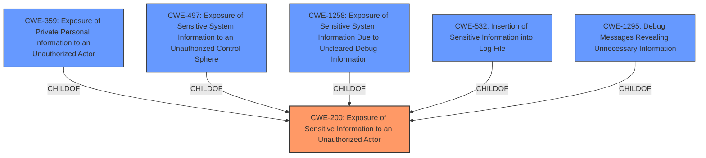

# Enhanced Analysis for CVE-2024-45245

# Summary
| CWE ID | CWE Name | Confidence | CWE Abstraction Level | CWE Vulnerability Mapping Label | CWE-Vulnerability Mapping Notes |
|---|---|---|---|---|---|
| CWE-200 | Exposure of Sensitive Information to an Unauthorized Actor | 0.7 | Class | Primary CWE | Discouraged |

## Evidence and Confidence

*   **Confidence Score:** 0.7
*   **Evidence Strength:** LOW

## Relationship Analysis
The primary identified CWE is CWE-200, which is a class-level CWE. Several base-level CWEs are children of CWE-200 and were considered. However, due to the lack of specific details in the provided vulnerability description, a more specific base-level CWE cannot be confidently assigned.



## Vulnerability Chain
The vulnerability chain starts with the **Exposure of Sensitive Information** which leads to the impact of unauthorized access to the sensitive information. The vulnerability description key phrases identify the root cause and impact.

## Summary of Analysis
The vulnerability description explicitly states "**Exposure of Sensitive Information** to an Unauthorized Actor", aligning directly with CWE-200. While the retriever results suggest more specific base-level CWEs like CWE-359, CWE-497, CWE-1258, CWE-532, and CWE-1295, the lack of detailed information prevents a confident mapping to these more specific CWEs. CWE-200 is a Class-level CWE, and the mapping guidance discourages its use when more specific options are available. However, in this case, the limited information makes it the most appropriate choice. The evidence for this decision is the explicit mention of "**Exposure of Sensitive Information**" in the vulnerability description.


## CWE Relationship Analysis

Current CWEs represent these abstraction levels: .


### Vulnerability Chain Analysis

**Chain starting from CWE-359:**
- 359 (Exposure of Private Personal Information to an Unauthorized Actor) - ROOT


**Chain starting from CWE-1295:**
- 1295 (Debug Messages Revealing Unnecessary Information) - ROOT


### CWE Relationship Diagram

```mermaid
graph TD
    classDef primary fill:#f96,stroke:#333,stroke-width:2px
    classDef secondary fill:#69f,stroke:#333
    classDef tertiary fill:#9e9,stroke:#333
```