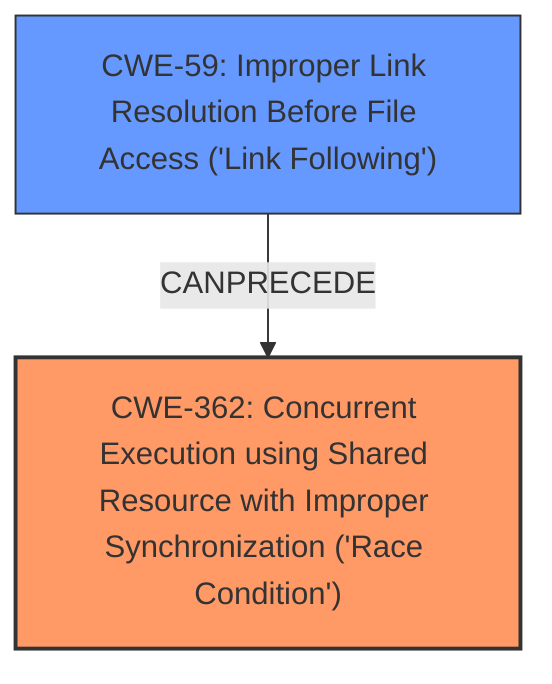

# Analysis Report for CVE-2024-45310

# Vulnerability Analysis Report: CVE-2024-45310

## Description

runc is a CLI tool for spawning and running containers according to the OCI specification. runc 1.1.13 and earlier, as well as 1.2.0-rc2 and earlier, can be tricked into creating empty files or directories in arbitrary locations in the host filesystem by sharing a volume between two containers and exploiting a race with `os.MkdirAll`. While this could be used to create empty files, existing files would not be truncated. An attacker must have the ability to start containers using some kind of custom volume configuration. Containers using user namespaces are still affected, but the scope of places an attacker can create inodes can be significantly reduced. Sufficiently strict LSM policies (SELinux/Apparmor) can also in principle block this attack -- we suspect the industry standard SELinux policy may restrict this attacks scope but the exact scope of protection hasnt been analysed. This is exploitable using runc directly as well as through Docker and Kubernetes. The issue is fixed in runc v1.1.14 and v1.2.0-rc3. Some workarounds are available. Using user namespaces restricts this attack fairly significantly such that the attacker can only create inodes in directories that the remapped root user/group has write access to. Unless the root user is remapped to an actual user on the host (such as with rootless containers that dont use `/etc/sub[ug]id`), this in practice means that an attacker would only be able to create inodes in world-writable directories. A strict enough SELi

## Vulnerability Description Key Phrases

- **Rootcause:** race condition
- **Impact:** create empty files or directories in arbitrary locations
- **Vector:** exploiting a race with os.MkdirAll
- **Attacker:** attacker
- **Product:** runc
- **Version:** 1.1.13 and earlier, as well as 1.2.0-rc2 and earlier

## Analysis (with Relationship Data)

# Summary
| CWE ID | CWE Name | Confidence | CWE Abstraction Level | CWE Vulnerability Mapping Label | CWE-Vulnerability Mapping Notes |
|---|---|---|---|---|---|
| CWE-362 | Concurrent Execution using Shared Resource with Improper Synchronization ('**Race Condition**') | 0.9 | Class | Allowed-with-Review | Primary CWE. The vulnerability is due to a **race condition** when sharing a volume between containers. |
| CWE-59 | Improper Link Resolution Before File Access ('Link Following') | 0.7 | Base | Allowed | Secondary candidate. The **race condition** allows symlinks to be manipulated to create directories outside the intended container rootfs. |

## Evidence and Confidence

*   **Confidence Score:** 0.8
*   **Evidence Strength:** HIGH

## Relationship Analysis
The primary weakness is CWE-362, which is a Class-level CWE. A more specific Base-level CWE could be considered, but CWE-362 directly reflects the **concurrent execution** and **improper synchronization** aspects of the **race condition**. CWE-59 is a Base-level CWE and is related because the **race condition** enables the "Link Following" issue. The graph below illustrates the relationship.



## Vulnerability Chain
The vulnerability chain starts with a **race condition** (CWE-362) when sharing a volume between two containers. This **race condition** allows for the manipulation of symlinks, leading to CWE-59 (Improper Link Resolution Before File Access). The end result is the creation of empty files or directories in arbitrary locations on the host filesystem.

## Summary of Analysis
The primary vulnerability is a **race condition**, specifically CWE-362 (Concurrent Execution using Shared Resource with Improper Synchronization ('**Race Condition**')). The vulnerability description key phrases highlight the **race condition** as the root cause, and the CVE reference links content summary further supports this by stating that the vulnerability stems from a **race condition** in runc's mount handling. The ability to manipulate symlinks due to the **race condition**, leading to the creation of files outside the intended container rootfs, suggests a secondary weakness, CWE-59 (Improper Link Resolution Before File Access ('Link Following')).

The retriever results also support the selection of CWE-362 as the primary weakness, with a high score and a recommendation to consider its Base-level children if applicable. While CWE-367 (Time-of-check Time-of-use (TOCTOU) **Race Condition**) is a Base-level CWE and also appears in the retriever results, CWE-362 is a better fit because it specifically addresses concurrent execution and shared resources, which are key aspects of this vulnerability. The evidence supports these findings and the chosen CWEs are at an appropriate level of specificity.

CWE-732 (Incorrect Permission Assignment for Critical Resource) was considered but not selected because the issue is not directly related to incorrect permission assignments but rather to the **race condition** that allows symlink manipulation.
CWE-22 (Improper Limitation of a Pathname to a Restricted Directory ('Path Traversal')) was considered, but it is less relevant than CWE-59 because the core issue is with symlink following, not directly with pathname traversal.

Relevant CWE Information:

# Enhanced Context (25 CWEs)
The following CWEs were identified as potentially relevant to this vulnerability:

## CWE-367: Time-of-check Time-of-use (TOCTOU) Race Condition
**Abstraction Level**: Base
**Similarity Score**: 0.74
**Source**: dense

**Description**:
The product checks the state of a resource before using that resource, but the resource's state can change between the check and the use in a way that invalidates the results of the check. This can cause the product to perform invalid actions when the resource is in an unexpected state.

**Mapping Guidance**:
- Usage: Allowed
- Rationale: This CWE entry is at the Base level of abstraction, which is a preferred level of abstraction for mapping to the root causes of vulnerabilities.


## CWE-362: Concurrent Execution using Shared Resource with Improper Synchronization ('Race Condition')
**Abstraction Level**: Class
**Similarity Score**: 0.74
**Source**: dense

**Description**:
The product contains a concurrent code sequence that requires temporary, exclusive access to a shared resource, but a timing window exists in which the shared resource can be modified by another code sequence operating concurrently.

**Mapping Guidance**:
- Usage: Allowed-with-Review
- Rationale: This CWE entry is a Class and might have Base-level children that would be more appropriate


## CWE-59: Improper Link Resolution Before File Access ('Link Following')
**Abstraction Level**: Base
**Similarity Score**: 0.72
**Source**: dense

**Description**:
The product attempts to access a file based on the filename, but it does not properly prevent that filename from identifying a link or shortcut that resolves to an unintended resource.

**Mapping Guidance**:
- Usage: Allowed
- Rationale: This CWE entry is at the Base level of abstraction, which is a preferred level of abstraction for mapping to the root causes of vulnerabilities.


## CWE-277: Insecure Inherited Permissions
**Abstraction Level**: Variant
**Similarity Score**: 0.72
**Source**: dense

**Description**:
A product defines a set of insecure permissions that are inherited by objects that are created by the program.

**Mapping Guidance**:
- Usage: Allowed
- Rationale: This CWE entry is at the Variant level of abstraction, which is a preferred level of abstraction for mapping to the root causes of vulnerabilities.


## CWE-366: Race Condition within a Thread
**Abstraction Level**: Base
**Similarity Score**: 0.72
**Source**: dense

**Description**:
If two threads of execution use a resource simultaneously, there exists the possibility that resources may be used while invalid, in turn making the state of execution undefined.

**Mapping Guidance**:
- Usage: Allowed
- Rationale: This CWE entry is at the Base level of abstraction, which is a preferred level of abstraction for mapping to the root causes of vulnerabilities.


## CWE-667: Improper Locking
**Abstraction Level**: Class
**Similarity Score**: 0.71
**Source**: dense

**Description**:
The product does not properly acquire or release a lock on a resource, leading to unexpected resource state changes and behaviors.

**Mapping Guidance**:
- Usage: Allowed-with-Review
- Rationale: This CWE entry is a Class and might have Base-level children that would be more appropriate


## CWE-61: UNIX Symbolic Link (Symlink) Following
**Abstraction Level**: Compound
**Similarity Score**: 0.71
**Source**: dense

**Description**:
The product, when opening a file or directory, does not sufficiently account for when the file is a symbolic link that resolves to a target outside of the intended control sphere. This could allow an attacker to cause the product to operate on unauthorized files.

**Mapping Guidance**:
- Usage: Allowed
- Rationale: This is a well-known Composite of multiple weaknesses that must all occur simultaneously, although it is attack-oriented in nature.


## CWE-212: Improper Removal of Sensitive Information Before Storage or Transfer
**Abstraction Level**: Base
**Similarity Score**: 0.70
**Source**: dense

**Description**:
The product stores, transfers, or shares a resource that contains sensitive information, but it does not properly remove that information before the product makes the resource available to unauthorized actors.

**Mapping Guidance**:
- Usage: Allowed
- Rationale: This CWE entry is at the Base level of abstraction, which is a preferred level of abstraction for mapping to the root causes of vulnerabilities.


## CWE-824: Access of Uninitialized Pointer
**Abstraction Level**: Base
**Similarity Score**: 0.70
**Source**: dense

**Description**:
The product accesses or uses a pointer that has not been initialized.

**Mapping Guidance**:
- Usage: Allowed
- Rationale: This CWE entry is at the Base level of abstraction, which is a preferred level of abstraction for mapping to the root causes of vulnerabilities.


## CWE-923: Improper Restriction of Communication Channel to Intended Endpoints
**Abstraction Level**: Class
**Similarity Score**: 0.70
**Source**: dense

**Description**:
The product establishes a communication channel to (or from) an endpoint for privileged or protected operations, but it does not properly ensure that it is communicating with the correct endpoint.

**Mapping Guidance**:
- Usage: Allowed-with-Review
- Rationale: This CWE entry is a Class and might have Base-level children that would be more appropriate


## CWE-367: Time-of-check Time-of-use (TOCTOU) Race Condition
**Abstraction Level**: Base
**Similarity Score


## CWE Relationship Analysis

Current CWEs represent these abstraction levels: .


### Vulnerability Chain Analysis

**Chain starting from CWE-732:**
- 732 (Incorrect Permission Assignment for Critical Resource) - ROOT


**Chain starting from CWE-22:**
- 22 (Improper Limitation of a Pathname to a Restricted Directory ('Path Traversal')) - ROOT


### CWE Relationship Diagram

```mermaid
graph TD
    classDef primary fill:#f96,stroke:#333,stroke-width:2px
    classDef secondary fill:#69f,stroke:#333
    classDef tertiary fill:#9e9,stroke:#333
```


*Report generated on 2025-07-13 16:17:45*
