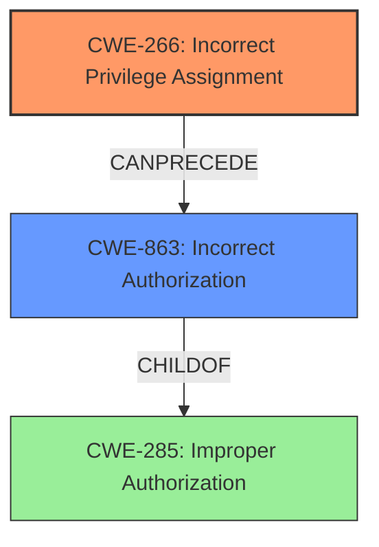

# Enhanced Analysis for CVE-2024-45331

# Summary
| CWE ID | CWE Name | Confidence | CWE Abstraction Level | CWE Vulnerability Mapping Label | CWE-Vulnerability Mapping Notes |
|---|---|---|---|---|---|
| CWE-266 | Incorrect Privilege Assignment | 1.0 | Base | Allowed | Primary CWE. The **incorrect privilege assignment** is the root cause of the vulnerability. |
| CWE-863 | Incorrect Authorization | 0.7 | Class | Allowed-with-Review | Secondary candidate. An authorization check occurs, but is performed incorrectly. |

## Evidence and Confidence

*   **Confidence Score:** 0.9
*   **Evidence Strength:** HIGH

## Relationship Analysis
CWE-266 is a Base level CWE, which is preferred for root cause analysis. CWE-863 is a Class level CWE, which is less specific. CWE-863 could be a consequence of CWE-266, where the **incorrect privilege assignment** leads to an **incorrect authorization**.



## Vulnerability Chain
The vulnerability chain starts with an **incorrect privilege assignment** (CWE-266), which allows an attacker to then perform actions they should not be authorized to do (CWE-863), leading to privilege escalation.

## Summary of Analysis
The primary weakness is CWE-266 (**Incorrect Privilege Assignment**). The vulnerability description explicitly states "**incorrect privilege assignment**" as the root cause. The CVE Reference Links Content Summary also points to "**incorrect filesystem permissions**" which further supports this. CWE-266 is a Base level CWE, which is the preferred level for mapping root causes. The advisory guidance on privileges vs permissions also suggest this is a good mapping.

CWE-863 (**Incorrect Authorization**) is a secondary weakness, because the **incorrect privilege assignment** allows the attacker to perform actions they should not be authorized to do. It's a Class-level CWE, and while relevant, it's less specific than CWE-266 for identifying the root cause.

I considered CWE-285 (**Improper Authorization**), which is a parent of CWE-863, but CWE-863 is a more precise description of the authorization issue.

Relevant CWE Information:
- CWE-266: Incorrect Privilege Assignment
- CWE-863: Incorrect Authorization


## CWE Relationship Analysis

Current CWEs represent these abstraction levels: .


### Vulnerability Chain Analysis

**Chain starting from CWE-266:**
- 266 (Incorrect Privilege Assignment) - ROOT


**Chain starting from CWE-863:**
- 863 (Incorrect Authorization) - ROOT


### CWE Relationship Diagram

```mermaid
graph TD
    classDef primary fill:#f96,stroke:#333,stroke-width:2px
    classDef secondary fill:#69f,stroke:#333
    classDef tertiary fill:#9e9,stroke:#333
```