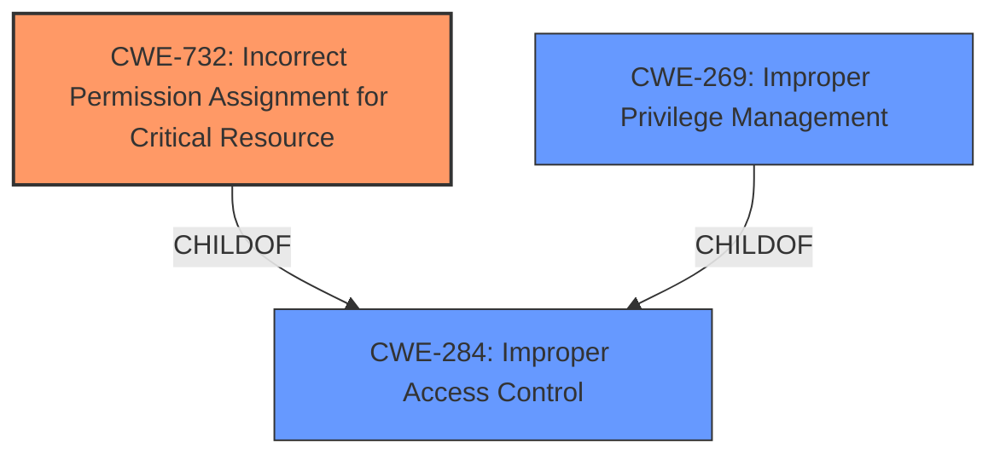

# Analysis Report for CVE-2024-45334

# Vulnerability Analysis Report: CVE-2024-45334

## Description

Trend Micro Antivirus One versions 3.10.4 and below (Consumer) is vulnerable to an Arbitrary Configuration Update that could allow unauthorized access to product configurations and functions.

## Vulnerability Description Key Phrases

- **Impact:** unauthorized access to product configurations and functions
- **Vector:** Arbitrary Configuration Update
- **Product:** Trend Micro Antivirus One
- **Version:** 3.10.4 and below (Consumer)

## Analysis (with Relationship Data)

# Summary
| CWE ID | CWE Name | Confidence | CWE Abstraction Level | CWE Vulnerability Mapping Label | CWE-Vulnerability Mapping Notes |
|---|---|---|---|---|---|
| CWE-732 | Incorrect Permission Assignment for Critical Resource | 0.9 | Class | Allowed-with-Review | Primary CWE: The root cause is the **incorrect permission assignment**. |
| CWE-269 | Improper Privilege Management | 0.6 | Class | Discouraged | Secondary candidate: The product **does not properly assign, modify, track, or check privileges for an actor, creating an unintended sphere of control for that actor**. |
| CWE-284 | Improper Access Control | 0.5 | Pillar | Discouraged | Secondary candidate: The product **does not restrict or incorrectly restricts access to a resource from an unauthorized actor**. |

## Evidence and Confidence

*   **Confidence Score:** 0.9
*   **Evidence Strength:** MEDIUM

## Relationship Analysis
The primary CWE is CWE-732, which is a class-level CWE. CWE-269 is a class-level CWE and a peer of CWE-732. CWE-284 is a pillar-level CWE and a parent of CWE-732. The relationship analysis confirms that CWE-732 is the most specific and relevant CWE for this vulnerability, as it directly addresses the **incorrect permission assignment** issue.



## Vulnerability Chain
The vulnerability chain starts with the **incorrect permission assignment** (CWE-732), which leads to the **unauthorized access to product configurations and functions**.

## Summary of Analysis
The primary weakness is **incorrect permission assignment** in the Safety Server component of Trend Micro Antivirus One, leading to an Arbitrary Configuration Update vulnerability. This allows unauthorized access to product configurations and functions.

The vulnerability description clearly states that the root cause is incorrect permissions, which directly aligns with CWE-732. The CVE Reference Links Content Summary explicitly mentions **incorrect permissions** as the root cause. The Retriever Results also list CWE-732 as the top candidate.

The confidence level is high (0.9) because the vulnerability description and CVE summary provide clear evidence of **incorrect permission assignment**.

Other CWEs Considered but Not Used:
* CWE-269 (Improper Privilege Management): While related, CWE-732 is more specific to the **incorrect permission assignment**, which is the root cause.
* CWE-284 (Improper Access Control): This is a high-level pillar and less specific than CWE-732.
* CWE-59 (Improper Link Resolution Before File Access ('Link Following')): This is not relevant as the vulnerability is not related to link following.
* CWE-78 (Improper Neutralization of Special Elements used in an OS Command ('OS Command Injection')): This is not relevant as the vulnerability is not related to OS command injection.
#


## CWE Relationship Analysis

Current CWEs represent these abstraction levels: .


### Vulnerability Chain Analysis

**Chain starting from CWE-732:**
- 732 (Incorrect Permission Assignment for Critical Resource) - ROOT


**Chain starting from CWE-59:**
- 59 (Improper Link Resolution Before File Access ('Link Following')) - ROOT


### CWE Relationship Diagram

```mermaid
graph TD
    classDef primary fill:#f96,stroke:#333,stroke-width:2px
    classDef secondary fill:#69f,stroke:#333
    classDef tertiary fill:#9e9,stroke:#333
```


*Report generated on 2025-07-13 16:20:47*
