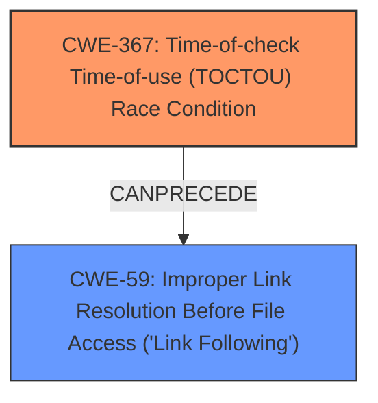

# Raw Analyzer Response for CVE-2024-45339

# Summary
| CWE ID | CWE Name | Confidence | CWE Abstraction Level | CWE Vulnerability Mapping Label | CWE-Vulnerability Mapping Notes |
|---|---|---|---|---|---|
| CWE-367 | Time-of-check Time-of-use (TOCTOU) Race Condition | 0.9 | Base | Allowed | Primary CWE: This is the root cause where the state of a resource is checked before use, but the resource's state can change between the check and the use. |
| CWE-59 | Improper Link Resolution Before File Access ('Link Following') | 0.8 | Base | Allowed | Secondary CWE: An attacker places a symbolic link (symlink) to a sensitive file in place of the expected log file. When the privileged process runs, it follows this symlink and overwrites the sensitive file. |

## Evidence and Confidence

*   **Confidence Score:** 0.85
*   **Evidence Strength:** HIGH

## Relationship Analysis
The primary weakness is CWE-367, which describes a time-of-check time-of-use race condition. The secondary weakness, CWE-59, is a specific case of **improper link resolution**, which can be exploited because of the TOCTOU condition. CWE-367 can precede CWE-59 because the race condition enables the link following. CWE-59 is the more direct cause of the vulnerability's impact, as it involves the **improper resolution of a symbolic link**. The other CWEs were not selected because they didn't fit the specific nature of the vulnerability as well.

## Vulnerability Chain
The vulnerability chain starts with a **time-of-check time-of-use race condition (CWE-367)**. An attacker exploits this by creating a symbolic link to a sensitive file in place of the expected log file. When the privileged process runs, it checks if the log file exists (or creates it) and then attempts to write to it. Due to the race condition, the symbolic link is followed (**improper link resolution, CWE-59**), and the sensitive file is overwritten.

## Summary of Analysis
The initial assessment focused on the description of how the vulnerability occurs. The **root cause** is the **TOCTOU race condition (CWE-367)**, where the state of the resource (log file) is checked before use, but can be changed by an attacker creating a symlink in its place. This leads to **improper link resolution (CWE-59)** when the privileged process follows the symlink and overwrites the sensitive file. This is supported by the description: "an unprivileged attacker may predict a privileged processs log file path and pre-create a symbolic link to a sensitive file in its place. When that privileged process runs, it will follow the planted symlink and overwrite that sensitive file".

The retriever results also pointed to CWE-59 and CWE-61 (UNIX Symbolic Link Following), but CWE-61 is a compound weakness, and CWE-59 is more specific and at the base level of abstraction, which is preferred. CWE-367 was also in the retriever results, confirming its relevance.

Relevant CWE Information:
*   CWE-367: The product checks the state of a resource before using that resource, but the resource's state can change between the check and the use in a way that invalidates the results of the check.
*   CWE-59: The product attempts to access a file based on the filename, but it does not properly prevent that filename from identifying a link or shortcut that resolves to an unintended resource.