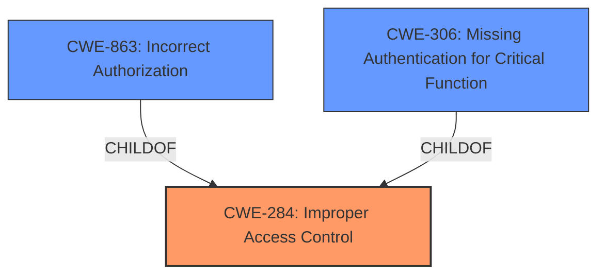

# Raw Analyzer Response for CVE-2024-45371

# Summary
| CWE ID   | CWE Name                                                                                                                                                                                                                                                                  | Confidence | CWE Abstraction Level | CWE Vulnerability Mapping Label | CWE-Vulnerability Mapping Notes |
| :--------- | :-------------------------------------------------------------------------------------------------------------------------------------------------------------------------------------------------------------------------------------------------------------------------- | :--------- | :---------------------- | :------------------------------ | :------------------------------ |
| **CWE-284** | Improper Access Control                                                                                                                                                                                                                                                     | 0.8        | Pillar                    | Primary CWE                     | Discouraged                    |
| CWE-863   | Incorrect Authorization                                                                                                                                                                                                                                                     | 0.6        | Class                     | Secondary Candidate             | Allowed-with-Review             |
| CWE-306   | Missing Authentication for Critical Function                                                                                                                                                                                                                              | 0.5        | Base                      | Secondary Candidate             | Allowed                         |

## Evidence and Confidence

*   **Confidence Score:** 0.7
*   **Evidence Strength:** MEDIUM

## Relationship Analysis
The primary CWE is CWE-284, which is a high-level category. CWE-863 (Incorrect Authorization) and CWE-306 (Missing Authentication) are child CWEs that are more specific. The choice of CWE-284 is because the vulnerability is described as **improper access control**, and it is unclear whether the issue stems from authentication or authorization failures specifically. If more information was available to pinpoint the exact cause, one of the child CWEs (CWE-863 or CWE-306) would be preferred.

## Vulnerability Chain
The vulnerability chain starts with **improper access control**, which leads to a potential denial of service.

Improper Access Control -> Potential Denial of Service

CWE-284 is the root cause. The impact is denial of service, which isn't explicitly mapped to a CWE but is the ultimate consequence.

## Summary of Analysis
The initial analysis identified **improper access control** as the root cause, which aligns with CWE-284. The retriever results also show CWE-284 as a relevant candidate. Given the limited information, and the guidance to use a more specific CWE if the root cause is clear, CWE-284 is the most appropriate choice at this time. If there was more information available to pinpoint whether the **improper access control** was due to lack of authentication or incorrect authorization, then it would be appropriate to change the CWE to CWE-306 or CWE-863 respectively.

The evidence provided focuses on the **improper access control**, without clearly indicating whether it is an authentication or authorization issue. The graph relationships highlight that CWE-863 and CWE-306 are children of CWE-284, providing a hierarchy that guides the selection of the most specific CWE when possible.

The selected CWEs are at the optimal level of specificity, given the available information. CWE-284 is chosen because the nature of the access control issue is not fully clarified in the vulnerability description.

Relevant CWE Information:

*   **CWE-284: Improper Access Control** - The product does not adequately control access to resources or functions, allowing unintended access. This is a high-level category used when the specific cause of the access control issue is unclear. The description states "**Improper access control** for some Intel(R) Arc &amp Iris(R) Xe graphics software...may allow an authenticated user to potentially enable denial of service via local access." The guidance indicates this should be avoided if a more specific child CWE is appropriate.
*   **CWE-863: Incorrect Authorization** - The product performs an authorization check, but it does not correctly perform the check. If the **improper access control** stems from a flawed authorization check, this CWE would be more appropriate. The description doesn't specify this, so it is only a secondary candidate.
*   **CWE-306: Missing Authentication for Critical Function** - The product does not perform any authentication for functionality that requires a provable user identity. If the **improper access control** stems from a missing authentication check, this CWE would be more appropriate. The description doesn't specify this, so it is only a secondary candidate.