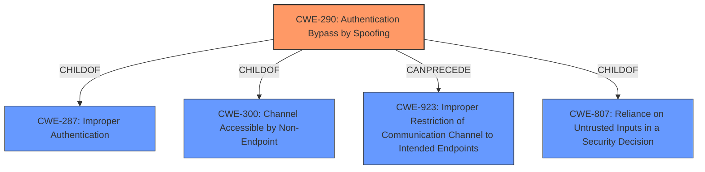

# Analysis for CVE-2024-45397

# Summary
| CWE ID | CWE Name | Confidence | CWE Abstraction Level | CWE Vulnerability Mapping Label | CWE-Vulnerability Mapping Notes |
|---|---|---|---|---|---|
| CWE-290 | Authentication Bypass by Spoofing | 0.9 | Base | Primary CWE | Allowed |
| CWE-923 | Improper Restriction of Communication Channel to Intended Endpoints | 0.7 | Class | Secondary Candidate | Allowed-with-Review |
| CWE-807 | Reliance on Untrusted Inputs in a Security Decision | 0.6 | Base | Secondary Candidate | Allowed |

## Evidence and Confidence

*   **Confidence Score:** 0.8
*   **Evidence Strength:** HIGH

## Relationship Analysis
The primary CWE is CWE-290, which is a Base level weakness. This CWE has child-of relationships to CWE-287 Improper Authentication and CWE-300 Channel Accessible by Non-Endpoint. CWE-290 is related to CWE-923 "Improper Restriction of Communication Channel to Intended Endpoints" through a "CanPrecede" relationship. CWE-807 is related as a more general case of relying on untrusted input for security decisions, which aligns with the concept of spoofed addresses.

## Vulnerability Chain
The vulnerability chain starts with the **spoofed source address** being accepted by the IP-address-based access control due to the use of TLS/1.3 early data on top of TCP Fast Open or QUIC 0-RTT packets. This leads to the **bypassing of authentication** and the ability to **execute HTTP requests from unauthorized addresses**.

## Summary of Analysis
The initial analysis identified CWE-290 Authentication Bypass by Spoofing as the primary weakness, supported by the **weakness** of the **spoofed source address** and the bypass of access control. The Retriever Results and the Vulnerability Description Key Phrases both support this conclusion. The vulnerability chain highlights the root cause (spoofing) leading to the impact (unauthorized access).

CWE-290 is the most specific and appropriate choice because the attack relies on **spoofing** the source address to bypass access control.

CWE-923, Improper Restriction of Communication Channel to Intended Endpoints, was considered because the vulnerability involves a failure to properly restrict the communication channel to intended endpoints by validating the source IP address, but is a more general case.

CWE-807, Reliance on Untrusted Inputs in a Security Decision, was considered because the access control relies on the IP address, which can be spoofed, representing an untrusted input. But CWE-290 more accurately captures the core issue of authentication bypass via spoofing.

Relevant CWE Information:
# Enhanced Context (25 CWEs)
The following CWEs were identified as potentially relevant to this vulnerability:

## CWE-290: Authentication Bypass by Spoofing
The vulnerability involves the **spoofing** of the source IP address to bypass the IP-address-based access control. This aligns with the core concept of CWE-290.

## CWE-923: Improper Restriction of Communication Channel to Intended Endpoints
The vulnerability involves a failure to properly restrict the communication channel to intended endpoints by validating the source IP address.

## CWE-807: Reliance on Untrusted Inputs in a Security Decision
The access control relies on the IP address, which can be spoofed, representing an untrusted input.