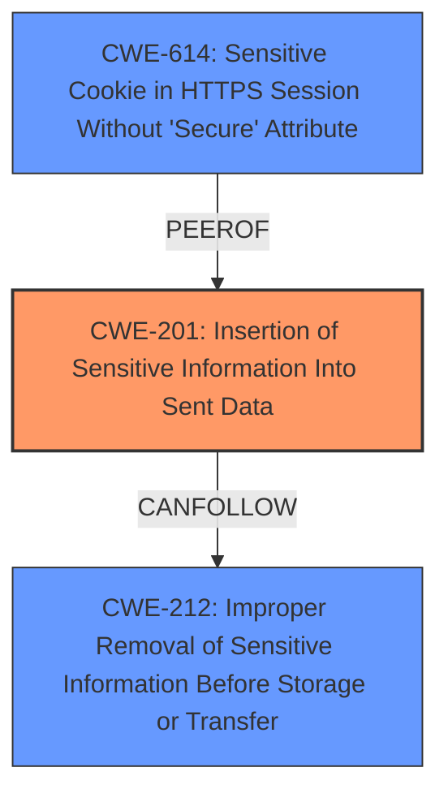

# Analysis Report for CVE-2024-4540

# Vulnerability Analysis Report: CVE-2024-4540

## Description

A flaw was found in Keycloak in OAuth 2.0 Pushed Authorization Requests (PAR). Client-provided parameters were found to be included in plain text in the KC_RESTART cookie returned by the authorization servers HTTP response to a `request_uri` authorization request, possibly leading to an **information disclosure vulnerability**.

## Vulnerability Description Key Phrases

- **Weakness:** information disclosure vulnerability
- **Impact:** information disclosure
- **Product:** Keycloak
- **Component:** OAuth 2.0 Pushed Authorization Requests (PAR)

## Analysis (with Relationship Data)

# Summary

| CWE ID  | CWE Name                                                                   | Confidence | CWE Abstraction Level | CWE Vulnerability Mapping Label | CWE-Vulnerability Mapping Notes |
| :-------- | :------------------------------------------------------------------------- | :--------- | :---------------------- | :------------------------------ | :-------------------------------- |
| CWE-201 | Insertion of Sensitive Information Into Sent Data                          | 0.9        | Base                    | Primary CWE                    | Allowed                          |
| CWE-212 | Improper Removal of Sensitive Information Before Storage or Transfer        | 0.7        | Base                    | Secondary Candidate             | Allowed                          |
| CWE-614 | Sensitive Cookie in HTTPS Session Without 'Secure' Attribute | 0.6        | Variant                    | Secondary Candidate             | Allowed                          |

## Evidence and Confidence

*   **Confidence Score:** 0.8
*   **Evidence Strength:** HIGH

## Relationship Analysis

The primary CWE is CWE-201, which indicates that sensitive information is being included in data that is sent to another actor. CWE-212 is a parent of CWE-201, indicating that the sensitive information was not properly removed before being stored or transferred. CWE-614 is related to the use of cookies and the 'Secure' attribute, which can help prevent sensitive information from being exposed.



## Vulnerability Chain

The vulnerability chain starts with the inclusion of client-provided parameters (sensitive data) in the `KC_RESTART` cookie, which is then sent in the HTTP response.

1.  **Root Cause:** **Improper inclusion of sensitive data into a cookie.**
2.  **Weakness:** **Information Disclosure** due to the **lack of encryption/obfuscation**.
3.  **Impact:** Potential unauthorized access or further attacks if the cookie is intercepted or accessed.

The chain highlights how the initial flaw (inclusion of sensitive data) leads to the impact (information disclosure).

## Summary of Analysis

The primary assessment is based on the provided evidence, specifically: "Client-provided parameters were found to be included in plain text in the KC_RESTART cookie returned by the authorization servers HTTP response to a `request_uri` authorization request, possibly leading to an **information disclosure vulnerability**."

This directly aligns with **CWE-201 (Insertion of Sensitive Information Into Sent Data)**, as sensitive data is being transmitted in the cookie.

The relationship analysis shows that **CWE-212 (Improper Removal of Sensitive Information Before Storage or Transfer)** is a related weakness, because the sensitive data should have been removed or protected before being included in the cookie.

The retriever results and graph relationships support this assessment, with CWE-201 having a high similarity score and a clear relationship with CWE-212.

The selected CWEs are at the optimal level of specificity, as they accurately represent the root cause and contributing factors to the vulnerability.

# Relevant CWE Information:

## CWE-201: Insertion of Sensitive Information Into Sent Data

**Abstraction Level**: Base
**Similarity Score**: 1689.57
**Source**: sparse
**Description**: The code transmits data to another actor, but a portion of the data includes sensitive information that should not be accessible to that actor.
**Mapping Guidance**:
- Usage: Allowed
- Rationale: This CWE entry is at the Base level of abstraction, which is a preferred level of abstraction for mapping to the root causes of vulnerabilities.

**Justification:** The **root cause** is the inclusion of client-provided parameters in plain text within the `KC_RESTART` cookie. This cookie is sent in the HTTP response, meaning that the parameters are being transmitted to another actor (the client). This aligns directly with CWE-201.
**Confidence:** 0.9

## CWE-212: Improper Removal of Sensitive Information Before Storage or Transfer

**Abstraction Level**: Base
**Similarity Score**: 2.90
**Source**: graph
**Description**: The product stores, transfers, or shares a resource that contains sensitive information, but it does not properly remove that information before the product makes the resource available to unauthorized actors.
**Mapping Guidance**:
- Usage: Allowed
- Rationale: This CWE entry is at the Base level of abstraction, which is a preferred level of abstraction for mapping to the root causes of vulnerabilities.

**Justification:** This CWE applies because the application did not properly remove the sensitive client-provided parameters before including them in the `KC_RESTART` cookie. This cookie is then transferred (sent) to the client.
**Confidence:** 0.7

## CWE-614: Sensitive Cookie in HTTPS Session Without 'Secure' Attribute

**Abstraction Level**: Variant
**Similarity Score**: 0.255
**Source**: sparse

**Description**: The web application transmits a cookie that contains sensitive information over an HTTPS session, but the cookie does not have the "Secure" attribute set.
**Justification**: This CWE applies because the `KC_RESTART` cookie contains client-provided parameters over HTTPS but the cookie doesn't have the "Secure" attribute set.
**Confidence:** 0.6

### Other CWEs Considered:

*   **CWE-200 (Exposure of Sensitive Information to an Unauthorized Actor)**: This is a high-level class. CWE-201 is more specific as it details that the exposure occurs because the sensitive information is being sent in data. Therefore, CWE-201 is preferred.
*   **CWE-863 (Incorrect Authorization), CWE-1390 (Weak Authentication), CWE-639 (Authorization Bypass Through User-Controlled Key)**: These CWEs relate to authorization and authentication issues. While information disclosure can lead to authorization bypass, the **root cause** here is the **insertion of sensitive information** into the cookie, not a flaw in authorization or authentication mechanisms.
*   **CWE-532 (Insertion of Sensitive Information into Log File)**: This is specific to log files, while the vulnerability involves a cookie. Therefore, it is not applicable.
*   **CWE-472 (External Control of Assumed-Immutable Web Parameter)**: While the vulnerability does involve client-provided parameters, the core issue is not the external control of these parameters but their inclusion in the cookie.
*   **CWE-226 (Sensitive Information in Resource Not Removed Before Reuse)**: Similar to CWE-212, but the "reuse" aspect isn't strongly emphasized in the description. CWE-212 better captures the essence of the **root cause**.


## CWE Relationship Analysis

Current CWEs represent these abstraction levels: .


### Vulnerability Chain Analysis

**Chain starting from CWE-1390:**
- 1390 (Weak Authentication) - ROOT


**Chain starting from CWE-863:**
- 863 (Incorrect Authorization) - ROOT


### CWE Relationship Diagram

```mermaid
graph TD
    classDef primary fill:#f96,stroke:#333,stroke-width:2px
    classDef secondary fill:#69f,stroke:#333
    classDef tertiary fill:#9e9,stroke:#333
```


*Report generated on 2025-07-13 16:25:56*
