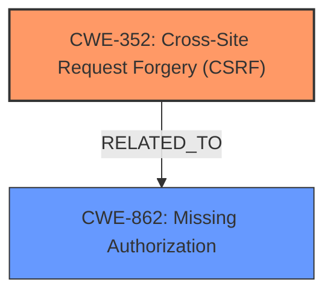

# Enhanced Analysis for CVE-2024-4541

# Summary
| CWE ID | CWE Name | Confidence | CWE Abstraction Level | CWE Vulnerability Mapping Label | CWE-Vulnerability Mapping Notes |
|---|---|---|---|---|---|
| CWE-352 | Cross-Site Request Forgery (CSRF) | 1.0 | Compound | Primary | Allowed |
| CWE-862 | Missing Authorization | 0.7 | Class | Secondary Candidate | Allowed-with-Review |

## Evidence and Confidence

*   **Confidence Score:** 0.9
*   **Evidence Strength:** HIGH

## Relationship Analysis
The primary CWE is CWE-352, Cross-Site Request Forgery. CWE-862, Missing Authorization, is a related CWE. CSRF can be viewed as a type of authorization bypass, where the application **incorrectly** assumes the request originates from a legitimate user due to **missing or incorrect nonce validation**. CWE-352 is a compound weakness, representing a combination of factors that enable the attack.



## Vulnerability Chain
The vulnerability chain starts with the **missing or incorrect nonce validation**, leading to the possibility of a Cross-Site Request Forgery (CSRF) attack. An unauthenticated attacker tricks a site administrator into performing an action, resulting in the attacker being able to add, delete, bulk edit, approve, or cancel products.

Root Cause: **Missing or incorrect nonce validation**
Weakness: Cross-Site Request Forgery (CSRF)
Impact: Add, delete, bulk edit, approve, or cancel products

## Summary of Analysis
The initial assessment identified CWE-352 as the primary weakness due to the **missing or incorrect nonce validation**, which is a core requirement for preventing CSRF attacks. The analysis is based on the vulnerability description and CVE reference details, both of which explicitly mention CSRF and the lack of nonce validation.

The evidence for CWE-352 is strong, with direct mentions in the vulnerability description key phrases ("**weakness: cross-site request forgery**", "**rootcause: missing or incorrect nonce validation**") and the CVE reference summary ("**Cross-Site Request Forgery (CSRF):** The plugin fails to properly validate the origin of requests, allowing attackers to forge requests on behalf of an authenticated user.").

The selection of CWE-352 is at the appropriate level of specificity, as it directly addresses the nature of the vulnerability. While CWE-862 (Missing Authorization) is related, it is a more general class of weakness, and CSRF is a more precise description of the actual vulnerability.

# Relevant CWE Information:

## CWE-352: Cross-Site Request Forgery (CSRF)
**Technical Explanation:** The Custom Product List Table plugin is vulnerable to Cross-Site Request Forgery (CSRF) due to **missing or incorrect nonce validation** when modifying products. This means the plugin does not properly verify if the request to modify products originated from a legitimate source (the user's authenticated session) or from a malicious site.
**Security Implications:** An attacker can craft a malicious request and trick a logged-in administrator into clicking a link or visiting a page that executes the request. This allows the attacker to perform actions such as adding, deleting, bulk editing, approving, or canceling products, as if they were the administrator.
**Relationship Analysis:** CWE-352 is a compound weakness. It's related to CWE-862, Missing Authorization, but is more specific. In this case, the authorization failure occurs because the request is forged, bypassing the usual authorization checks.
**Mapping Guidance Influence:** The MITRE mapping guidance for CWE-352 allows its use and acknowledges that it's a composite of multiple weaknesses.

## CWE-862: Missing Authorization
**Technical Explanation:** While the primary issue is CSRF, CWE-862 is related. The **missing or incorrect nonce validation** leads to an authorization bypass. The application fails to properly authorize the request, allowing unauthorized actions to be performed.
**Security Implications:** The impact is that an unauthenticated attacker can perform administrative actions on the products.
**Relationship Analysis:** CWE-862 is a class-level weakness. CWE-352 is a more specific case of missing authorization, where the authorization is bypassed due to a forged request.
**Mapping Guidance Influence:** The MITRE mapping guidance for CWE-862 recommends considering more specific Base-level children if available, which supports choosing CWE-352 as the primary weakness.

## CWEs Considered But Not Used:
*   CWE-79, CWE-89, CWE-116: These CWEs relate to injection and output encoding, which are not relevant to this vulnerability. The core issue is the **missing or incorrect nonce validation** that leads to CSRF, not improper handling of input or output.
*   CWE-425: Direct Request ('Forced Browsing'): This CWE relates to inadequate authorization enforcement on restricted URLs. While CSRF can be seen as a form of forced browsing, CWE-352 is more specific to the mechanism of the attack (forged requests).
*   CWE-306: Missing Authentication for Critical Function: This CWE addresses missing authentication. In this case, the administrator *is* authenticated, but the CSRF attack bypasses the authorization checks, making CWE-352 a more accurate classification.
*   CWE-471, CWE-472: Modification of Assumed-Immutable Data (MAID), External Control of Assumed-Immutable Web Parameter: These CWEs are not relevant because the vulnerability doesn't involve modifying assumed-immutable data. The core issue is the **lack of CSRF protection**.


## CWE Relationship Analysis

Current CWEs represent these abstraction levels: .


### Vulnerability Chain Analysis

**Chain starting from CWE-89:**
- 89 (Improper Neutralization of Special Elements used in an SQL Command ('SQL Injection')) - ROOT


**Chain starting from CWE-471:**
- 471 (Modification of Assumed-Immutable Data (MAID)) - ROOT


### CWE Relationship Diagram

```mermaid
graph TD
    classDef primary fill:#f96,stroke:#333,stroke-width:2px
    classDef secondary fill:#69f,stroke:#333
    classDef tertiary fill:#9e9,stroke:#333
```