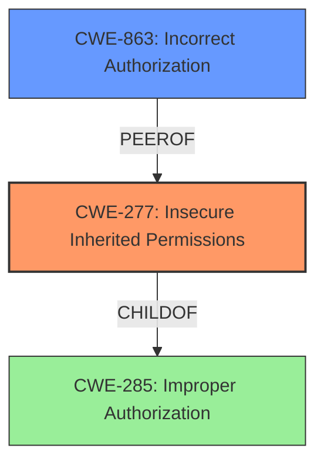

# Analysis Report for CVE-2024-45411

# Vulnerability Analysis Report: CVE-2024-45411

## Description

Twig is a template language for PHP. Under some circumstances, the sandbox security checks are not run which allows user-contributed templates to bypass the sandbox restrictions. This vulnerability is fixed in 1.44.8, 2.16.1, and 3.14.0.

## Vulnerability Description Key Phrases

- **Impact:** bypass sandbox restrictions
- **Vector:** user-contributed templates
- **Product:** Twig

## Analysis (with Relationship Data)

# Summary
| CWE ID | CWE Name | Confidence | CWE Abstraction Level | CWE Vulnerability Mapping Label | CWE-Vulnerability Mapping Notes |
|---|---|---|---|---|---|
| CWE-277 | Insecure Inherited Permissions | 0.8 | Variant | Allowed | Primary CWE. The vulnerability occurs due to **insecure inherited permissions** when a template is loaded outside the sandbox and later included in a sandboxed context. |
| CWE-863 | Incorrect Authorization | 0.6 | Class | Allowed-with-Review | Secondary candidate. The core issue involves bypassing intended sandbox security restrictions, which can be seen as a form of **incorrect authorization**. |

## Evidence and Confidence

*   **Confidence Score:** 0.7
*   **Evidence Strength:** MEDIUM

## Relationship Analysis
The primary CWE is CWE-277, which is a Variant of CWE-285 (Improper Authorization). The vulnerability involves insecure inherited permissions, leading to a sandbox bypass. This bypass can be seen as a form of incorrect authorization, justifying the consideration of CWE-863, a Class-level CWE for incorrect authorization, as a secondary candidate.



## Vulnerability Chain
The vulnerability chain starts with **insecure inherited permissions** (CWE-277), where templates loaded outside a sandbox context inherit permissions that allow them to bypass sandbox restrictions when included later in a sandboxed context. This leads to a sandbox bypass and ultimately to unrestricted template execution, which could allow for arbitrary code execution or data breaches.

## Summary of Analysis
The primary classification is CWE-277 (Insecure Inherited Permissions) because the root cause is the incorrect inheritance of permissions that allows the sandbox to be bypassed. The vulnerability description clearly states that the sandbox security checks are not run under some circumstances, specifically when a template is loaded before the `include()` call in a non-sandboxed context. This is a direct result of the permissions inherited by the template when it was loaded outside the sandbox.

CWE-863 (Incorrect Authorization) is considered as a secondary candidate, as the **sandbox bypass** effectively constitutes an authorization failure. However, CWE-277 is more specific to the actual root cause, which is the **insecure inheritance** of permissions.

The final assessment is based on the provided evidence, including the vulnerability description, CVE reference links, and retriever results. The graph relationships show that CWE-277 is a child of CWE-285 (Improper Authorization) and a peer of CWE-863 (Incorrect Authorization), which provides further justification for selecting CWE-277 as the primary CWE and CWE-863 as a secondary candidate.

Relevant CWE Information:

# Enhanced Context (25 CWEs)
The following CWEs were identified as potentially relevant to this vulnerability:

## CWE-1336: Improper Neutralization of Special Elements Used in a Template Engine
**Abstraction Level**: Base
**Similarity Score**: 0.74
**Source**: dense

**Description**:
The product uses a template engine to insert or process externally-influenced input, but it does not neutralize or incorrectly neutralizes special elements or syntax that can be interpreted as template expressions or other code directives when processed by the engine.

**Mapping Guidance**:
- Usage: Allowed
- Rationale: This CWE entry is at the Base level of abstraction, which is a preferred level of abstraction for mapping to the root causes of vulnerabilities.

Justification for not using: While this CWE relates to template engines, the specific vulnerability is not about improper neutralization but about **bypassing sandbox restrictions** through **insecurely inherited permissions**.

## CWE-116: Improper Encoding or Escaping of Output
**Abstraction Level**: Class
**Similarity Score**: 0.68
**Source**: dense

**Description**:
The product prepares a structured message for communication with another component, but encoding or escaping of the data is either missing or done incorrectly. As a result, the intended structure of the message is not preserved.

**Mapping Guidance**:
- Usage: Allowed-with-Review
- Rationale: This CWE entry is a Class and might have Base-level children that would be more appropriate

Justification for not using: This CWE is not relevant because the vulnerability isn't related to encoding or escaping of output.

## CWE-1286: Improper Validation of Syntactic Correctness of Input
**Abstraction Level**: Base
**Similarity Score**: 0.68
**Source**: dense

**Description**:
The product receives input that is expected to be well-formed - i.e., to comply with a certain syntax - but it does not validate or incorrectly validates that the input complies with the syntax.

**Mapping Guidance**:
- Usage: Allowed
- Rationale: This CWE entry is at the Base level of abstraction, which is a preferred level of abstraction for mapping to the root causes of vulnerabilities.

Justification for not using: This CWE doesn't apply since the vulnerability is about **bypassing sandbox restrictions**, not about validating input syntax.

## CWE-212: Improper Removal of Sensitive Information Before Storage or Transfer
**Abstraction Level**: Base
**Similarity Score**: 0.67
**Source**: dense

**Description**:
The product stores, transfers, or shares a resource that contains sensitive information, but it does not properly remove that information before the product makes the resource available to unauthorized actors.

**Mapping Guidance**:
- Usage: Allowed
- Rationale: This CWE entry is at the Base level of abstraction, which is a preferred level of abstraction for mapping to the root causes of vulnerabilities.

Justification for not using: This CWE is not relevant because the vulnerability doesn't involve the storage or transfer of sensitive information.

## CWE-184: Incomplete List of Disallowed Inputs
**Abstraction Level**: Base
**Similarity Score**: 0.67
**Source**: dense

**Description**:
The product implements a protection mechanism that relies on a list of inputs (or properties of inputs) that are not allowed by policy or otherwise require other action to neutralize before additional processing takes place, but the list is incomplete.

**Mapping Guidance**:
- Usage: Allowed
- Rationale: This CWE entry is at the Base level of abstraction, which is a preferred level of abstraction for mapping to the root causes of vulnerabilities.

Justification for not using: The **sandbox bypass** isn't directly related to an incomplete list of disallowed inputs.

## CWE-138: Improper Neutralization of Special Elements
**Abstraction Level**: Class
**Similarity Score**: 0.67
**Source**: dense

**Description**:
The product receives input from an upstream component, but it does not neutralize or incorrectly neutralizes special elements that could be interpreted as control elements or syntactic markers when they are sent to a downstream component.

**Mapping Guidance**:
- Usage: Discouraged
- Rationale: This CWE entry is a level-1 Class (i.e., a child of a Pillar). It might have lower-level children that would be more appropriate

Justification for not using: While the issue involves templates, it's not about improper neutralization of special elements in the traditional sense, but rather a **bypass of the sandbox** altogether due to **insecurely inherited permissions**.

## CWE-88: Improper Neutralization of Argument Delimiters in a Command ('Argument Injection')
**Abstraction Level**: Base
**Similarity Score**: 0.67
**Source**: dense

**Description**:
The product constructs a string for a command to be executed by a separate component
in another control sphere, but it does not properly delimit the
intended arguments, options, or switches within that command string.

**Mapping Guidance**:
- Usage: Allowed
- Rationale: This CWE entry is at the Base level of abstraction, which is a preferred level of abstraction for mapping to the root causes of vulnerabilities.

Justification for not using: This CWE is not relevant as the vulnerability doesn't involve command injection.

## CWE-80: Improper Neutralization of Script-Related HTML Tags in a Web Page (Basic XSS)
**Abstraction Level**: Variant
**Similarity Score**: 0.67
**Source**: dense

**Description**:
The product receives input from an upstream component, but it does not neutralize or incorrectly neutralizes special characters such as "<", ">", and "&" that could be interpreted as web-scripting elements when they are sent to a downstream component that processes web pages.

**Mapping Guidance**:
- Usage: Allowed
- Rationale: This CWE entry is at the Variant level of abstraction, which is a preferred level of abstraction for mapping to the root causes of vulnerabilities.

Justification for not using: This CWE is not relevant because the vulnerability is not about Cross-Site Scripting (XSS).


## CWE Relationship Analysis

Current CWEs represent these abstraction levels: .


### Vulnerability Chain Analysis

**Chain starting from CWE-863:**
- 863 (Incorrect Authorization) - ROOT


**Chain starting from CWE-116:**
- 116 (Improper Encoding or Escaping of Output) - ROOT


### CWE Relationship Diagram

```mermaid
graph TD
    classDef primary fill:#f96,stroke:#333,stroke-width:2px
    classDef secondary fill:#69f,stroke:#333
    classDef tertiary fill:#9e9,stroke:#333
```


*Report generated on 2025-07-13 16:27:52*
