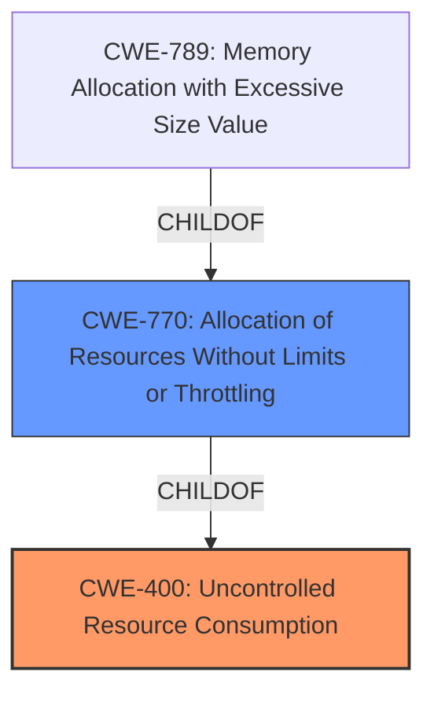

# Analysis for CVE-2024-45420

# Summary
| CWE ID | CWE Name | Confidence | CWE Abstraction Level | CWE Vulnerability Mapping Label | CWE-Vulnerability Mapping Notes |
|---|---|---|---|---|---|
| CWE-400 | Uncontrolled Resource Consumption | 0.9 | Class | Primary | Discouraged |
| CWE-770 | Allocation of Resources Without Limits or Throttling | 0.7 | Base | Secondary Candidate | Allowed |

## Evidence and Confidence

*   **Confidence Score:** 0.9
*   **Evidence Strength:** HIGH

## Relationship Analysis
The primary relationship influencing the decision is the parent-child relationship where CWE-400: Uncontrolled Resource Consumption is a class-level CWE. Several more specific CWEs, like CWE-770: Allocation of Resources Without Limits or Throttling, are children of CWE-400. The choice between using the class-level CWE-400 and its children depends on the specificity of the available evidence. Since the description mentions "uncontrolled resource consumption" but doesn't provide specific details about the type of resource or the mechanism, CWE-400 is initially chosen. However, CWE-770 is considered as a secondary candidate.

## Vulnerability Chain
The vulnerability chain starts with **uncontrolled resource consumption**, leading to a denial of service.
- **Root Cause:** **Uncontrolled resource consumption** (CWE-400)
- **Impact:** Denial of service

## Summary of Analysis
Initially, the vulnerability description points directly to **uncontrolled resource consumption**, which aligns with CWE-400. The key phrase "**uncontrolled resource consumption**" and the summary "The vulnerability lies in the improper management of resources by certain Zoom Apps, allowing an authenticated user to trigger excessive resource usage." support this. The impact, a denial-of-service condition, further reinforces this. However, the mapping guidance for CWE-400 discourages its use because it's often misused and conflated with the "technical impact." Despite this, the description clearly indicates a lack of control over resource consumption, making CWE-400 relevant at least at a class level.

CWE-770 (Allocation of Resources Without Limits or Throttling) is considered because it's a child of CWE-400 and provides more specificity. However, the description doesn't explicitly state that resources are allocated without limits or throttling, so CWE-400 is selected as the primary, with CWE-770 as a secondary consideration.

The choice of CWE-400 is made with the understanding that it is a class-level CWE and might not be as specific as desired, but it accurately reflects the **root cause** described in the vulnerability.

Relevant CWE Information:

# Enhanced Context (25 CWEs)
The following CWEs were identified as potentially relevant to this vulnerability:

## CWE-400: Uncontrolled Resource Consumption
**Abstraction Level**: Class
**Similarity Score**: 0.71
**Source**: dense

**Description**:
The product does not properly control the allocation and maintenance of a limited resource, thereby enabling an actor to influence the amount of resources consumed, eventually leading to the exhaustion of available resources.

**Mapping Guidance**:
- Usage: Discouraged
- Rationale: CWE-400 is intended for incorrect behaviors in which the product is expected to track and restrict how many resources it consumes, but CWE-400 is often misused because it is conflated with the "technical impact" of vulnerabilities in which resource consumption occurs. It is sometimes used for low-information vulnerability reports. It is a level-1 Class (i.e., a child of a Pillar).

**Technical Explanation for CWE-400:**
The vulnerability description states "**Uncontrolled resource consumption** in some Zoom Apps before version 6.2.0 may allow an authenticated user to conduct a denial of service via network access." This aligns directly with the description of CWE-400, where the product (Zoom Apps) does not properly control the allocation and maintenance of a limited resource, leading to resource exhaustion and a denial-of-service condition.

**Security Implications and Potential Impact:**
The security implication is a denial of service, making the application unavailable. The potential impact includes disruption of services and potential financial losses.

**Parent-Child Relationships or Chain Patterns:**
CWE-400 is a class-level CWE with several child CWEs that provide more specific details about the type of resource consumption.

**Whether the Weakness is Primary or Secondary in the Vulnerability:**
The **uncontrolled resource consumption** is the primary weakness in this vulnerability.

**How the Official MITRE Mapping Guidance Influenced Your Decision:**
The MITRE mapping guidance discourages the use of CWE-400 because it is often misused. However, in this case, the vulnerability description explicitly states **"uncontrolled resource consumption"** as the **root cause**, making it appropriate despite the discouraged usage.

## CWE-770: Allocation of Resources Without Limits or Throttling
**Abstraction Level**: Base
**Similarity Score**: 0.68
**Source**: dense

**Description**:
The product allocates a reusable resource or group of resources on behalf of an actor without imposing any restrictions on the size or number of resources that can be allocated, in violation of the intended security policy for that actor.

**Mapping Guidance**:
- Usage: Allowed
- Rationale: This CWE entry is at the Base level of abstraction, which is a preferred level of abstraction for mapping to the root causes of vulnerabilities.

**Technical Explanation for CWE-770:**
CWE-770 describes a scenario where resources are allocated without limits or throttling. While the vulnerability description does not explicitly state this, it is a potential underlying cause of the **uncontrolled resource consumption**.

**Security Implications and Potential Impact:**
The security implication is a denial of service. The potential impact includes disruption of services.

**Parent-Child Relationships or Chain Patterns:**
CWE-770 is a child of CWE-400.

**Whether the Weakness is Primary or Secondary in the Vulnerability:**
CWE-770 could be a secondary weakness, representing a more specific cause of the **uncontrolled resource consumption**.

**How the Official MITRE Mapping Guidance Influenced Your Decision:**
The MITRE mapping guidance allows the use of CWE-770, as it is at the Base level of abstraction. It is considered as a secondary candidate since the description does not explicitly mention the lack of limits or throttling.

## Other CWEs Considered But Not Used:
- CWE-789: Memory Allocation with Excessive Size Value - While resource consumption is involved, this CWE is specific to memory allocation with excessive sizes. The vulnerability description does not provide enough information to confirm this, so it is not selected.
- CWE-410: Insufficient Resource Pool - This CWE relates to the resource pool not being large enough to handle demand. While the result might be similar, the **root cause** in the description is **uncontrolled consumption**, not an insufficient pool.
- CWE-1325: Improperly Controlled Sequential Memory Allocation - Similar to CWE-789, this is specific to memory allocation, and there isn't enough information to confirm its applicability.
- CWE-1284: Improper Validation of Specified Quantity in Input - While input might influence resource consumption, the description doesn't highlight input validation as the primary issue.

The final decision prioritizes CWE-400 due to the clear statement of **uncontrolled resource consumption** in the vulnerability description, and considers CWE-770 as a secondary candidate, demonstrating a nuanced understanding of the vulnerability.