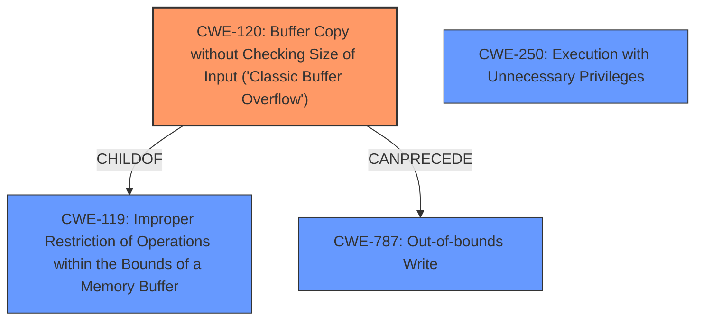

# Analysis Report for CVE-2024-45421

# Vulnerability Analysis Report: CVE-2024-45421

## Description

**Buffer overflow** in some Zoom Apps may allow an authenticated user to conduct an escalation of privilege via network access.

## Vulnerability Description Key Phrases

- **Vector:** network access
- **Weakness:** Buffer overflow
- **Product:** Zoom Apps
- **Impact:** conduct an escalation of privilege, escalation of privilege
- **Attacker:** authenticated user

## Analysis (with Relationship Data)

# Summary
| CWE ID  | CWE Name                                                                     | Confidence | CWE Abstraction Level | CWE Vulnerability Mapping Label | CWE-Vulnerability Mapping Notes |
| :-------- | :--------------------------------------------------------------------------- | :--------- | :-------------------- | :------------------------------ | :------------------------------ |
| CWE-120 | Buffer Copy without Checking Size of Input ('Classic Buffer Overflow') | 0.9        | Base                  | Primary                         | Allowed-with-Review           |
| CWE-250 | Execution with Unnecessary Privileges                                    | 0.5        | Base                  | Secondary                       | Allowed                       |

## Evidence and Confidence

*   **Confidence Score:** 0.7
*   **Evidence Strength:** HIGH

## Relationship Analysis
The primary relationship is that CWE-120 [Buffer Copy without Checking Size of Input ('Classic Buffer Overflow')] can lead to an out-of-bounds write (CWE-787) and consequently, privilege escalation. CWE-120 is a child of CWE-119 [Improper Restriction of Operations within the Bounds of a Memory Buffer] a more general class of buffer-related errors.
CWE-250 [Execution with Unnecessary Privileges] is a possible secondary weakness, as the vulnerability allows an authenticated user to escalate privileges, which could be due to the application running with unnecessary privileges.



## Vulnerability Chain
The vulnerability chain starts with **CWE-120** [Buffer Copy without Checking Size of Input ('Classic Buffer Overflow')], where the software copies data into a buffer without validating the size of the input. This leads to an out-of-bounds write, which could lead to **CWE-787** [Out-of-bounds Write]. If successful, the attacker can then escalate privileges, potentially due to **CWE-250** [Execution with Unnecessary Privileges], where the application runs with more privileges than necessary.

## Summary of Analysis
The primary weakness is a **buffer overflow**, specifically **CWE-120** [Buffer Copy without Checking Size of Input ('Classic Buffer Overflow')], because the buffer overflow occurs due to copying without proper size checks. The vulnerability description and CVE details explicitly mention a **buffer overflow** that leads to privilege escalation. The retriever results also list CWE-120 with a reasonable score. The evidence supports this mapping because the "CVE Reference Links Content Summary" section states "Root cause of vulnerability: Buffer overflow in some Zoom Apps" and "Weaknesses/vulnerabilities present: Buffer Overflow."
The secondary weakness might be **CWE-250** [Execution with Unnecessary Privileges], which relates to the escalation of privilege impact. This suggests that the application might be running with more privileges than it needs, allowing an attacker to escalate privileges more easily after exploiting the **buffer overflow**.

CWEs considered but not used:

*   CWE-119 [Improper Restriction of Operations within the Bounds of a Memory Buffer]: While this is a parent of CWE-120, CWE-120 is more specific and accurately describes the vulnerability.
*   CWE-190 [Integer Overflow or Wraparound]: This is not relevant as the vulnerability is a buffer overflow, not an integer overflow.
*   CWE-131 [Incorrect Calculation of Buffer Size]: This could be a contributing factor, but the primary issue is the lack of size checking during the buffer copy, making CWE-120 more relevant.
*   CWE-285 [Improper Authorization]: This might be related to the privilege escalation aspect, but the root cause is the buffer overflow, not an authorization issue.
*   CWE-269 [Improper Privilege Management]: This is too general, as the specific issue is related to a buffer overflow leading to privilege escalation.


## CWE Relationship Analysis

Current CWEs represent these abstraction levels: .


### Vulnerability Chain Analysis

**Chain starting from CWE-131:**
- 131 (Incorrect Calculation of Buffer Size) - ROOT


**Chain starting from CWE-787:**
- 787 (Out-of-bounds Write) - ROOT


### CWE Relationship Diagram

```mermaid
graph TD
    classDef primary fill:#f96,stroke:#333,stroke-width:2px
    classDef secondary fill:#69f,stroke:#333
    classDef tertiary fill:#9e9,stroke:#333
```


*Report generated on 2025-07-13 16:29:32*
