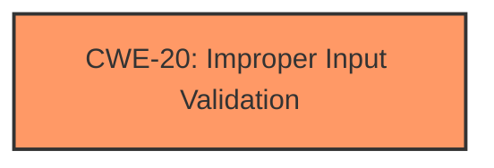

# Analysis Report for CVE-2024-45441

# Vulnerability Analysis Report: CVE-2024-45441

## Description

**Input verification vulnerability** in the system service module Impact Successful exploitation of this vulnerability will affect availability.

## Vulnerability Description Key Phrases

- **Rootcause:** Input verification vulnerability
- **Impact:** affect availability
- **Component:** system service module

## Analysis (with Relationship Data)

# Summary
| CWE ID | CWE Name | Confidence | CWE Abstraction Level | CWE Vulnerability Mapping Label | CWE-Vulnerability Mapping Notes |
|---|---|---|---|---|---|
| CWE-20 | Improper Input Validation | 0.75 | Class | Primary CWE | Discouraged |

## Evidence and Confidence

*   **Confidence Score:** 0.75
*   **Evidence Strength:** LOW

## Relationship Analysis
The primary CWE selected is CWE-20. It is a class level CWE, but the available information is limited. The retriever results suggested more specific CWEs, but the provided description does not allow for a more precise selection.



## Vulnerability Chain
The chain of the vulnerability consists of:
1.  **Root Cause:** **Input verification vulnerability** (CWE-20 Improper Input Validation).
2.  Impact: Affect availability.

The provided information is insufficient to determine the specific mechanism of how the **improper input validation** leads to the availability issue.

## Summary of Analysis
The vulnerability description indicates an **input verification vulnerability** in a system service module that affects availability.
The primary assigned CWE is CWE-20 (Improper Input Validation) because the root cause is described as **input verification vulnerability**.

The retriever results suggest CWE-20 Improper Input Validation as a candidate, but it is discouraged because it is too general. However, given the limited information, it's difficult to pinpoint a more specific CWE.

Other considered CWEs:
*   CWE-125 (Out-of-bounds Read): This could be a result of improper input validation leading to a buffer overflow/underflow, but there's no direct evidence.
*   CWE-119 (Improper Restriction of Operations within the Bounds of a Memory Buffer): Same reasoning as CWE-125.
*   CWE-94 (Improper Control of Generation of Code ('Code Injection')): This is not related to the vulnerability description.
*   CWE-347 (Improper Verification of Cryptographic Signature): There's no mention of cryptographic signatures in the description.

The final decision is to assign CWE-20 as the primary weakness due to the explicit mention of **input verification vulnerability**, but the confidence is relatively low due to the lack of details.


## CWE Relationship Analysis

Current CWEs represent these abstraction levels: .


### Vulnerability Chain Analysis

**Chain starting from CWE-94:**
- 94 (Improper Control of Generation of Code ('Code Injection')) - ROOT


**Chain starting from CWE-125:**
- 125 (Out-of-bounds Read) - ROOT


### CWE Relationship Diagram

```mermaid
graph TD
    classDef primary fill:#f96,stroke:#333,stroke-width:2px
    classDef secondary fill:#69f,stroke:#333
    classDef tertiary fill:#9e9,stroke:#333
```


*Report generated on 2025-07-13 16:30:28*
