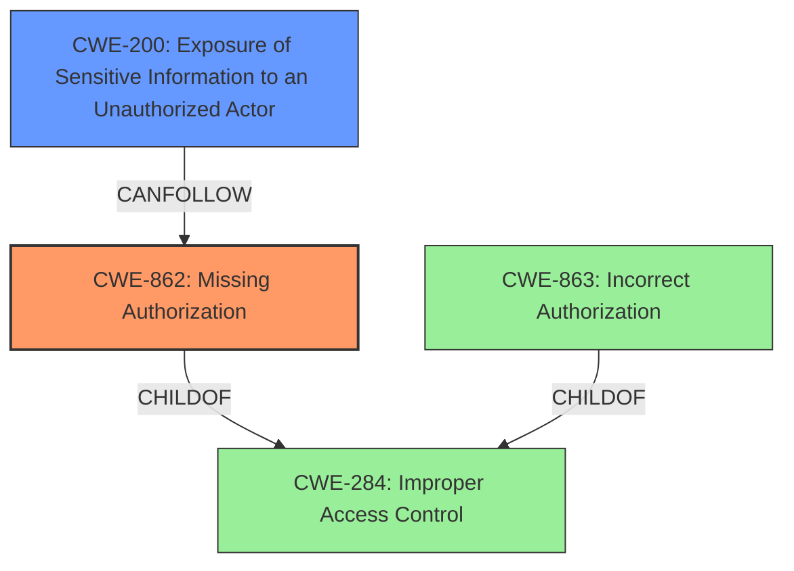

# Enhanced Analysis for CVE-2024-45444

# Summary
| CWE ID  | CWE Name                                                                  | Confidence | CWE Abstraction Level | CWE Vulnerability Mapping Label | CWE-Vulnerability Mapping Notes |
| :-------- | :------------------------------------------------------------------------ | :--------- | :-------------------- | :------------------------------ | :------------------------------ |
| CWE-862   | Missing Authorization                                                     | 0.9        | Class                 | Allowed-with-Review             | Primary CWE                     |
| CWE-200   | Exposure of Sensitive Information to an Unauthorized Actor                | 0.6        | Class                 | Discouraged                     | Secondary Candidate             |

## Evidence and Confidence

*   **Confidence Score:** 0.75
*   **Evidence Strength:** MEDIUM

## Relationship Analysis
The primary relationship influencing the CWE selection is the parent-child relationship between CWE-284 (Improper Access Control), CWE-863 (Incorrect Authorization), and CWE-862 (Missing Authorization). Given the **lack of** proper access permission verification, CWE-862 is more appropriate than its parent CWE-284. CWE-863 (Incorrect Authorization) was also considered, but the description suggests a **missing** check rather than an incorrect one. The potential impact of the vulnerability, affecting service confidentiality, links to CWE-200 (Exposure of Sensitive Information to an Unauthorized Actor) but is considered a secondary effect rather than the root cause.



## Vulnerability Chain
The vulnerability chain begins with the **missing authorization** check (CWE-862). This **lack of verification** allows unauthorized access, potentially leading to the exposure of sensitive information (CWE-200), ultimately affecting service confidentiality. The chain is: CWE-862 -> CWE-200.

## Summary of Analysis
The analysis is primarily based on the provided vulnerability description and the "CVE Reference Links Content Summary." The key phrase "Access permission **verification vulnerability**" suggests a problem with access control. Given that the issue is described as a **verification vulnerability**, the primary candidate CWEs were those related to authorization and access control. The retriever results also pointed towards CWE-862, CWE-863, and CWE-285 as potential matches.

The selection of CWE-862 is justified by the evidence that the authorization check is **missing**. If the check was present but implemented incorrectly, CWE-863 would be more appropriate. The provided information doesn't indicate an incorrect implementation, but rather the **absence** of a check. This aligns with the definition of CWE-862: "The product does not perform an authorization check when an actor attempts to access a resource or perform an action."

CWE-200 is included as a secondary CWE because the impact of the vulnerability is that it "may affect service confidentiality," which implies potential exposure of sensitive information. However, this is an impact rather than the root cause.

The selected CWEs are at the optimal level of specificity. While CWE-284 (Improper Access Control) is a parent of CWE-862, CWE-862 provides a more precise description of the vulnerability: the **authorization check is missing**. This is a more specific and actionable weakness.

Relevant CWE Information:

# Enhanced Context (25 CWEs)
The following CWEs were identified as potentially relevant to this vulnerability:

## CWE-280: Improper Handling of Insufficient Permissions or Privileges
**Abstraction Level**: Base
**Similarity Score**: 0.78
**Source**: dense

**Description**:
The product does not handle or incorrectly handles when it has insufficient privileges to access resources or functionality as specified by their permissions. This may cause it to follow unexpected code paths that may leave the product in an invalid state.

**Mapping Guidance**:
- Usage: Allowed
- Rationale: This CWE entry is at the Base level of abstraction, which is a preferred level of abstraction for mapping to the root causes of vulnerabilities.
*Not Used:* This CWE focuses on handling insufficient privileges, whereas the vulnerability description discusses the **lack of verification** of access permissions.

## CWE-266: Incorrect Privilege Assignment
**Abstraction Level**: Base
**Similarity Score**: 0.78
**Source**: dense

**Description**:
A product incorrectly assigns a privilege to a particular actor, creating an unintended sphere of control for that actor.

**Mapping Guidance**:
- Usage: Allowed
- Rationale: This CWE entry is at the Base level of abstraction, which is a preferred level of abstraction for mapping to the root causes of vulnerabilities.
*Not Used:* This CWE describes incorrect privilege assignment. The vulnerability is about a **missing authorization** check, not the assignment of privileges.

## CWE-274: Improper Handling of Insufficient Privileges
**Abstraction Level**: Base
**Similarity Score**: 0.77
**Source**: dense

**Description**:
The product does not handle or incorrectly handles when it has insufficient privileges to perform an operation, leading to resultant weaknesses.

**Mapping Guidance**:
- Usage: Discouraged
- Rationale: This CWE entry could be deprecated in a future version of CWE.
*Not Used:* Similar to CWE-280, this focuses on the handling of insufficient privileges, not the **absence** of an authorization check.

## CWE-267: Privilege Defined With Unsafe Actions
**Abstraction Level**: Base
**Similarity Score**: 0.77
**Source**: dense

**Description**:
A particular privilege, role, capability, or right can be used to perform unsafe actions that were not intended, even when it is assigned to the correct entity.

**Mapping Guidance**:
- Usage: Allowed
- Rationale: This CWE entry is at the Base level of abstraction, which is a preferred level of abstraction for mapping to the root causes of vulnerabilities.
*Not Used:* This CWE describes a scenario where a privilege allows unsafe actions. This doesn't align with the description of a **missing authorization** check.

## CWE-668: Exposure of Resource to Wrong Sphere
**Abstraction Level**: Class
**Similarity Score**: 0.76
**Source**: dense

**Description**:
The product exposes a resource to the wrong control sphere, providing unintended actors with inappropriate access to the resource.

**Mapping Guidance**:
- Usage: Discouraged
- Rationale: CWE-668 is high-level and is often misused as a catch-all when lower-level CWE IDs might be applicable. It is sometimes used for low-information vulnerability reports [REF-1287]. It is a level-1 Class (i.e., a child of a Pillar). It is not useful for trend analysis.
*Not Used:* While the vulnerability could lead to exposure of resources, the root cause is the **missing authorization** check.

## CWE-281: Improper Preservation of Permissions
**Abstraction Level**: Base
**Similarity Score**: 0.74
**Source**: dense

**Description**:
The product does not preserve permissions or incorrectly preserves permissions when copying, restoring, or sharing objects, which can cause them to have less restrictive permissions than intended.

**Mapping Guidance**:
- Usage: Allowed
- Rationale: This CWE entry is at the Base level of abstraction, which is a preferred level of abstraction for mapping to the root causes of vulnerabilities.
*Not Used:* This CWE is about improperly preserving permissions, not the **absence** of an initial authorization check.

## CWE-703: Improper Check or Handling of Exceptional Conditions
**Abstraction Level**: Pillar
**Similarity Score**: 0.74
**Source**: dense

**Description**:
The product does not properly anticipate or handle exceptional conditions that rarely occur during normal operation of the product.

**Mapping Guidance**:
- Usage: Discouraged
- Rationale: This CWE entry is extremely high-level, a Pillar.
*Not Used:* This is a very high-level CWE and doesn't describe the specific vulnerability.

## CWE-404: Improper Resource Shutdown or Release
**Abstraction Level**: Class
**Similarity Score**: 0.74
**Source**: dense

**Description**:
The product does not release or incorrectly releases a resource before it is made available for re-use.

**Mapping Guidance**:
- Usage: Allowed-with-Review
- Rationale: This CWE entry is a Class and might have Base-level children that would be more appropriate
*Not Used:* This CWE is not relevant to the **missing authorization** vulnerability.

## CWE-41: Improper Resolution of Path Equ


## CWE Relationship Analysis

Current CWEs represent these abstraction levels: .


### Vulnerability Chain Analysis

**Chain starting from CWE-274:**
- 274 (Improper Handling of Insufficient Privileges) - ROOT


**Chain starting from CWE-863:**
- 863 (Incorrect Authorization) - ROOT


### CWE Relationship Diagram

```mermaid
graph TD
    classDef primary fill:#f96,stroke:#333,stroke-width:2px
    classDef secondary fill:#69f,stroke:#333
    classDef tertiary fill:#9e9,stroke:#333
```