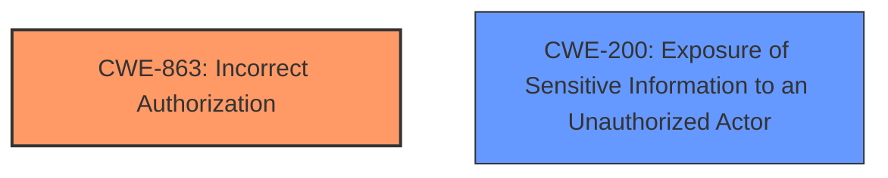

# Analysis for CVE-2024-45450

# Summary
| CWE ID | CWE Name | Confidence | CWE Abstraction Level | CWE Vulnerability Mapping Label | CWE-Vulnerability Mapping Notes |
|---|---|---|---|---|---|
| CWE-863 | Incorrect Authorization | 0.9 | Class | Allowed-with-Review | Primary CWE. The product performs an authorization check when an actor attempts to access a resource or perform an action, but it does not correctly perform the check. |
| CWE-200 | Exposure of Sensitive Information to an Unauthorized Actor | 0.6 | Class | Discouraged | Secondary. The vulnerability leads to service confidentiality being affected, resulting in the exposure of sensitive information. |

## Evidence and Confidence

*   **Confidence Score:** 0.75
*   **Evidence Strength:** MEDIUM

## Relationship Analysis
The primary CWE is CWE-863, which is a Class-level CWE. Several Base-level CWEs are children of CWE-863, but the provided description does not give sufficient information to determine if any of them are a more appropriate fit. CWE-200 is included as a secondary weakness, representing the impact of the vulnerability.

## Vulnerability Chain
The vulnerability chain starts with **incorrect authorization** (CWE-863), which leads to the impact of affecting service confidentiality, resulting in the **exposure of sensitive information** (CWE-200).

## Summary of Analysis
The vulnerability description indicates a **permission control vulnerability** in the software update module. The primary impact of this vulnerability is that successful exploitation may affect service confidentiality.

The primary CWE is CWE-863 (**Incorrect Authorization**). This CWE is chosen because the description explicitly mentions a "**permission control vulnerability**," which aligns with the concept of authorization. Specifically, CWE-863 describes a situation where the product performs an authorization check, but the check is not performed correctly. The "Retriever Results" also lists CWE-863 with a relatively high score, further supporting this choice.

CWE-200 (**Exposure of Sensitive Information to an Unauthorized Actor**) is included as a secondary CWE. This is because the vulnerability affects "service confidentiality," implying that sensitive information may be exposed. While CWE-200 is often misused, in this case, it accurately represents the impact of the **permission control vulnerability**.

Other CWEs were considered but not selected. CWE-285 (**Improper Authorization**) was a close contender, but CWE-863 was chosen because it specifically addresses cases where authorization checks are present but performed incorrectly. CWE-266 (**Incorrect Privilege Assignment**) and CWE-269 (**Improper Privilege Management**) were also considered, but they focus more on privilege-related issues, whereas the description highlights a **permission control vulnerability**, which is more closely related to authorization.

The selected CWEs are at the optimal level of specificity because they accurately reflect the root cause and impact of the vulnerability, based on the available information. More specific CWEs might exist, but the current description lacks the necessary details to make a more precise classification.