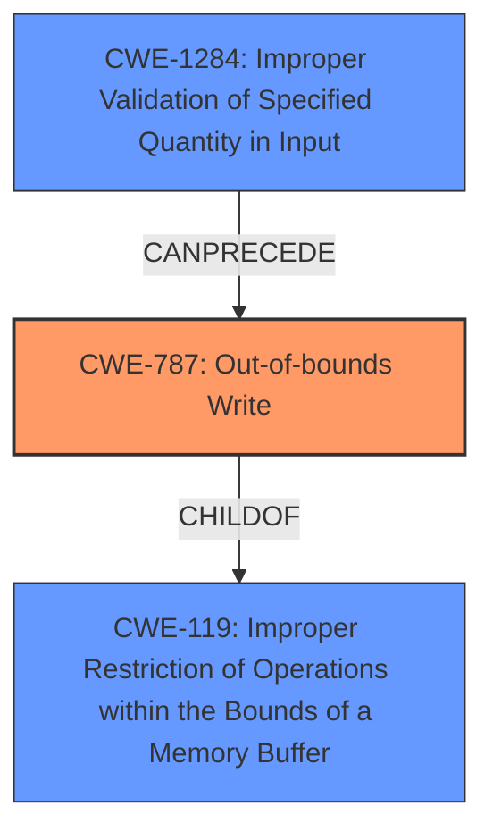

# Analysis for CVE-2024-45468

# Summary
| CWE ID | CWE Name | Confidence | CWE Abstraction Level | CWE Vulnerability Mapping Label | CWE-Vulnerability Mapping Notes |
|---|---|---|---|---|---|
| CWE-787 | Out-of-bounds Write | 0.9 | Base | Primary | Allowed |
| CWE-1284 | Improper Validation of Specified Quantity in Input | 0.6 | Base | Secondary | Allowed |
| CWE-119 | Improper Restriction of Operations within the Bounds of a Memory Buffer | 0.5 | Class | Secondary | Discouraged |

## Evidence and Confidence

*   **Confidence Score:** 0.8
*   **Evidence Strength:** HIGH

## Relationship Analysis
The primary CWE is CWE-787, which represents the **out-of-bounds write**. CWE-787 is a child of CWE-119, which describes improper restrictions of operations within memory buffers. CWE-1284, is present because the application **does not validate or incorrectly validates that the quantity has the required properties**.
The relationship between CWE-1284 and CWE-787 is that improper input validation (CWE-1284) can lead to an out-of-bounds write (CWE-787).

## Vulnerability Chain
The vulnerability chain starts with the parsing of a specially crafted WRL file. The **improper validation** of the specified quantity in the input file(CWE-1284) leads to a **memory corruption** due to an **out-of-bounds write** (CWE-787). This allows an attacker to execute arbitrary code.

## Summary of Analysis
The primary vulnerability is due to **memory corruption** which occurs while parsing specially crafted WRL files. The key phrase "memory corruption" and the CVE Reference Links Content Summary, point to **CWE-119: Improper Restriction of Operations within the Bounds of a Memory Buffer**. Since it is due to parsing a file, and the file has a specified quantity, **CWE-1284: Improper Validation of Specified Quantity in Input** is also present. The most specific CWE for this case is **CWE-787: Out-of-bounds Write**, which describes the root cause of the **memory corruption** when parsing the specially crafted WRL files.

The **CWE for similar CVE Descriptions** lists CWE-787 as a top CWE.

*   **CWE-787: Out-of-bounds Write** is selected as the primary CWE because the vulnerability description explicitly mentions memory corruption due to parsing specially crafted files, leading to an out-of-bounds write. The "CVE Reference Links Content Summary" confirms this, stating that the vulnerability leads to memory corruption.
*   **CWE-1284: Improper Validation of Specified Quantity in Input** is selected as a secondary CWE because the specially crafted WRL files are not properly validated by the affected application.
*   **CWE-119: Improper Restriction of Operations within the Bounds of a Memory Buffer** is considered a relevant, but less specific, CWE. CWE-787 is a child of CWE-119, and is a more descriptive and specific classification.

Relevant CWE Information:

# Enhanced Context (25 CWEs)
The following CWEs were identified as potentially relevant to this vulnerability:

## CWE-824: Access of Uninitialized Pointer
**Abstraction Level**: Base
**Similarity Score**: 0.73
**Source**: dense

**Description**:
The product accesses or uses a pointer that has not been initialized.

**Mapping Guidance**:
- Usage: Allowed
- Rationale: This CWE entry is at the Base level of abstraction, which is a preferred level of abstraction for mapping to the root causes of vulnerabilities.

*   Not Selected: This CWE does not directly relate to the **memory corruption** issue described. There is no evidence of uninitialized pointers being accessed.

## CWE-303: Incorrect Implementation of Authentication Algorithm
**Abstraction Level**: Base
**Similarity Score**: 0.70
**Source**: dense

**Description**:
The requirements for the product dictate the use of an established authentication algorithm, but the implementation of the algorithm is incorrect.

**Mapping Guidance**:
- Usage: Allowed
- Rationale: This CWE entry is at the Base level of abstraction, which is a preferred level of abstraction for mapping to the root causes of vulnerabilities.

*   Not Selected: This CWE is not relevant as the vulnerability does not involve authentication.

## CWE-119: Improper Restriction of Operations within the Bounds of a Memory Buffer
**Abstraction Level**: Class
**Similarity Score**: 0.70
**Source**: dense

**Description**:
The product performs operations on a memory buffer, but it reads from or writes to a memory location outside the buffer's intended boundary. This may result in read or write operations on unexpected memory locations that could be linked to other variables, data structures, or internal program data.

**Mapping Guidance**:
- Usage: Discouraged
- Rationale: CWE-119 is commonly misused in low-information vulnerability reports when lower-level CWEs could be used instead, or when more details about the vulnerability are available.

*   Selected as Secondary: While CWE-119 is a parent of CWE-787, and thus related, it is less specific. The vulnerability details allow us to pinpoint the issue as an out-of-bounds write.

## CWE-294: Authentication Bypass by Capture-replay
**Abstraction Level**: Base
**Similarity Score**: 0.70
**Source**: dense

**Description**:
A capture-replay flaw exists when the design of the product makes it possible for a malicious user to sniff network traffic and bypass authentication by replaying it to the server in question to the same effect as the original message (or with minor changes).

**Mapping Guidance**:
- Usage: Allowed
- Rationale: This CWE entry is at the Base level of abstraction, which is a preferred level of abstraction for mapping to the root causes of vulnerabilities.

*   Not Selected: This CWE is not applicable as the vulnerability does not involve authentication or network traffic replay.

## CWE-755: Improper Handling of Exceptional Conditions
**Abstraction Level**: Class
**Similarity Score**: 0.70
**Source**: dense

**Description**:
The product does not handle or incorrectly handles an exceptional condition.

**Mapping Guidance**:
- Usage: Discouraged
- Rationale: This CWE entry is a level-1 Class (i.e., a child of a Pillar). It might have lower-level children that would be more appropriate

*   Not Selected: This CWE is too general. While an exception might occur due to the **memory corruption**, it's not the root cause.

## CWE-668: Exposure of Resource to Wrong Sphere
**Abstraction Level**: Class
**Similarity Score**: 0.70
**Source**: dense

**Description**:
The product exposes a resource to the wrong control sphere, providing unintended actors with inappropriate access to the resource.

**Mapping Guidance**:
- Usage: Discouraged
- Rationale: CWE-668 is high-level and is often misused as a catch-all when lower-level CWE IDs might be applicable. It is sometimes used for low-information vulnerability reports [REF-1287]. It is a level-1 Class (i.e., a child of a Pillar). It is not useful for trend analysis.

*   Not Selected: This CWE does not fit the vulnerability's nature, which is centered around memory corruption due to malformed file parsing.

## CWE-789: Memory Allocation with Excessive Size Value
**Abstraction Level**: Variant
**Similarity Score**: 0.69
**Source**: dense

**Description**:
The product allocates memory based on an untrusted, large size value, but it does not ensure that the size is within expected limits, allowing arbitrary amounts of memory to be allocated.

**Mapping Guidance**:
- Usage: Allowed
- Rationale: This CWE entry is at the Variant level of abstraction, which is a preferred level of abstraction for mapping to the root causes of vulnerabilities.

*Not Selected:* There's no indication of excessive memory allocation based on untrusted size values.

## CWE-497: Exposure of Sensitive System Information to an Unauthorized Control Sphere
**Abstraction Level**: Base
**Similarity Score**: 0.69
**Source**: dense

**Description**:
The product does not properly prevent sensitive system-level information from being accessed by unauthorized actors who do not have the same level of access to the