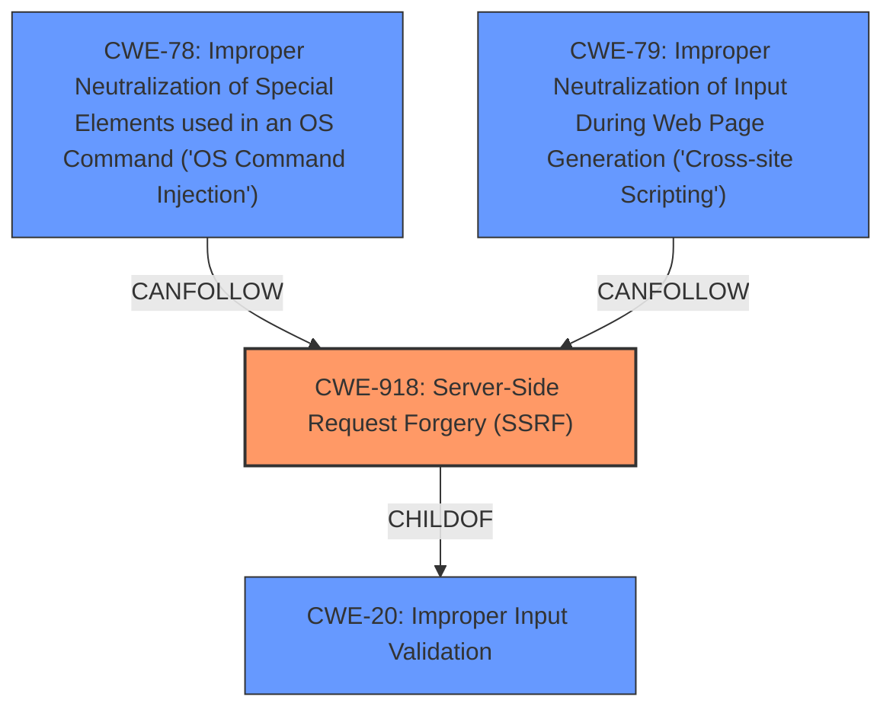

# Raw Analyzer Response for CVE-2024-45518

# Summary
| CWE ID | CWE Name | Confidence | CWE Abstraction Level | CWE Vulnerability Mapping Label | CWE-Vulnerability Mapping Notes |
|---|---|---|---|---|---|
| CWE-918 | Server-Side Request Forgery (SSRF) | 1.0 | Base | Primary | Allowed |
| CWE-20 | Improper Input Validation | 0.8 | Class | Secondary | Allowed-with-Review |
| CWE-78 | Improper Neutralization of Special Elements used in an OS Command ('OS Command Injection') | 0.7 | Base | Secondary | Allowed |
| CWE-79 | Improper Neutralization of Input During Web Page Generation ('Cross-site Scripting') | 0.7 | Base | Secondary | Allowed |

## Evidence and Confidence

*   **Confidence Score:** 0.8
*   **Evidence Strength:** HIGH

## Relationship Analysis
The primary weakness is **CWE-918 Server-Side Request Forgery (SSRF)**, which occurs due to **improper input sanitization and misconfigured domain whitelisting**. This allows unauthorized HTTP requests. **CWE-20 Improper Input Validation** is a high-level class that **CWE-918 Server-Side Request Forgery (SSRF)** can be a child of, and contributes to the root cause. The **Command Injection** can be represented by **CWE-78 Improper Neutralization of Special Elements used in an OS Command ('OS Command Injection')**. The **XSS** can be represented by **CWE-79 Improper Neutralization of Input During Web Page Generation ('Cross-site Scripting')**.

## Vulnerability Chain
The vulnerability chain starts with **improper input sanitization and misconfigured domain whitelisting**, which leads to **CWE-918 Server-Side Request Forgery (SSRF)**. This SSRF allows unauthorized HTTP requests to internal services. By chaining **Command Injection** (**CWE-78 Improper Neutralization of Special Elements used in an OS Command ('OS Command Injection')**) within the internal service, and combining with existing **XSS** vulnerabilities (**CWE-79 Improper Neutralization of Input During Web Page Generation ('Cross-site Scripting')**), it leads to Remote Code Execution (RCE).

## Summary of Analysis
The primary issue is **CWE-918 Server-Side Request Forgery (SSRF)**, caused by **improper input sanitization and misconfigured domain whitelisting**. The vulnerability description explicitly mentions **Server-Side Request Forgery (SSRF)** due to **improper input sanitization and misconfigured domain whitelisting**. This is the most accurate and specific CWE for the root cause. The **Command Injection** and **XSS** are secondary issues that are chained with the **SSRF** to achieve Remote Code Execution (RCE). **CWE-20 Improper Input Validation** is selected because it is a contributing factor to the root cause of **CWE-918 Server-Side Request Forgery (SSRF)**.

Relevant CWE Information:
*   **CWE-918: Server-Side Request Forgery (SSRF)** - The core vulnerability that allows unauthorized requests.
*   **CWE-20: Improper Input Validation** - Contributes to the root cause.
*   **CWE-78: Improper Neutralization of Special Elements used in an OS Command ('OS Command Injection')** - Secondary weakness chained with SSRF.
*   **CWE-79: Improper Neutralization of Input During Web Page Generation ('Cross-site Scripting')** - Secondary weakness chained with SSRF.