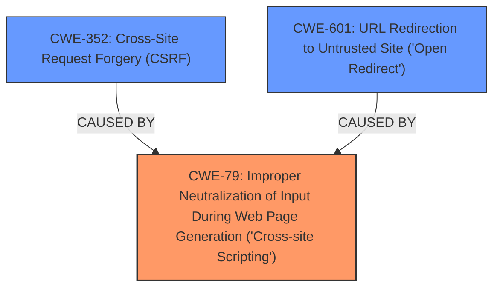

# Analysis for CVE-2024-45527

# Summary
| CWE ID | CWE Name | Confidence | CWE Abstraction Level | CWE Vulnerability Mapping Label | CWE-Vulnerability Mapping Notes |
|---|---|---|---|---|---|
| CWE-79 | Improper Neutralization of Input During Web Page Generation ('Cross-site Scripting') | 1.0 | Base | Allowed | Primary CWE. The **improper input sanitization** leads to **HTML injection**. |
| CWE-352 | Cross-Site Request Forgery (CSRF) | 0.7 | Compound | Allowed | Secondary CWE. HTML injection used to perform CSRF. |
| CWE-601 | URL Redirection to Untrusted Site ('Open Redirect') | 0.7 | Base | Allowed | Secondary CWE. HTML injection used to insert link to phishing website. |

## Evidence and Confidence

*   **Confidence Score:** 0.9
*   **Evidence Strength:** HIGH

## Relationship Analysis
The primary weakness is CWE-79, which allows for the secondary weaknesses of CWE-352 and CWE-601. CWE-79 is a base level CWE, which is preferred. CWE-352 and CWE-601 are also base level CWEs, however they are impacts of the primary weakness of CWE-79.

## Vulnerability Chain
The vulnerability chain starts with **improper input sanitization** (**rootcause**) leading to **HTML injection** (CWE-79), which then allows for either logout CSRF (CWE-352) or phishing via redirect to an external site (CWE-601).

## Summary of Analysis
The analysis is strongly supported by the provided evidence. The key phrases clearly indicate **improper input sanitization** as the root cause, resulting in **HTML injection**. The vulnerability description and CVE summary also confirm that this **HTML injection** can lead to CSRF and phishing. Therefore, CWE-79 is the primary weakness, and CWE-352 and CWE-601 are secondary weaknesses resulting from the **HTML injection**.

The selection of CWE-79 is at the optimal level of specificity because it directly addresses the **improper neutralization** of input that leads to **HTML injection**. It is a base level CWE, which is preferred.

Other CWEs Considered:
*   CWE-116: Improper Encoding or Escaping of Output: This is similar to CWE-79, but CWE-79 is a more specific type of **improper neutralization** that leads to **HTML injection**.
*   CWE-89: Improper Neutralization of Special Elements used in an SQL Command ('SQL Injection'): Not applicable because the vulnerability involves **HTML injection**, not SQL injection.
*   CWE-434: Unrestricted Upload of File with Dangerous Type: Not applicable because the vulnerability does not involve file uploads.
*   CWE-451: User Interface (UI) Misrepresentation of Critical Information: This could be tangentially related to the phishing aspect, but CWE-601 covers that aspect directly.
*   CWE-184: Incomplete List of Disallowed Inputs: This is a more general weakness and CWE-79 is more specific to the issue of **HTML injection**.