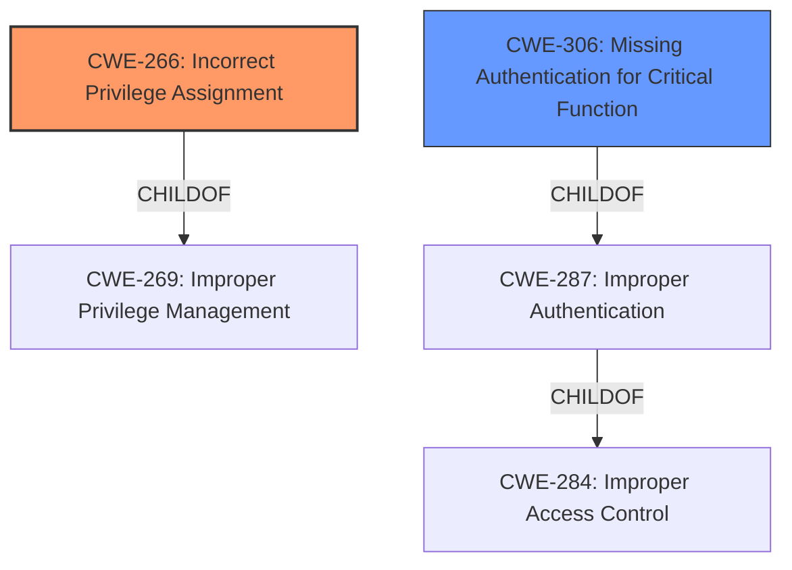

# Enhanced Analysis for CVE-2024-4555

# Summary
| CWE ID | CWE Name | Confidence | CWE Abstraction Level | CWE Vulnerability Mapping Label | CWE-Vulnerability Mapping Notes |
|---|---|---|---|---|---|
| CWE-266 | Incorrect Privilege Assignment | 0.8 | Base | Primary CWE | Allowed |
| CWE-306 | Missing Authentication for Critical Function | 0.5 | Base | Secondary Candidate | Allowed |

## Evidence and Confidence

*   **Confidence Score:** 0.7
*   **Evidence Strength:** MEDIUM

## Relationship Analysis
The primary relationship influencing the CWE selection is the parent-child relationship, specifically how CWE-266 (Incorrect Privilege Assignment) is a more specific manifestation of broader privilege management issues. While CWE-269 (Improper Privilege Management) is suggested by the retriever, it is discouraged due to its high-level nature. The decision favors CWE-266 due to the specific phrase "**Improper Privilege Management**" in the vulnerability description combined with the user account impersonation impact. CWE-306 is considered as a possible secondary weakness if the impersonation resulted from missing authentication, suggesting a potential chain where missing authentication leads to privilege mismanagement. The abstraction levels guided the selection towards Base CWEs for greater specificity.



## Vulnerability Chain
The vulnerability chain starts with **Improper Privilege Management** (CWE-269), which leads to a more specific **Incorrect Privilege Assignment** (CWE-266), ultimately resulting in user account impersonation. A potential missing authentication (CWE-306) could be a precursor if the impersonation occurs due to the lack of proper authentication mechanisms.

## Summary of Analysis
The initial analysis focused on the **rootcause**, which is explicitly stated as "**Improper Privilege Management**". However, the retriever results and the provided guidance suggest that a more specific CWE should be identified if possible. The vulnerability description key phrases highlight "**Improper Privilege Management**" as the root cause and user account impersonation as the impact. The analysis considered the relationship between privilege and permission and the guidance provided for selecting appropriate CWEs. The evidence, though limited, points towards **Incorrect Privilege Assignment** (CWE-266) as the primary weakness due to the direct connection to privilege management and the resulting impersonation.

The alternative candidate CWE-306 was considered because if the impersonation was successful because of a missing authentication check, that would also be the root cause. Given that the document doesn't specify the mechanism of impersonation a confidence level of 0.5 was assigned to the candidate CWE-306.

Relevant CWE Information:

*   **CWE-266 Incorrect Privilege Assignment:** This is the primary CWE. The vulnerability involves **improper privilege management** which allows for user account impersonation. This aligns with CWE-266 because it directly relates to incorrectly assigning privileges, leading to unintended access. The security implication is unauthorized access to user accounts, potentially leading to sensitive data exposure or malicious activities.
*   **CWE-306 Missing Authentication for Critical Function:** This is a secondary candidate. If the **improper privilege management** stems from a lack of authentication, this CWE would also be relevant. It represents a scenario where a critical function (accessing a user account) lacks proper authentication, allowing impersonation. This would be a prerequisite to the privilege mismanagement.

CWEs considered but not used:

*   CWE-269 (Improper Privilege Management): While initially considered due to the description, it is a Class-level CWE and discouraged for direct mapping when more specific Base-level CWEs are available.
*   CWE-287 (Improper Authentication) and CWE-285 (Improper Authorization): These were considered but deemed less directly relevant than CWE-266, as the core issue appears to be the incorrect assignment of privileges rather than a general authentication or authorization failure.
*   CWE-732 (Incorrect Permission Assignment for Critical Resource): This was considered, but the focus on "privilege" rather than "permission" makes CWE-266 a better fit.


## CWE Relationship Analysis

Current CWEs represent these abstraction levels: .


### Vulnerability Chain Analysis

**Chain starting from CWE-732:**
- 732 (Incorrect Permission Assignment for Critical Resource) - ROOT


**Chain starting from CWE-306:**
- 306 (Missing Authentication for Critical Function) - ROOT


### CWE Relationship Diagram

```mermaid
graph TD
    classDef primary fill:#f96,stroke:#333,stroke-width:2px
    classDef secondary fill:#69f,stroke:#333
    classDef tertiary fill:#9e9,stroke:#333
```