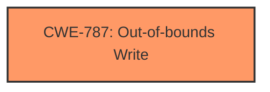

# Analysis Report for CVE-2024-45565

# Vulnerability Analysis Report: CVE-2024-45565

## Description

Memory corruption when blob structure is modified by user-space after kernel verification.

## Vulnerability Description Key Phrases

- **Weakness:** memory corruption

## Analysis (with Relationship Data)

# Summary
| CWE ID | CWE Name | Confidence | CWE Abstraction Level | CWE Vulnerability Mapping Label | CWE-Vulnerability Mapping Notes |
|---|---|---|---|---|---|
| CWE-787 | Out-of-bounds Write | 0.9 | Base | Allowed | Primary CWE |

## Evidence and Confidence

*   **Confidence Score:** 0.9
*   **Evidence Strength:** LOW

## Relationship Analysis
The primary relationship to consider is that CWE-787 is a base CWE. Other CWEs were considered, especially those related to memory corruption and buffer overflows/over-reads, but CWE-787 appears to be the most direct fit based on the limited information provided.



## Vulnerability Chain
The vulnerability chain is simple: a blob structure is modified by user-space after kernel verification which leads to **memory corruption**. The root cause is the **memory corruption** which is an Out-of-bounds Write.

## Summary of Analysis
The vulnerability description indicates **memory corruption** due to a user-space modification of a blob structure after kernel verification. This suggests a potential **out-of-bounds write**, where user-space writes beyond the intended boundaries of the memory allocated for the blob.

The evidence is weak as the vulnerability description is very short.

CWE-787 (Out-of-bounds Write) is selected as the primary CWE due to the **memory corruption**.

Other CWEs considered:

*   CWE-125 (Out-of-bounds Read): While a read could occur, the description focuses on modification (**memory corruption**), suggesting a write operation is the primary concern.
*   CWE-122 (Heap-based Buffer Overflow): This is a more specific type of out-of-bounds write, but the description doesn't explicitly mention the heap, so using the more general CWE-787 is more appropriate.
*   CWE-415 (Double Free): This is not relevant to the description as there is no mention of freeing memory.
*   CWE-667 (Improper Locking): This is not relevant to the description as there is no mention of locking.

CWE-787 is at the base level of abstraction, which is the preferred level.

Relevant CWE Information:

# Enhanced Context (25 CWEs)
The following CWEs were identified as potentially relevant to this vulnerability:

## CWE-787: Out-of-bounds Write
**Abstraction Level**: base
**Similarity Score**: 4.33
**Source**: graph

**Description**:
CWE-787: Out-of-bounds Write

**Mapping Guidance**:
- Usage: Allowed
- Rationale: This CWE entry is at the Base level of abstraction, which is a preferred level of abstraction for mapping to the root causes of vulnerabilities.

**Relationships**:
- CANFOLLOW -> CWE-825
- CANFOLLOW -> CWE-824
- CANFOLLOW -> CWE-823
- CANFOLLOW -> CWE-822
- PARENTOF -> CWE-124


## CWE Relationship Analysis

Current CWEs represent these abstraction levels: .


### Vulnerability Chain Analysis

**Chain starting from CWE-823:**
- 823 (Use of Out-of-range Pointer Offset) - ROOT


**Chain starting from CWE-125:**
- 125 (Out-of-bounds Read) - ROOT


### CWE Relationship Diagram

```mermaid
graph TD
    classDef primary fill:#f96,stroke:#333,stroke-width:2px
    classDef secondary fill:#69f,stroke:#333
    classDef tertiary fill:#9e9,stroke:#333
```


*Report generated on 2025-07-13 16:43:43*
