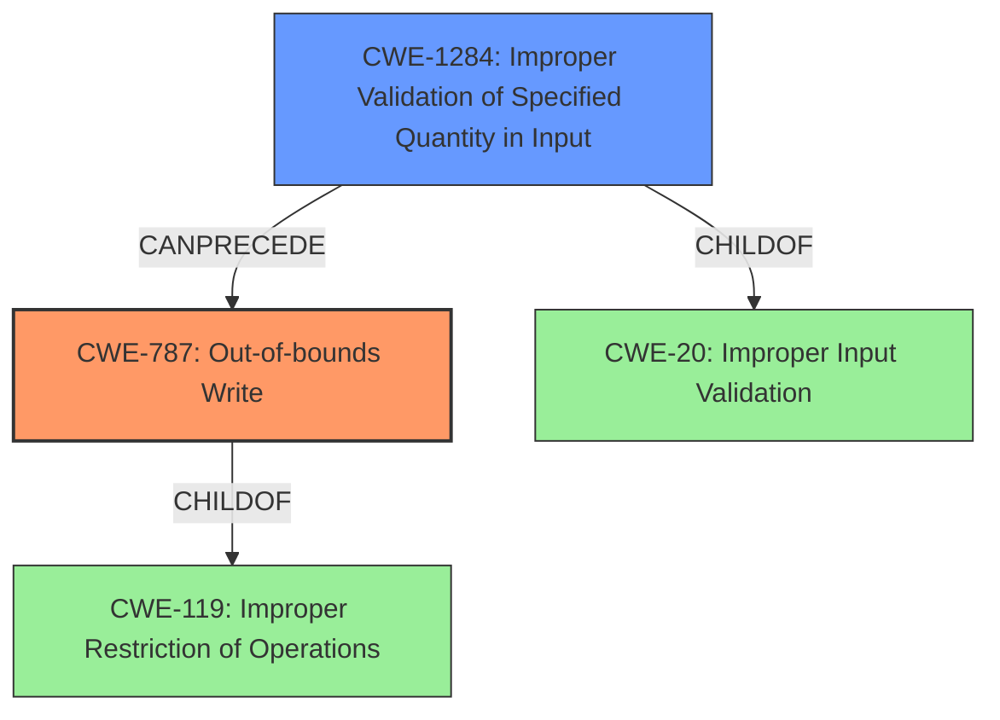

# Analysis Report for CVE-2024-45570

# Vulnerability Analysis Report: CVE-2024-45570

## Description

Memory corruption may occur during IO configuration processing when the IO port count is invalid.

## Vulnerability Description Key Phrases

- **Weakness:** memory corruption
- **Component:** IO configuration processing

## Analysis (with Relationship Data)

# Summary
| CWE ID | CWE Name | Confidence | CWE Abstraction Level | CWE Vulnerability Mapping Label | CWE-Vulnerability Mapping Notes |
|---|---|---|---|---|---|
| CWE-787 | Out-of-bounds Write | 0.9 | Base | Allowed | Primary CWE: The vulnerability involves memory corruption due to an invalid IO port count, which can lead to writing outside the intended memory boundaries. |
| CWE-1284 | Improper Validation of Specified Quantity in Input | 0.7 | Base | Allowed | Secondary Candidate: The invalid IO port count suggests a failure to properly validate the input quantity. |

## Evidence and Confidence

*   **Confidence Score:** 0.8
*   **Evidence Strength:** MEDIUM

## Relationship Analysis
The primary CWE is CWE-787 (Out-of-bounds Write), which is a base-level CWE. CWE-787 is a child of CWE-119 (Improper Restriction of Operations within the Bounds of a Memory Buffer). CWE-1284 (Improper Validation of Specified Quantity in Input) could be a cause of the out-of-bounds write. It is a base-level CWE and child of CWE-20 (Improper Input Validation).



## Vulnerability Chain
The vulnerability chain starts with **improper validation** of the IO port count (CWE-1284), which leads to an **out-of-bounds write** (CWE-787), resulting in **memory corruption**.
- CWE-1284: Improper Validation of Specified Quantity in Input (Root Cause)
- CWE-787: Out-of-bounds Write (Impact)

## Summary of Analysis
The vulnerability description indicates that **memory corruption** occurs due to an invalid IO port count during IO configuration processing. This suggests that the software **writes data outside the intended memory boundaries**, which aligns with CWE-787 (Out-of-bounds Write). The phrase "invalid IO port count" points to a potential **failure in validating the input quantity**, making CWE-1284 (Improper Validation of Specified Quantity in Input) a relevant secondary consideration.

The retriever results also strongly suggest CWE-787 (Out-of-bounds Write) as the primary candidate, with a score of 1.000.

CWE-190 (Integer Overflow or Wraparound) was considered but not selected as the description does not explicitly mention an integer overflow condition. Similarly, CWE-415 (Double Free) and CWE-416 (Use After Free) were not selected because the description doesn't imply issues related to memory management like double freeing or use-after-free scenarios. CWE-123 (Write-what-where Condition) was also considered but deemed less specific than CWE-787, as the primary issue is writing outside the bounds rather than a general write-what-where condition.

The selected CWEs are at the base level of abstraction, providing a detailed representation of the vulnerability. CWE-787 accurately captures the **out-of-bounds write** leading to **memory corruption**, while CWE-1284 identifies the **improper input validation** that contributes to the vulnerability.


## CWE Relationship Analysis

Current CWEs represent these abstraction levels: .


### Vulnerability Chain Analysis

**Chain starting from CWE-123:**
- 123 (Write-what-where Condition) - ROOT


**Chain starting from CWE-1284:**
- 1284 (Improper Validation of Specified Quantity in Input) - ROOT


### CWE Relationship Diagram

```mermaid
graph TD
    classDef primary fill:#f96,stroke:#333,stroke-width:2px
    classDef secondary fill:#69f,stroke:#333
    classDef tertiary fill:#9e9,stroke:#333
```


*Report generated on 2025-07-13 16:44:21*
