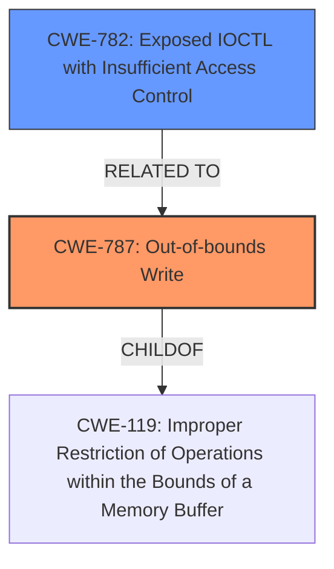

# Analysis Report for CVE-2024-45584

# Vulnerability Analysis Report: CVE-2024-45584

## Description

Memory corruption can occur when a compat IOCTL call is followed by a normal IOCTL call from userspace.

## Vulnerability Description Key Phrases

- **Weakness:** memory corruption
- **Component:** compat IOCTL call followed by normal IOCTL call

## Analysis (with Relationship Data)

# Summary
| CWE ID | CWE Name | Confidence | CWE Abstraction Level | CWE Vulnerability Mapping Label | CWE-Vulnerability Mapping Notes |
|---|---|---|---|---|---|
| CWE-787 | Out-of-bounds Write | 0.8 | Base | Primary | Allowed |
| CWE-782 | Exposed IOCTL with Insufficient Access Control | 0.4 | Variant | Secondary | Allowed |

## Evidence and Confidence

*   **Confidence Score:** 0.6
*   **Evidence Strength:** LOW

## Relationship Analysis
The primary relationship considered was the parent-child relationship between CWE-119 (Improper Restriction of Operations within the Bounds of a Memory Buffer) and CWE-787, where CWE-787 is a specific type of out-of-bounds write. The weakness involves memory corruption caused by a specific sequence of IOCTL calls, which hints at a potential issue with access control, motivating the consideration of CWE-782.



## Vulnerability Chain
The vulnerability chain starts with the specific sequence of "compat IOCTL call followed by normal IOCTL call," leading to the root cause of **memory corruption**, which is manifested as an out-of-bounds write.

## Summary of Analysis
The initial assessment identified CWE-787 as the primary candidate due to the description of **memory corruption**, which is a strong indicator of out-of-bounds write. The retriever results also listed CWE-787 as the top candidate. However, the vulnerability description mentions that this **memory corruption** occurs due to a "compat IOCTL call followed by normal IOCTL call from userspace," suggesting a potential issue related to exposed IOCTLs with insufficient access control, leading to the consideration of CWE-782.

The evidence is weak because the description is not detailed enough to pinpoint the exact mechanism causing the **memory corruption**. The selection of CWE-787 is primarily based on the general description of **memory corruption**. The inclusion of CWE-782 is speculative and based on the context of IOCTL calls.

The selected CWEs are at the base and variant level, respectively, which offers a balance between specificity and coverage of the observed vulnerability.

Relevant CWE Information:

# Enhanced Context (25 CWEs)
The following CWEs were identified as potentially relevant to this vulnerability:

## CWE-782: Exposed IOCTL with Insufficient Access Control
**Abstraction Level**: Variant
**Similarity Score**: 0.74
**Source**: dense

**Description**:
The product implements an IOCTL with functionality that should be restricted, but it does not properly enforce access control for the IOCTL.

**Mapping Guidance**:
- Usage: Allowed
- Rationale: This CWE entry is at the Variant level of abstraction, which is a preferred level of abstraction for mapping to the root causes of vulnerabilities.

## CWE-787: Out-of-bounds Write
**Abstraction Level**: Base
**Similarity Score**: 4.33
**Source**: graph

**Description**:
CWE-787: Out-of-bounds Write

**Mapping Guidance**:
- Usage: Allowed
- Rationale: This CWE entry is at the Base level of abstraction, which is a preferred level of abstraction for mapping to the root causes of vulnerabilities.

**Relationships**:
- CANFOLLOW -> CWE-825
- CANFOLLOW -> CWE-824
- CANFOLLOW -> CWE-823
- CANFOLLOW -> CWE-822
- PARENTOF -> CWE-124

**CWE-787: Out-of-bounds Write**
*   **Technical Explanation:** The vulnerability description explicitly mentions **memory corruption**, which aligns directly with the characteristics of CWE-787 (Out-of-bounds Write). This occurs when data is written outside the intended buffer boundaries.
*   **Security Implications:** This can lead to arbitrary code execution, denial of service, or information disclosure.
*   **Relationship Analysis:** CWE-787 is a child of CWE-119 (Improper Restriction of Operations within the Bounds of a Memory Buffer), indicating a more specific instance of a broader class of buffer-related vulnerabilities.
*   **Mapping Guidance:** The MITRE mapping guidance allows for the use of CWE-787 at the Base level.
*   **Primary/Secondary:** Primary

**CWE-782: Exposed IOCTL with Insufficient Access Control**
*   **Technical Explanation:** The vulnerability involves a "compat IOCTL call followed by normal IOCTL call from userspace." This sequence suggests that an IOCTL, which should be restricted, might be accessible due to **insufficient access control**.
*   **Security Implications:** An attacker could potentially exploit this **insufficient access control** to trigger unintended operations or bypass security mechanisms.
*   **Relationship Analysis:** There is no direct hierarchical relationship, but the IOCTL context suggests this as a potential contributing factor.
*   **Mapping Guidance:** The MITRE mapping guidance allows for the use of CWE-782 at the Variant level.
*   **Primary/Secondary:** Secondary

**CWEs Considered But Not Used:**

*   CWE-131 (Incorrect Calculation of Buffer Size): While a buffer overflow could be the root cause of the **memory corruption**, the description does not provide enough information to confirm this.
*   CWE-415 (Double Free) and CWE-416 (Use After Free): These are other potential causes of memory corruption, but the description does not point to these specifically.
*   CWE-823 (Use of Out-of-range Pointer Offset) and CWE-822 (Untrusted Pointer Dereference): These CWEs are related to pointer manipulation, but the description doesn't provide enough detail to determine if they are involved.
*   CWE-134 (Use of Externally-Controlled Format String): This is unlikely in the context of IOCTL calls.
*   CWE-394 (Unexpected Status Code or Return Value): The description doesn't focus on status code issues, but rather memory corruption.
*   CWE-909 (Missing Initialization of Resource): The vulnerability description doesn't indicate missing initialization.
*   CWE-762 (Mismatched Memory Management Routines): There is no specific evidence of mismatched memory management routines.
*   CWE-123 (Write-what-where Condition): This is a more specific type of memory corruption, but the description doesn't provide enough information to confirm this.


## CWE Relationship Analysis

Current CWEs represent these abstraction levels: .


### Vulnerability Chain Analysis

**Chain starting from CWE-123:**
- 123 (Write-what-where Condition) - ROOT


**Chain starting from CWE-394:**
- 394 (Unexpected Status Code or Return Value) - ROOT


### CWE Relationship Diagram

```mermaid
graph TD
    classDef primary fill:#f96,stroke:#333,stroke-width:2px
    classDef secondary fill:#69f,stroke:#333
    classDef tertiary fill:#9e9,stroke:#333
```


*Report generated on 2025-07-13 16:45:44*
