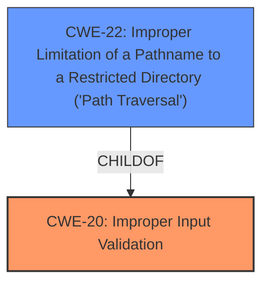

# Raw Analyzer Response for CVE-2024-45601

# Summary
| CWE ID | CWE Name | Confidence | CWE Abstraction Level | CWE Vulnerability Mapping Label | CWE-Vulnerability Mapping Notes |
|---|---|---|---|---|---|
| CWE-20 [Improper Input Validation](https://cwe.mitre.org/data/definitions/20.html) | Improper Input Validation | 0.8 | Class | Primary | Discouraged |
| CWE-22 [Improper Limitation of a Pathname to a Restricted Directory ('Path Traversal')](https://cwe.mitre.org/data/definitions/22.html) | Improper Limitation of a Pathname to a Restricted Directory ('Path Traversal') | 0.7 | Base | Secondary | Allowed |

## Evidence and Confidence

*   **Confidence Score:** 0.75
*   **Evidence Strength:** MEDIUM

## Relationship Analysis
The primary weakness identified is CWE-20 [Improper Input Validation](https://cwe.mitre.org/data/definitions/20.html), which is a high-level class. The more specific weakness is CWE-22 [Improper Limitation of a Pathname to a Restricted Directory ('Path Traversal')](https://cwe.mitre.org/data/definitions/22.html). CWE-22 [Improper Limitation of a Pathname to a Restricted Directory ('Path Traversal')](https://cwe.mitre.org/data/definitions/22.html) is a child of CWE-20 [Improper Input Validation](https://cwe.mitre.org/data/definitions/20.html). The relationship indicates that the **improper input validation** leads to path traversal.

## Vulnerability Chain
The vulnerability chain starts with **insufficient input validation** (CWE-20 [Improper Input Validation](https://cwe.mitre.org/data/definitions/20.html)), which allows an attacker to manipulate file paths, leading to path traversal (CWE-22 [Improper Limitation of a Pathname to a Restricted Directory ('Path Traversal')](https://cwe.mitre.org/data/definitions/22.html)). This, in turn, results in unauthorized file access.

## Summary of Analysis
The vulnerability is primarily due to CWE-20 [Improper Input Validation](https://cwe.mitre.org/data/definitions/20.html), as highlighted by the "**rootcause:** **insufficient input validation**" key phrase and the CVE reference summary: "The application did not properly sanitize or validate the input file path, which is a common cause for path traversal vulnerabilities." However, CWE-20 [Improper Input Validation](https://cwe.mitre.org/data/definitions/20.html) is a discouraged CWE.

The CVE reference summary also states "**Path Traversal (CWE-22)**: The vulnerability stems from the lack of proper validation on the file paths provided to the static file server." This indicates that the **improper input validation** directly leads to a path traversal vulnerability. Therefore, CWE-22 [Improper Limitation of a Pathname to a Restricted Directory ('Path Traversal')](https://cwe.mitre.org/data/definitions/22.html) is included as a secondary CWE.

The selected CWEs are at the appropriate level of specificity, with CWE-20 [Improper Input Validation](https://cwe.mitre.org/data/definitions/20.html) representing the general **lack of validation** and CWE-22 [Improper Limitation of a Pathname to a Restricted Directory ('Path Traversal')](https://cwe.mitre.org/data/definitions/22.html) representing the specific consequence of this **lack of validation** in the context of file path handling.

Other CWEs considered but not used:

*   CWE-79 [Improper Neutralization of Input During Web Page Generation ('Cross-site Scripting')](https://cwe.mitre.org/data/definitions/79.html): While improper neutralization is a form of input validation, the vulnerability is specifically about file access and not web page generation.
*   CWE-94 [Improper Control of Generation of Code ('Code Injection')](https://cwe.mitre.org/data/definitions/94.html): Code injection is not directly related to the described vulnerability, which focuses on file access.
*   CWE-306 [Missing Authentication for Critical Function](https://cwe.mitre.org/data/definitions/306.html): The description mentions that the vulnerability does not require authentication, but the root cause is **improper input validation**, not the absence of authentication.