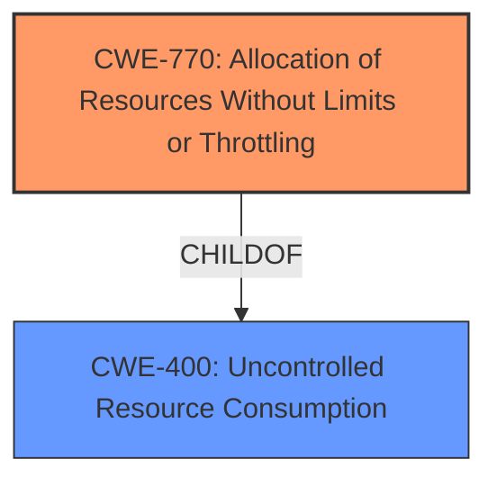

# Analysis for CVE-2024-45626

# Summary
| CWE ID | CWE Name | Confidence | CWE Abstraction Level | CWE Vulnerability Mapping Label | CWE-Vulnerability Mapping Notes |
|---|---|---|---|---|---|
| CWE-770 | Allocation of Resources Without Limits or Throttling | 0.9 | Base | Allowed | Primary CWE: Root cause is the **unbounded memory consumption** due to lack of limits. |
| CWE-400 | Uncontrolled Resource Consumption | 0.7 | Class | Discouraged | Secondary CWE: The vulnerability leads to **uncontrolled resource consumption**, specifically memory, resulting in denial of service. |

## Evidence and Confidence

*   **Confidence Score:** 0.9
*   **Evidence Strength:** HIGH

## Relationship Analysis
The primary weakness is CWE-770, which describes a general lack of limits on resource allocation. CWE-400 is a class-level CWE that describes the impact of uncontrolled resource consumption, which results from CWE-770. While CWE-400 is a parent of CWE-770, it's less specific and focuses on the impact rather than the root cause.

## Vulnerability Chain
The vulnerability chain starts with the **unbounded memory consumption** (CWE-770), which directly leads to **uncontrolled resource consumption** (CWE-400) and ultimately results in a denial-of-service condition.

## Summary of Analysis
The analysis is based on the provided vulnerability description and the associated CVE reference content summary. The key phrase "unbounded memory consumption" strongly suggests that the root cause is related to the lack of limits on resource allocation.

The retriever results also support this, with CWE-770 being a relevant candidate.

CWE-770 is selected as the primary CWE because it precisely captures the root cause of the vulnerability.
CWE-400 is included as a secondary CWE to highlight the resulting impact of the uncontrolled memory consumption.

Relevant CWE Information:

# Enhanced Context (25 CWEs)
The following CWEs were identified as potentially relevant to this vulnerability:

## CWE-770: Allocation of Resources Without Limits or Throttling
**Abstraction Level**: Base
**Similarity Score**: 0.69
**Source**: dense

**Description**:
The product allocates a reusable resource or group of resources on behalf of an actor without imposing any restrictions on the size or number of resources that can be allocated, in violation of the intended security policy for that actor.

**Mapping Guidance**:
- Usage: Allowed
- Rationale: This CWE entry is at the Base level of abstraction, which is a preferred level of abstraction for mapping to the root causes of vulnerabilities.
## CWE-400: Uncontrolled Resource Consumption
**Abstraction Level**: Class
**Similarity Score**: 0.69
**Source**: dense

**Description**:
The product does not properly control the consumption of resources, potentially leading to a denial of service or reduced system performance.

**Mapping Guidance**:
- Usage: Allowed-with-Review
- Rationale: This CWE entry is a Class and might have Base-level children that would be more appropriate

**CWEs Considered but Not Used:**

*   **CWE-789: Memory Allocation with Excessive Size Value:** This CWE is similar, but focuses on the size value being excessive, whereas the provided text implies no limits at all.
*   **CWE-1333: Inefficient Regular Expression Complexity:** While the description mentions HTML to text conversion, there is no specific mention of regular expressions.
*   **CWE-401: Missing Release of Memory after Effective Lifetime:** While memory isn't released, the root cause is due to the unbounded allocation in the first place.
*   **CWE-1284: Improper Validation of Specified Quantity in Input:** This could apply, but the main problem is the lack of limits, rather than improper validation of a specified quantity.
*   **CWE-674: Uncontrolled Recursion:** Not applicable, as there is no mention of recursion.
*   **CWE-79: Improper Neutralization of Input During Web Page Generation ('Cross-site Scripting'):** Not applicable, as there is no XSS.
*   **CWE-476: NULL Pointer Dereference:** Not applicable, as there is no mention of NULL pointer dereference.
*   **CWE-918: Server-Side Request Forgery (SSRF):** Not applicable, as there is no mention of SSRF.
*   **CWE-617: Reachable Assertion:** Not applicable, as there is no mention of assertions.
*   **CWE-212: Improper Removal of Sensitive Information Before Storage or Transfer:** Not applicable.