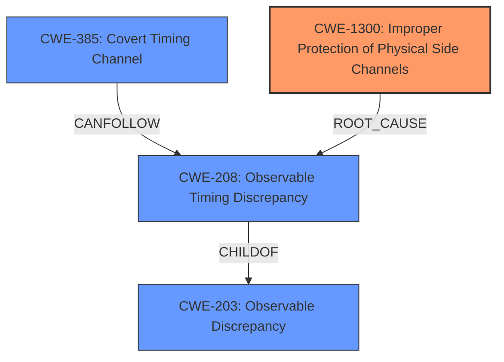

# Raw Analyzer Response for CVE-2024-45678

# Summary
| CWE ID | CWE Name | Confidence | CWE Abstraction Level | CWE Vulnerability Mapping Label | CWE-Vulnerability Mapping Notes |
|---|---|---|---|---|---|
| CWE-1300 | Improper Protection of Physical Side Channels | 0.9 | Base | Primary | Allowed |
| CWE-208 | Observable Timing Discrepancy | 0.7 | Base | Secondary | Allowed |
| CWE-385 | Covert Timing Channel | 0.6 | Base | Secondary | Allowed |

## Evidence and Confidence

*   **Confidence Score:** 0.9
*   **Evidence Strength:** HIGH

## Relationship Analysis
The primary weakness is an **improper protection of physical side channels** (CWE-1300). This leads to an **observable timing discrepancy** (CWE-208) which can be exploited as a **covert timing channel** (CWE-385). CWE-1300 is the root cause because it describes the fundamental flaw, while CWE-208 and CWE-385 are consequences of that flaw. The hierarchy reflects that CWE-208 is a child of CWE-203 (Observable Discrepancy), and CWE-385 (Covert Timing Channel) can follow CWE-208 in a vulnerability chain.

## Vulnerability Chain
The vulnerability chain starts with **improper protection against physical side channels** (CWE-1300), specifically because of a **non-constant-time modular inversion for the Extended Euclidean Algorithm**. This leads to an **observable timing discrepancy** (CWE-208), which then creates a **covert timing channel** (CWE-385) that allows for **ECDSA secret-key extraction**.
  - CWE-1300: Improper Protection of Physical Side Channels (**Root Cause**)
  - CWE-208: Observable Timing Discrepancy
  - CWE-385: Covert Timing Channel
  - Impact: ECDSA secret-key extraction

## Summary of Analysis
The primary classification is CWE-1300, as it directly addresses the **weakness** of **improper protection against physical side channels**, which is the root cause. The vulnerability description explicitly mentions an **electromagnetic side channel** due to a **non-constant-time modular inversion**. The "CVE Reference Links Content Summary" further confirms this by stating, "The root cause of the vulnerability is a non-constant-time modular inversion...". The resulting **observable timing discrepancy** (CWE-208) and the exploitable **covert timing channel** (CWE-385) are secondary consequences of this root cause. The selected CWEs are at the optimal level of specificity, with CWE-1300 being a Base level CWE that precisely matches the described vulnerability.

Relevant CWE Information:

# Enhanced Context (25 CWEs)
The following CWEs were identified as potentially relevant to this vulnerability:

## CWE-208: Observable Timing Discrepancy
**Abstraction Level**: Base
**Similarity Score**: 0.76
**Source**: dense

**Description**:
Two separate operations in a product require different amounts of time to complete, in a way that is observable to an actor and reveals security-relevant information about the state of the product, such as whether a particular operation was successful or not.

**Mapping Guidance**:
- Usage: Allowed
- Rationale: This CWE entry is at the Base level of abstraction, which is a preferred level of abstraction for mapping to the root causes of vulnerabilities.

## CWE-203: Observable Discrepancy
**Abstraction Level**: Base
**Similarity Score**: 0.74
**Source**: dense

**Description**:
The product behaves differently or sends different responses under different circumstances in a way that is observable to an unauthorized actor, which exposes security-relevant information about the state of the product, such as whether a particular operation was successful or not.

**Mapping Guidance**:
- Usage: Allowed
- Rationale: This CWE entry is at the Base level of abstraction, which is a preferred level of abstraction for mapping to the root causes of vulnerabilities.

## CWE-1391: Use of Weak Credentials
**Abstraction Level**: Class
**Similarity Score**: 0.73
**Source**: dense

**Description**:
The product uses weak credentials (such as a default key or hard-coded password) that can be calculated, derived, reused, or guessed by an attacker.

**Mapping Guidance**:
- Usage: Allowed-with-Review
- Rationale: This CWE entry is a Class and might have Base-level children that would be more appropriate

## CWE-1300: Improper Protection of Physical Side Channels
**Abstraction Level**: Base
**Similarity Score**: 0.73
**Source**: dense

**Description**:
The device does not contain sufficient protection
	mechanisms to prevent physical side channels from exposing
	sensitive information due to patterns in physically observable
	phenomena such as variations in power consumption,
	electromagnetic emissions (EME), or acoustic emissions.

**Mapping Guidance**:
- Usage: Allowed
- Rationale: This CWE entry is at the Base level of abstraction, which is a preferred level of abstraction for mapping to the root causes of vulnerabilities.

## CWE-325: Missing Cryptographic Step
**Abstraction Level**: Base
**Similarity Score**: 0.73
**Source**: dense

**Description**:
The product does not implement a required step in a cryptographic algorithm, resulting in weaker encryption than advertised by the algorithm.

**Mapping Guidance**:
- Usage: Allowed
- Rationale: This CWE entry is at the Base level of abstraction, which is a preferred level of abstraction for mapping to the root causes of vulnerabilities.

## CWE-345: Insufficient Verification of Data Authenticity
**Abstraction Level**: Class
**Similarity Score**: 0.72
**Source**: dense

**Description**:
The product does not sufficiently verify the origin or authenticity of data, in a way that causes it to accept invalid data.

**Mapping Guidance**:
- Usage: Discouraged
- Rationale: This CWE entry is a level-1 Class (i.e., a child of a Pillar). It might have lower-level children that would be more appropriate

## CWE-327: Use of a Broken or Risky Cryptographic Algorithm
**Abstraction Level**: Class
**Similarity Score**: 0.72
**Source**: dense

**Description**:
The product uses a broken or risky cryptographic algorithm or protocol.

**Mapping Guidance**:
- Usage: Allowed-with-Review
- Rationale: This CWE entry is a Class and might have Base-level children that would be more appropriate

## CWE-321: Use of Hard-coded Cryptographic Key
**Abstraction Level**: Variant
**Similarity Score**: 0.72
**Source**: dense

**Description**:
The use of a hard-coded cryptographic key significantly increases the possibility that encrypted data may be recovered.

**Mapping Guidance**:
- Usage: Allowed
- Rationale: This CWE entry is at the Variant level of abstraction, which is a preferred level of abstraction for mapping to the root causes of vulnerabilities.

## CWE-330: Use of Insufficiently Random Values
**Abstraction Level**: Class
**Similarity Score**: 0.71
**Source**: dense

**Description**:
The product uses insufficiently random numbers or values in a security context that depends on unpredictable numbers.

**Mapping Guidance**:
- Usage: Discouraged
- Rationale: This CWE entry is a level-1 Class (i.e., a child of a Pillar). It might have lower-level children that would be more appropriate

## CWE-703: Improper Check or Handling of Exceptional Conditions
**Abstraction Level**: Pillar
**Similarity Score**: 0.71
**Source**: dense

**Description**:
The product does not properly anticipate or handle exceptional conditions that rarely occur during normal operation of the product.

**Mapping Guidance**:
- Usage: Discouraged
- Rationale: This CWE entry is extremely high-level, a Pillar.

## CWE-208: Observable Timing Discrepancy
**Abstraction Level**: Base
**Similarity Score**: 1063.41
**Source**: sparse

**Description**:
Two separate operations in a product require different amounts of time to complete, in a way that is