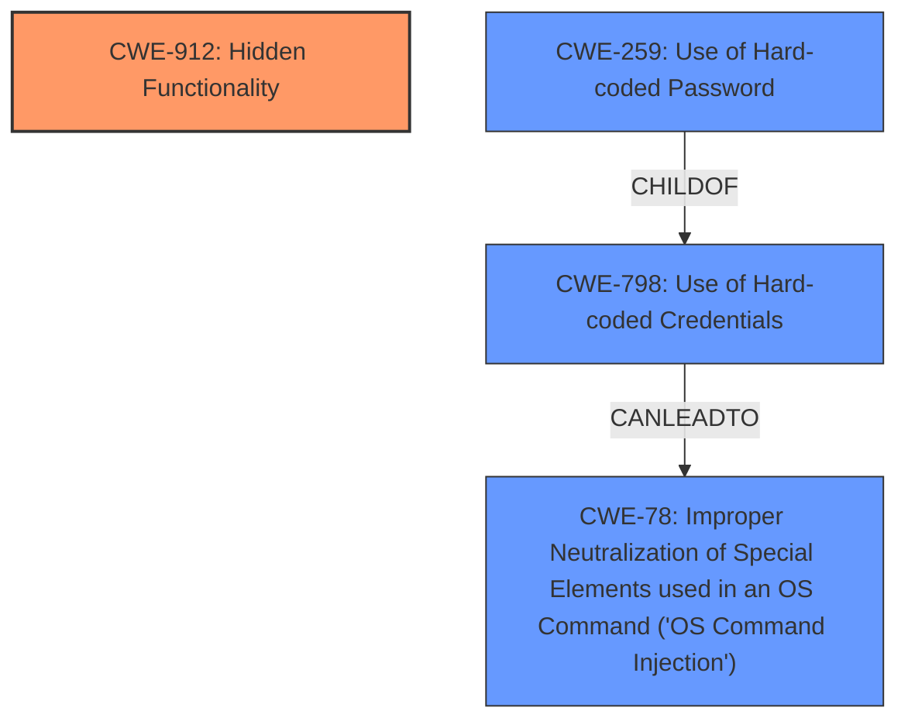

# Enhanced Analysis for CVE-2024-45697

# Summary
| CWE ID | CWE Name | Confidence | CWE Abstraction Level | CWE Vulnerability Mapping Label | CWE-Vulnerability Mapping Notes |
|---|---|---|---|---|---|
| CWE-912 | Hidden Functionality | 0.9 | Class | Primary | Allowed-with-Review |
| CWE-798 | Use of Hard-coded Credentials | 0.8 | Base | Secondary | Allowed |
| CWE-78 | Improper Neutralization of Special Elements used in an OS Command ('OS Command Injection') | 0.7 | Base | Secondary | Allowed |
| CWE-259 | Use of Hard-coded Password | 0.7 | Variant | Secondary | Allowed |

## Evidence and Confidence

*   **Confidence Score:** 0.8
*   **Evidence Strength:** MEDIUM

## Relationship Analysis
The primary relationship that influenced my decision was the hierarchical one, specifically the child-parent relationship. CWE-912 is a Class-level CWE, and while it broadly fits the description of **hidden functionality**, a more specific Base or Variant level CWE would be ideal. However, the information provided does not allow for a more specific classification of the **hidden functionality**.



## Vulnerability Chain
The vulnerability chain starts with the **hidden functionality**, which allows unauthorized access due to **hard-coded credentials**, leading to the ability to execute OS commands.

1.  **CWE-912 Hidden Functionality**
2.  **CWE-798 Use of Hard-coded Credentials**
3.  **CWE-78 Improper Neutralization of Special Elements used in an OS Command ('OS Command Injection')**

## Summary of Analysis
The primary weakness is the **hidden functionality** that enables the telnet service when the WAN port is plugged in. This is classified as CWE-912. The use of **hard-coded credentials** (CWE-798) allows unauthorized remote attackers to log in. The ability to execute OS commands is a result of successful login with those credentials, and the **improper neutralization of special elements** in those commands is classified as CWE-78. CWE-259 is included because the vulnerability description mentions **hard-coded credentials**, which are used to log in.

The decision to use CWE-912 as the primary CWE is based on the vulnerability description's emphasis on the **hidden functionality** as the enabler for the vulnerability. The subsequent CWEs are consequences of this initial flaw.

Relevant CWE Information:

# Enhanced Context (25 CWEs)

## CWE-912: Hidden Functionality
**Abstraction Level**: Class
**Similarity Score**: 0.78
**Source**: dense

**Description**:
The product contains functionality that is not documented, not part of the specification, and not accessible through an interface or command sequence that is obvious to the product's users or administrators.

**Mapping Guidance**:
- Usage: Allowed-with-Review
- Rationale: This CWE entry is a Class and might have Base-level children that would be more appropriate

## CWE-798: Use of Hard-coded Credentials
**Abstraction Level**: Base
**Similarity Score**: 0.74
**Source**: dense

**Description**:
The product contains hard-coded credentials, such as a password or cryptographic key.

**Mapping Guidance**:
- Usage: Allowed
- Rationale: This CWE entry is at the Base level of abstraction, which is a preferred level of abstraction for mapping to the root causes of vulnerabilities.

## CWE-259: Use of Hard-coded Password
**Abstraction Level**: Variant
**Similarity Score**: 0.74
**Source**: dense

**Description**:
The product contains a hard-coded password, which it uses for its own inbound authentication or for outbound communication to external components.

**Mapping Guidance**:
- Usage: Allowed
- Rationale: This CWE entry is at the Variant level of abstraction, which is a preferred level of abstraction for mapping to the root causes of vulnerabilities.

## CWE-78: Improper Neutralization of Special Elements used in an OS Command ('OS Command Injection')
**Abstraction Level**: Base
**Similarity Score**: 0.72
**Source**: dense

**Description**:
The product constructs all or part of an OS command using externally-influenced input from an upstream component, but it does not neutralize or incorrectly neutralizes special elements that could modify the intended OS command when it is sent to a downstream component.

**Mapping Guidance**:
- Usage: Allowed
- Rationale: This CWE entry is at the Base level of abstraction, which is a preferred level of abstraction for mapping to the root causes of vulnerabilities.


## CWE Relationship Analysis

Current CWEs represent these abstraction levels: .


### Vulnerability Chain Analysis

**Chain starting from CWE-259:**
- 259 (Use of Hard-coded Password) - ROOT


**Chain starting from CWE-798:**
- 798 (Use of Hard-coded Credentials) - ROOT


### CWE Relationship Diagram

```mermaid
graph TD
    classDef primary fill:#f96,stroke:#333,stroke-width:2px
    classDef secondary fill:#69f,stroke:#333
    classDef tertiary fill:#9e9,stroke:#333
```