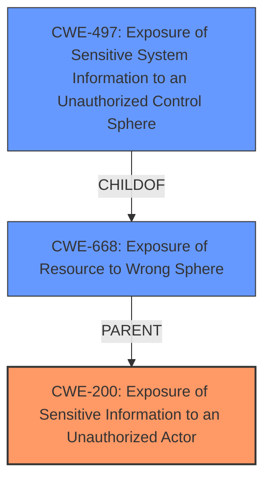

# Analysis Report for CVE-2024-45734

# Vulnerability Analysis Report: CVE-2024-45734

## Description

In Splunk Enterprise versions 9.3.0, 9.2.3, and 9.1.6, a low-privileged user that does not hold the admin or power Splunk roles could view images on the machine that runs Splunk Enterprise by using the PDF export feature in Splunk classic dashboards. The images on the machine could be exposed by exporting the dashboard as a PDF, using the local image path in the img tag in the source extensible markup language (XML) code for the Splunk classic dashboard.

## Vulnerability Description Key Phrases

- **Impact:** view images on the machine
- **Vector:** exporting the dashboard as a PDF
- **Attacker:** low-privileged user
- **Product:** Splunk Enterprise
- **Version:** 9.3.0, 9.2.3, and 9.1.6
- **Component:** PDF export feature in Splunk classic dashboards

## Analysis (with Relationship Data)

# Summary

| CWE ID | CWE Name | Confidence | CWE Abstraction Level | CWE Vulnerability Mapping Label | CWE-Vulnerability Mapping Notes |
|---|---|---|---|---|---|
| CWE-200 | Exposure of Sensitive Information to an Unauthorized Actor | 0.8 | Class |  | Discouraged, but used due to the direct exposure of sensitive images. |
| CWE-668 | Exposure of Resource to Wrong Sphere | 0.7 | Class |  | Discouraged, but considered as a contributing factor due to incorrect resource access. |
| CWE-497 | Exposure of Sensitive System Information to an Unauthorized Control Sphere | 0.6 | Base |  | Allowed, considered as the system information i.e. image is being exposed.|

## Evidence and Confidence

*   **Confidence Score:** 0.7
*   **Evidence Strength:** MEDIUM

## Relationship Analysis

The primary relationship is that of information exposure, which is best captured by CWE-200. CWE-668 is a broader class that encompasses the exposure to the wrong sphere, and CWE-497 more specifically highlights the exposure of system information. The relationships influenced the decision to include both the broad CWE-200 and the more specific CWE-497.



## Vulnerability Chain

The vulnerability chain starts with a low-privileged user creating a classic dashboard with a local image path in an `` tag. This leads to the PDF export feature including the content of that image file in the exported PDF, resulting in the exposure of sensitive information.

## Summary of Analysis

The initial analysis considered several CWEs related to information exposure and access control. The final decision focused on CWE-200 as the primary weakness because the core issue is the **exposure of sensitive information** (images) to an unauthorized actor (low-privileged user). However, CWE-668 and CWE-497 were also included to provide additional context regarding the exposure of resources to the wrong sphere, and exposure of sensitive system information.

The vulnerability description clearly states that "a low-privileged user that does not hold the admin or power Splunk roles could view images on the machine...by using the PDF export feature." This aligns directly with the definition of CWE-200, which involves exposing sensitive information to an unauthorized actor.

The graph relationships and retriever results influenced the decision to include CWE-668 and CWE-497, as they provide additional context regarding the nature of the exposure. The selected CWEs are at the optimal level of specificity because they accurately represent the root cause and contributing factors of the vulnerability.

Relevant CWE Information:

*   **CWE-200:** The product exposes sensitive information to an actor that is not explicitly authorized to have access to that information. This is the core issue in this vulnerability.
*   **CWE-668:** The product exposes a resource to the wrong control sphere, providing unintended actors with inappropriate access to the resource. The images are resources that should not be accessible to low-privileged users.
*   **CWE-497:** The product does not properly prevent sensitive system-level information from being accessed by unauthorized actors who do not have the same level of access to the underlying system as the product does.

# Enhanced Context (25 CWEs)

## CWE-497: Exposure of Sensitive System Information to an Unauthorized Control Sphere
**Abstraction Level**: Base
**Similarity Score**: 0.75
**Source**: dense

**Description**:
The product does not properly prevent sensitive system-level information from being accessed by unauthorized actors who do not have the same level of access to the underlying system as the product does.

**Mapping Guidance**:
- Usage: Allowed
- Rationale: This CWE entry is at the Base level of abstraction, which is a preferred level of abstraction for mapping to the root causes of vulnerabilities.

## CWE-538: Insertion of Sensitive Information into Externally-Accessible File or Directory
**Abstraction Level**: Base
**Similarity Score**: 0.72
**Source**: dense

**Description**:
The product places sensitive information into files or directories that are accessible to actors who are allowed to have access to the files, but not to the sensitive information.

**Mapping Guidance**:
- Usage: Allowed
- Rationale: This CWE entry is at the Base level of abstraction, which is a preferred level of abstraction for mapping to the root causes of vulnerabilities.

## CWE-668: Exposure of Resource to Wrong Sphere
**Abstraction Level**: Class
**Similarity Score**: 0.72
**Source**: dense

**Description**:
The product exposes a resource to the wrong control sphere, providing unintended actors with inappropriate access to the resource.

**Mapping Guidance**:
- Usage: Discouraged
- Rationale: CWE-668 is high-level and is often misused as a catch-all when lower-level CWE IDs might be applicable. It is sometimes used for low-information vulnerability reports [REF-1287]. It is a level-1 Class (i.e., a child of a Pillar). It is not useful for trend analysis.

## CWE-212: Improper Removal of Sensitive Information Before Storage or Transfer
**Abstraction Level**: Base
**Similarity Score**: 0.72
**Source**: dense

**Description**:
The product stores, transfers, or shares a resource that contains sensitive information, but it does not properly remove that information before the product makes the resource available to unauthorized actors.

**Mapping Guidance**:
- Usage: Allowed
- Rationale: This CWE entry is at the Base level of abstraction, which is a preferred level of abstraction for mapping to the root causes of vulnerabilities.

## CWE-434: Unrestricted Upload of File with Dangerous Type
**Abstraction Level**: Base
**Similarity Score**: 0.72
**Source**: dense

**Description**:
The product allows the upload or transfer of dangerous file types that are automatically processed within its environment.

**Mapping Guidance**:
- Usage: Allowed
- Rationale: This CWE entry is at the Base level of abstraction, which is a preferred level of abstraction for mapping to the root causes of vulnerabilities.

## CWE-200: Exposure of Sensitive Information to an Unauthorized Actor
**Abstraction Level**: Class
**Similarity Score**: 0.72
**Source**: dense

**Description**:
The product exposes sensitive information to an actor that is not explicitly authorized to have access to that information.

**Mapping Guidance**:
- Usage: Discouraged
- Rationale: CWE-200 is commonly misused to represent the loss of confidentiality in a vulnerability, but confidentiality loss is a technical impact - not a root cause error. As of CWE 4.9, over 400 CWE entries can lead to a loss of confidentiality. Other options are often available. [REF-1287].

## CWE-74: Improper Neutralization of Special Elements in Output Used by a Downstream Component ('Injection')
**Abstraction Level**: Class
**Similarity Score**: 0.72
**Source**: dense

**Description**:
The product constructs all or part of a command, data structure, or record using externally-influenced input from an upstream component, but it does not neutralize or incorrectly neutralizes special elements that could modify how it is parsed or interpreted when it is sent to a downstream component.

**Mapping Guidance**:
- Usage: Discouraged
- Rationale: CWE-74 is high-level and often misused when lower-level weaknesses are more appropriate.

## CWE-209: Generation of Error Message Containing Sensitive Information
**Abstraction Level**: Base
**Similarity Score**: 0.71
**Source**: dense

**Description**:
The product generates an error message that includes sensitive information about its environment, users, or associated data.

**Mapping Guidance**:
- Usage: Allowed
- Rationale: This CWE entry is at the Base level of abstraction, which is a preferred level of abstraction for mapping to the root causes of vulnerabilities.

## CWE-639: Authorization Bypass Through User-Controlled Key
**Abstraction Level**: Base
**Similarity Score**: 0.71
**Source**: dense

**Description**:
The system's authorization functionality does not prevent one user from gaining access to another user's data or record by modifying the key value identifying the data.

**Mapping Guidance**:
- Usage: Allowed
- Rationale: This CWE entry is at the Base level of abstraction, which is a preferred level of abstraction for mapping to the root causes of vulnerabilities.

## CWE-923: Improper Restriction of Communication Channel to Intended Endpoints
**Abstraction Level**: Class
**Similarity Score**: 0.71


## CWE Relationship Analysis

Current CWEs represent these abstraction levels: .


### Vulnerability Chain Analysis

**Chain starting from CWE-639:**
- 639 (Authorization Bypass Through User-Controlled Key) - ROOT


**Chain starting from CWE-923:**
- 923 (Improper Restriction of Communication Channel to Intended Endpoints) - ROOT


### CWE Relationship Diagram

```mermaid
graph TD
    classDef primary fill:#f96,stroke:#333,stroke-width:2px
    classDef secondary fill:#69f,stroke:#333
    classDef tertiary fill:#9e9,stroke:#333
```


*Report generated on 2025-07-13 16:52:53*
