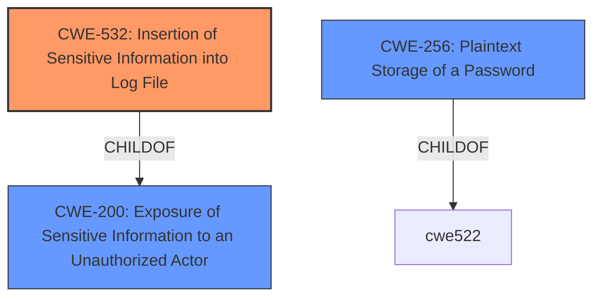

# Analysis for CVE-2024-45739

# Summary
| CWE ID | CWE Name | Confidence | CWE Abstraction Level | CWE Vulnerability Mapping Label | CWE-Vulnerability Mapping Notes |
|---|---|---|---|---|---|
| CWE-532 | Insertion of Sensitive Information into Log File | 1.0 | Base | Allowed | Primary CWE |
| CWE-256 | Plaintext Storage of a Password | 0.8 | Base | Allowed | Secondary Candidate |
| CWE-200 | Exposure of Sensitive Information to an Unauthorized Actor | 0.6 | Class | Discouraged | Secondary Candidate |

## Evidence and Confidence

*   **Confidence Score:** 0.9
*   **Evidence Strength:** HIGH

## Relationship Analysis
The primary CWE is CWE-532, which indicates that sensitive information is written to a log file. This is a direct consequence of the Splunk Enterprise AdminManager log channel potentially exposing plaintext passwords when the logging level is set to DEBUG. The relationship analysis shows that CWE-532 is a child of CWE-200 (Exposure of Sensitive Information to an Unauthorized Actor), indicating that the insertion of sensitive information into the log file leads to its exposure. CWE-256 (Plaintext Storage of a Password) is related, as the passwords being logged are stored in plaintext.

## Vulnerability Chain
The vulnerability chain starts with the configuration of the Splunk Enterprise AdminManager log channel at the DEBUG logging level. This leads to **CWE-256 (Plaintext Storage of a Password)**, as plaintext passwords are used. The next step is **CWE-532 (Insertion of Sensitive Information into Log File)**, where these plaintext passwords are written to the log file. Finally, this results in **CWE-200 (Exposure of Sensitive Information to an Unauthorized Actor)**, as the log file can be accessed by unauthorized actors, leading to the exposure of the passwords.
  - Root Cause: Improper logging configuration (DEBUG level)
  - Weakness 1: **CWE-256 Plaintext Storage of a Password**
  - Weakness 2: **CWE-532 Insertion of Sensitive Information into Log File**
  - Impact: **CWE-200 Exposure of Sensitive Information to an Unauthorized Actor**

## Summary of Analysis
The primary weakness is the **CWE-532 (Insertion of Sensitive Information into Log File)** because the root cause is the logging of the plaintext password to the log file. This is supported by the vulnerability description, which states that the software potentially exposes plaintext passwords when the AdminManager log channel is at the DEBUG logging level. The "CVE Reference Links Content Summary" confirms that plaintext passwords are written to log files when the `AdminManager` log channel is set to DEBUG.

The other CWEs considered were CWE-200 and CWE-256. **CWE-200 (Exposure of Sensitive Information to an Unauthorized Actor)** is a valid secondary consideration because the logging of the plaintext passwords leads to exposure of the passwords. However, it is more of an impact than a root cause, and CWE mapping guidance discourages using CWE-200 because it is a high level class CWE. **CWE-256 (Plaintext Storage of a Password)** is also a reasonable secondary candidate because the passwords are stored in plaintext. However, the vulnerability is most directly related to the logging of this information.

The selected CWEs are at the optimal level of specificity because they directly address the root cause and the immediate consequences of the vulnerability.

Relevant CWE Information:

# Enhanced Context (25 CWEs)
The following CWEs were identified as potentially relevant to this vulnerability:

## CWE-538: Insertion of Sensitive Information into Externally-Accessible File or Directory
**Abstraction Level**: Base
**Similarity Score**: 0.79
**Source**: dense

**Description**:
The product places sensitive information into files or directories that are accessible to actors who are allowed to have access to the files, but not to the sensitive information.

**Mapping Guidance**:
- Usage: Allowed
- Rationale: This CWE entry is at the Base level of abstraction, which is a preferred level of abstraction for mapping to the root causes of vulnerabilities.

## CWE-497: Exposure of Sensitive System Information to an Unauthorized Control Sphere
**Abstraction Level**: Base
**Similarity Score**: 0.79
**Source**: dense

**Description**:
The product does not properly prevent sensitive system-level information from being accessed by unauthorized actors who do not have the same level of access to the underlying system as the product does.

**Mapping Guidance**:
- Usage: Allowed
- Rationale: This CWE entry is at the Base level of abstraction, which is a preferred level of abstraction for mapping to the root causes of vulnerabilities.

## CWE-212: Improper Removal of Sensitive Information Before Storage or Transfer
**Abstraction Level**: Base
**Similarity Score**: 0.77
**Source**: dense

**Description**:
The product stores, transfers, or shares a resource that contains sensitive information, but it does not properly remove that information before the product makes the resource available to unauthorized actors.

**Mapping Guidance**:
- Usage: Allowed
- Rationale: This CWE entry is at the Base level of abstraction, which is a preferred level of abstraction for mapping to the root causes of vulnerabilities.

## CWE-668: Exposure of Resource to Wrong Sphere
**Abstraction Level**: Class
**Similarity Score**: 0.76
**Source**: dense

**Description**:
The product exposes a resource to the wrong control sphere, providing unintended actors with inappropriate access to the resource.

**Mapping Guidance**:
- Usage: Discouraged
- Rationale: CWE-668 is high-level and is often misused as a catch-all when lower-level CWE IDs might be applicable. It is sometimes used for low-information vulnerability reports [REF-1287]. It is a level-1 Class (i.e., a child of a Pillar). It is not useful for trend analysis.

## CWE-312: Cleartext Storage of Sensitive Information
**Abstraction Level**: Base
**Similarity Score**: 0.75
**Source**: dense

**Description**:
The product stores sensitive information in cleartext within a resource that might be accessible to another control sphere.

**Mapping Guidance**:
- Usage: Allowed
- Rationale: This CWE entry is at the Base level of abstraction, which is a preferred level of abstraction for mapping to the root causes of vulnerabilities.

## CWE-319: Cleartext Transmission of Sensitive Information
**Abstraction Level**: Base
**Similarity Score**: 0.75
**Source**: dense

**Description**:
The product transmits sensitive or security-critical data in cleartext in a communication channel that can be sniffed by unauthorized actors.

**Mapping Guidance**:
- Usage: Allowed
- Rationale: This CWE entry is at the Base level of abstraction, which is a preferred level of abstraction for mapping to the root causes of vulnerabilities.

## CWE-1391: Use of Weak Credentials
**Abstraction Level**: Class
**Similarity Score**: 0.75
**Source**: dense

**Description**:
The product uses weak credentials (such as a default key or hard-coded password) that can be calculated, derived, reused, or guessed by an attacker.

**Mapping Guidance**:
- Usage: Allowed-with-Review
- Rationale: This CWE entry is a Class and might have Base-level children that would be more appropriate

## CWE-807: Reliance on Untrusted Inputs in a Security Decision
**Abstraction Level**: Base
**Similarity Score**: 0.75
**Source**: dense

**Description**:
The product uses a protection mechanism that relies on the existence or values of an input, but the input can be modified by an untrusted actor in a way that bypasses the protection mechanism.

**Mapping Guidance**:
- Usage: Allowed
- Rationale: This CWE entry is at the Base level of abstraction, which is a preferred level of abstraction for mapping to the root causes of vulnerabilities.

## CWE-267: Privilege Defined With Unsafe Actions
**Abstraction Level**: Base
**Similarity Score**: 0.75
**Source**: dense

**Description**:
A particular privilege, role, capability, or right can be used to perform unsafe actions that were not intended, even when it is assigned to the correct entity.

**Mapping Guidance**:
- Usage: Allowed
- Rationale: This CWE entry is at the Base level of abstraction, which is a preferred level of abstraction for mapping to the root causes of vulnerabilities.

## CWE-209: Generation of Error Message Containing Sensitive Information
**Abstraction