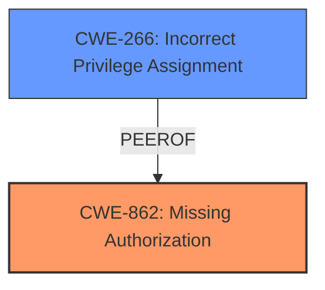

# Analysis for CVE-2024-45752

# Summary
| CWE ID | CWE Name | Confidence | CWE Abstraction Level | CWE Vulnerability Mapping Label | CWE-Vulnerability Mapping Notes |
|---|---|---|---|---|---|
| CWE-862 | Missing Authorization | 0.9 | Class |  | Allowed-with-Review, Primary CWE |
| CWE-266 | Incorrect Privilege Assignment | 0.7 | Base |  | Allowed, Secondary Candidate |

## Evidence and Confidence

*   **Confidence Score:** 0.8
*   **Evidence Strength:** HIGH

## Relationship Analysis
The primary CWE is CWE-862, which indicates a complete lack of authorization. CWE-266 is a related CWE, which addresses incorrect privilege assignments. CWE-862 is a class-level CWE and could potentially have more specific children, but none seem to fit as well based on the retriever results. The analysis relies on the fact that the D-Bus service is unrestricted, meaning no authorization is present.

## Vulnerability Chain
The vulnerability chain starts with the **unrestricted D-Bus service** (CWE-862), which allows any user to configure the `logid` daemon. This leads to the ability to set malicious keyboard macros, which then results in privilege escalation.

## Summary of Analysis
The initial assessment focuses on the **unrestricted D-Bus service**, enabling any unprivileged user to configure it. This points to a **lack of authorization**, making CWE-862 (Missing Authorization) the most appropriate primary CWE. The evidence includes the vulnerability description stating that the service is unrestricted, and the CVE reference summary mentioning the same.

The retriever results list several CWEs, including CWE-732 (Incorrect Permission Assignment for Critical Resource), CWE-862 (Missing Authorization), CWE-276 (Incorrect Default Permissions), and CWE-266 (Incorrect Privilege Assignment).

CWE-732 is less appropriate because the core issue isn't about incorrect permissions on a resource, but the complete absence of authorization checks on the D-Bus service itself.

CWE-276 (Incorrect Default Permissions) is also less fitting, as the problem isn't the default permissions but the absence of any authorization mechanism.

CWE-266 (Incorrect Privilege Assignment) could be considered since it leads to privilege escalation, but the root cause is the missing authorization, not an incorrect assignment. It could be argued that the D-Bus service effectively assigns "administrator" privileges to all users by default, which is not correct, but the absence of any checks is the more fundamental flaw.

CWE-862 is a class-level CWE. Per the Comple CWE Specifications, it is preferred to use a Base-level CWE. However, there is no clear "Base" level child of CWE-862 that applies.

The selection of CWE-862 is justified by the clear evidence of a missing authorization check on the D-Bus service, allowing any user to configure the daemon. This aligns with the definition of CWE-862, where the product does not perform an authorization check when an actor attempts to access a resource or perform an action. The impact of this is privilege escalation, as the unprivileged user can configure malicious keyboard macros.

The decision to use CWE-862 is based on the evidence from the vulnerability description and the CVE reference summary, which both highlight the **unrestricted nature** of the D-Bus service. The retriever results support this decision by listing CWE-862 as a relevant CWE.
The provided "Privileges vs Permissions Guidance" considers missing authorization as CWE-862.

Relevant CWE Information:

# Enhanced Context (25 CWEs)
## CWE-266: Incorrect Privilege Assignment
**Abstraction Level**: Base
**Similarity Score**: 0.80
**Source**: dense

**Description**:
A product incorrectly assigns a privilege to a particular actor, creating an unintended sphere of control for that actor.

**Mapping Guidance**:
- Usage: Allowed
- Rationale: This CWE entry is at the Base level of abstraction, which is a preferred level of abstraction for mapping to the root causes of vulnerabilities.

## CWE-862: Missing Authorization
**Abstraction Level**: Class
**Similarity Score**: 1848.22
**Source**: sparse

**Description**:
The product does not perform an authorization check when an actor attempts to access a resource or perform an action.

**Mapping Guidance**:
- Usage: Allowed-with-Review
- Rationale: This CWE entry is a Class and might have Base-level children that would be more appropriate