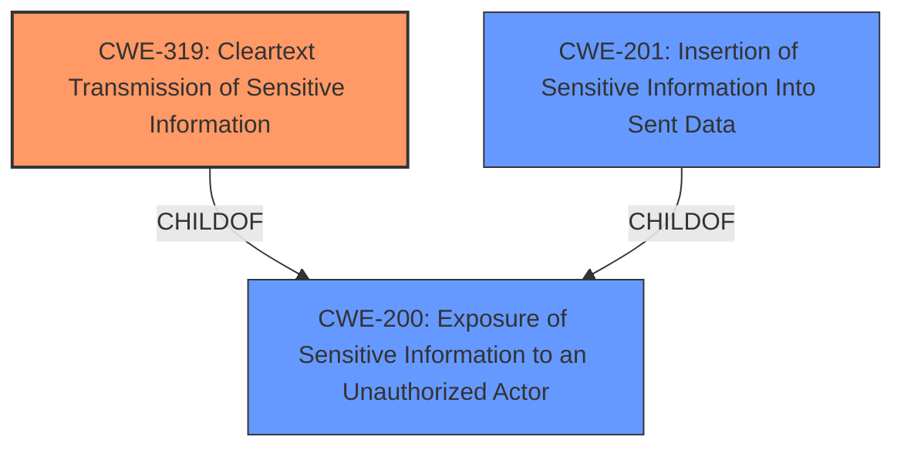

# Enhanced Analysis for CVE-2024-45791

# Summary
| CWE ID | CWE Name | Confidence | CWE Abstraction Level | CWE Vulnerability Mapping Label | CWE-Vulnerability Mapping Notes |
|---|---|---|---|---|---|
| CWE-319 | Cleartext Transmission of Sensitive Information | 0.9 | Base | Allowed | Primary CWE |
| CWE-200 | Exposure of Sensitive Information to an Unauthorized Actor | 0.5 | Class | Discouraged | Secondary Candidate |
| CWE-201 | Insertion of Sensitive Information Into Sent Data | 0.5 | Base | Allowed | Secondary Candidate |

## Evidence and Confidence

*   **Confidence Score:** 0.9
*   **Evidence Strength:** HIGH

## Relationship Analysis
The primary CWE is CWE-319 (Cleartext Transmission of Sensitive Information), which is a Base level CWE. CWE-200 (Exposure of Sensitive Information to an Unauthorized Actor) is a Class level CWE and is a parent of many more specific CWEs related to information exposure, thus is not specific enough. CWE-201 (Insertion of Sensitive Information Into Sent Data) can be related, however, the root cause is specifically the transmission of sensitive information in cleartext.



## Vulnerability Chain
The vulnerability chain starts with the **root cause** of transmitting sensitive tokens via HTTP GET method with query string which leads to **cleartext transmission of sensitive information** (CWE-319), which results in the **impact** of **exposure of sensitive information to an unauthorized actor** (CWE-200).

## Summary of Analysis
The analysis is based on the provided evidence, specifically the "CVE Reference Links Content Summary" section, which states "The application exposes sensitive tokens via HTTP GET method with query string." This clearly indicates that the sensitive information (tokens) are being transmitted in cleartext.

CWE-319 (Cleartext Transmission of Sensitive Information) is selected as the primary CWE because the vulnerability description and the CVE reference summary clearly indicate that the sensitive tokens are being transmitted in cleartext via HTTP GET requests. This aligns with the definition of CWE-319, which is "The product transmits sensitive or security-critical data in cleartext in a communication channel that can be sniffed by unauthorized actors."

The retriever results also list CWE-200 (Exposure of Sensitive Information to an Unauthorized Actor) and CWE-201 (Insertion of Sensitive Information Into Sent Data), but these are less specific than CWE-319. CWE-200 is a class level CWE and represents the impact of the vulnerability rather than the root cause. CWE-201 is relevant, but the core issue is the cleartext transmission, making CWE-319 the most accurate representation of the **weakness**.

The selected CWEs are at the optimal level of specificity because CWE-319 directly addresses the **root cause** of the vulnerability, while CWE-200 represents the high-level impact.


## CWE Relationship Analysis

Current CWEs represent these abstraction levels: .


### Vulnerability Chain Analysis

**Chain starting from CWE-319:**
- 319 (Cleartext Transmission of Sensitive Information) - ROOT


**Chain starting from CWE-200:**
- 200 (Exposure of Sensitive Information to an Unauthorized Actor) - ROOT


### CWE Relationship Diagram

```mermaid
graph TD
    classDef primary fill:#f96,stroke:#333,stroke-width:2px
    classDef secondary fill:#69f,stroke:#333
    classDef tertiary fill:#9e9,stroke:#333
```