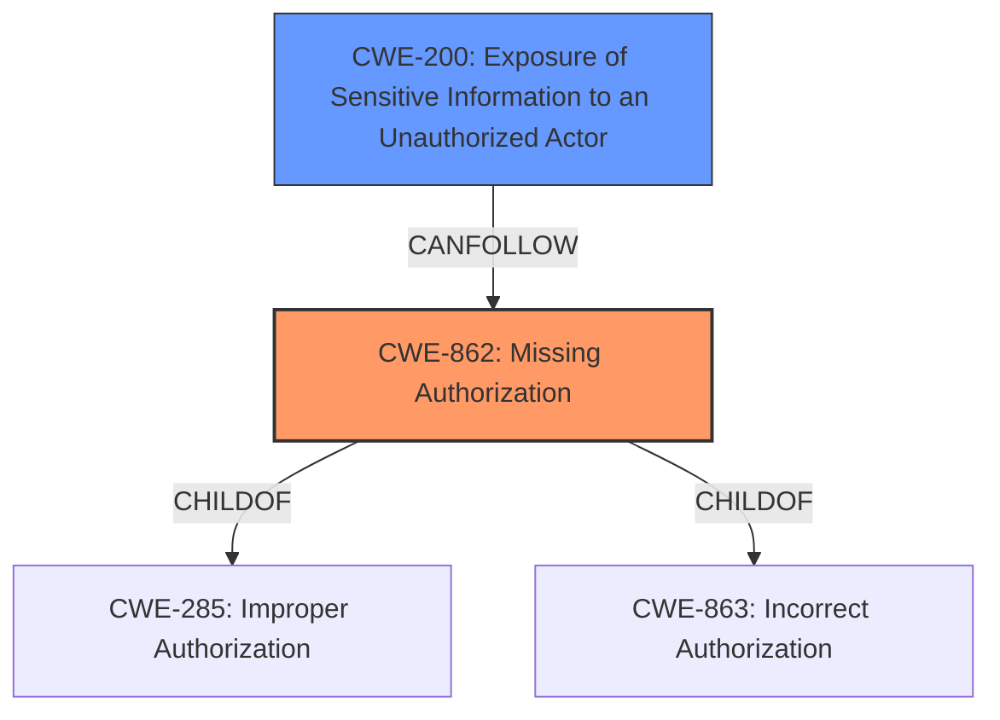

# Analysis Report for CVE-2024-45805

# Vulnerability Analysis Report: CVE-2024-45805

## Description

OpenCTI is an open-source cyber threat intelligence platform. Before 6.3.0, general users can access information that can only be accessed by users with access privileges to admin and support information (SETTINGS_SUPPORT). This is due to **inadequate access control** for support information (http///storage/get/support/UUID/UUID.zip), and that the UUID is available to general users using an attached query (logs query). This vulnerability is fixed in 6.3.0.

## Vulnerability Description Key Phrases

- **Rootcause:** inadequate access control
- **Impact:** access information that can only be accessed by users with access privileges to admin and support information
- **Attacker:** general users
- **Product:** OpenCTI
- **Version:** before 6.3.0

## Analysis (with Relationship Data)

# Summary
| CWE ID  | CWE Name                                                                   | Confidence | CWE Abstraction Level | CWE Vulnerability Mapping Label | CWE-Vulnerability Mapping Notes |
| :-------- | :------------------------------------------------------------------------- | :--------- | :-------------------- | :------------------------------ | :------------------------------ |
| CWE-862   | Missing Authorization                                                      | 0.9        | Base                  | Primary                         | Allowed                         |
| CWE-200   | Exposure of Sensitive Information to an Unauthorized Actor                 | 0.7        | Class                 | Secondary                       | Discouraged                     |

## Evidence and Confidence

*   **Confidence Score:** 0.8
*   **Evidence Strength:** HIGH

## Relationship Analysis
The primary CWE is CWE-862, which represents the **missing authorization** check that allows general users to access sensitive information. CWE-200 is a consequence of the **missing authorization**, where sensitive information is exposed due to the lack of proper access controls. CWE-862 is a base level CWE and a child of CWE-285 and CWE-863 which are more general classes of authorization issues.



## Vulnerability Chain
The vulnerability chain starts with **missing authorization** (CWE-862), which leads to the exposure of sensitive information (CWE-200). The root cause is the **inadequate access control** for support information, allowing general users to access data intended for administrators.

## Summary of Analysis
The vulnerability is primarily due to **inadequate access control**, specifically the **missing authorization** check for support information. General users can access sensitive information (software and OS version details, error details) because the system fails to verify their authorization to access the support package files.

The initial assessment considered several CWEs, including CWE-639, CWE-863, CWE-201, CWE-306, and CWE-285. However, based on the provided evidence and the CWE specifications, CWE-862 and CWE-200 were deemed the most appropriate.

*   CWE-862 (Missing Authorization) accurately reflects the root cause of the vulnerability, where the system completely lacks an authorization check for accessing support information. The "Vulnerability Description Key Phrases" clearly states "**inadequate access control**". The CVE Reference Links Content Summary states "General users can access support package files intended for administrators due to a **lack of proper authorization checks**."
*   CWE-200 (Exposure of Sensitive Information to an Unauthorized Actor) is a consequence of the **missing authorization**, as the lack of access control leads to the exposure of sensitive information to general users. The CVE Reference Links Content Summary indicates that "**The vulnerability allows unauthorized access to sensitive information contained within the support package**".

Other CWEs were considered but ultimately rejected:

*   CWE-639 (Authorization Bypass Through User-Controlled Key): This CWE is not applicable because the vulnerability does not involve bypassing authorization through user-controlled keys.
*   CWE-863 (Incorrect Authorization): This CWE is not applicable because there is no authorization check performed, rather it is missing.
*   CWE-306 (Missing Authentication for Critical Function): This CWE is not applicable because the issue is with authorization, not authentication. The vulnerability description does not indicate any missing authentication checks.
*   CWE-285 (Improper Authorization): This CWE is a general category for authorization failures, but CWE-862 is more specific and accurately reflects the root cause of the vulnerability.

The final selection of CWE-862 and CWE-200 provides a clear and accurate representation of the vulnerability, capturing both the root cause and the resulting impact. The CWEs are at the optimal level of specificity, with CWE-862 being a Base-level CWE and CWE-200 being a Class-level CWE.


## CWE Relationship Analysis

Current CWEs represent these abstraction levels: .


### Vulnerability Chain Analysis

**Chain starting from CWE-863:**
- 863 (Incorrect Authorization) - ROOT


**Chain starting from CWE-862:**
- 862 (Missing Authorization) - ROOT


### CWE Relationship Diagram

```mermaid
graph TD
    classDef primary fill:#f96,stroke:#333,stroke-width:2px
    classDef secondary fill:#69f,stroke:#333
    classDef tertiary fill:#9e9,stroke:#333
```


*Report generated on 2025-07-13 17:00:54*
