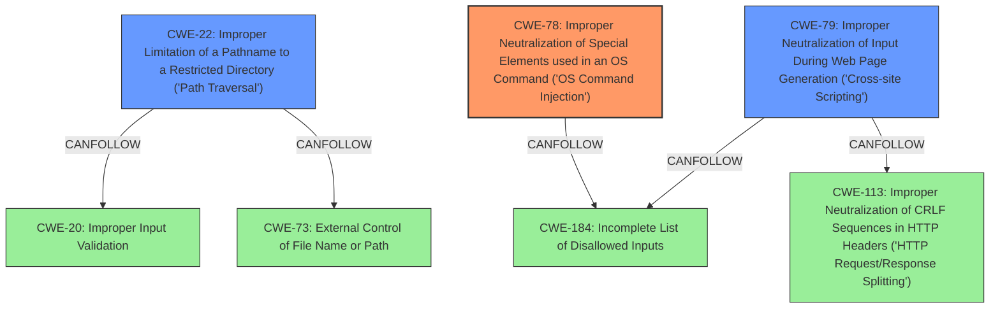

# Raw Analyzer Response for CVE-2024-45824

# Summary
| CWE ID    | CWE Name                                                                          | Confidence | CWE Abstraction Level | CWE Vulnerability Mapping Label | CWE-Vulnerability Mapping Notes |
| --------- | --------------------------------------------------------------------------------- | ---------- | --------------------- | ------------------------------- | ------------------------------- |
| CWE-78    | Improper Neutralization of Special Elements used in an OS Command ('OS Command Injection') | 0.9        | Base                  | Primary                         | Allowed                         |
| CWE-22    | Improper Limitation of a Pathname to a Restricted Directory ('Path Traversal')    | 0.8        | Base                  | Secondary                       | Allowed                         |
| CWE-79    | Improper Neutralization of Input During Web Page Generation ('Cross-site Scripting') | 0.8        | Base                  | Secondary                       | Allowed                         |

## Evidence and Confidence

*   **Confidence Score:** 0.8
*   **Evidence Strength:** HIGH

## Relationship Analysis
The primary weakness is CWE-78, which is a base-level CWE. CWE-22 and CWE-79 are also base-level CWEs, indicating that they are specific weaknesses that can be directly mapped to the vulnerability. CWE-78 can follow CWE-184, suggesting that an incomplete list of disallowed inputs could lead to command injection. CWE-22 can follow CWE-73 or CWE-20, indicating that external control of file names or improper input validation can lead to path traversal. CWE-79 can follow CWE-113 or CWE-184, suggesting that improper neutralization of CRLF sequences or an incomplete list of disallowed inputs can lead to cross-site scripting. The selection of these CWEs is based on their direct relevance to the described **weaknesses** and their base-level abstraction.

## Vulnerability Chain
The vulnerability chain starts with **Path Traversal** (CWE-22), which allows an attacker to manipulate file paths. This is followed by **Command Injection** (CWE-78), where the attacker can inject arbitrary commands into the system. Finally, **XSS** (CWE-79) allows the attacker to execute scripts in the user's browser. This chain leads to full unauthenticated remote code execution.

CWE-22 --> CWE-78 --> CWE-79 --> Remote Code Execution

## Summary of Analysis
The analysis is based on the provided evidence, specifically the vulnerability description and the keyphrase analysis. The description explicitly mentions **Path Traversal**, **Command Injection**, and **XSS** vulnerabilities, which directly correspond to CWE-22, CWE-78, and CWE-79, respectively. The retriever results also support these CWEs, with high scores for each. The graph relationships indicate potential chains of vulnerabilities, where improper input validation or incomplete lists of disallowed inputs can lead to these weaknesses. The selected CWEs are at the optimal level of specificity, as they directly represent the described weaknesses and are base-level CWEs.

CWE-78 is the primary CWE because the **remote code vulnerability** is the final result of the chained vulnerabilities of **Path Traversal**, **Command Injection**, and **XSS**, which allows for full unauthenticated remote code execution.

The following CWEs were considered but not used:

*   CWE-20: Improper Input Validation - While input validation is often a factor in vulnerabilities, the description provides more specific weaknesses (CWE-22, CWE-78, CWE-79) that are more appropriate. CWE-20 is also discouraged for usage.
*   CWE-23: Relative Path Traversal - CWE-22 is the more general case of Path Traversal.
*   CWE-41: Improper Resolution of Path Equivalence - While path equivalence could be a factor, the description focuses on basic path traversal.
*   CWE-59: Improper Link Resolution Before File Access ('Link Following') - While link following could be a factor, the description focuses on basic path traversal.
*   CWE-73: External Control of File Name or Path - While this is related to path traversal, CWE-22 is more specific.
*   CWE-74: Improper Neutralization of Special Elements in Output Used by a Downstream Component ('Injection') - This is a higher-level CWE, and CWE-78 is a more specific type of injection.
*   CWE-80: Improper Neutralization of Script-Related HTML Tags in a Web Page (Basic XSS) - This is a more specific variant of CWE-79 but the description doesn't give enough evidence to select this over CWE-79.
*   CWE-94: Improper Control of Generation of Code ('Code Injection') - CWE-78 is more specific.
*   CWE-113: Improper Neutralization of CRLF Sequences in HTTP Headers ('HTTP Request/Response Splitting') - This is not explicitly mentioned in the description.
*   CWE-138: Improper Neutralization of Special Elements - This is a more general CWE, and CWE-78 and CWE-79 are more specific.
*   CWE-184: Incomplete List of Disallowed Inputs - While this could contribute, it is not the direct cause of the vulnerability.
*   CWE-497: Exposure of Sensitive System Information to an Unauthorized Control Sphere - This is not explicitly mentioned in the description.
*   CWE-807: Reliance on Untrusted Inputs in a Security Decision - This is not explicitly mentioned in the description.