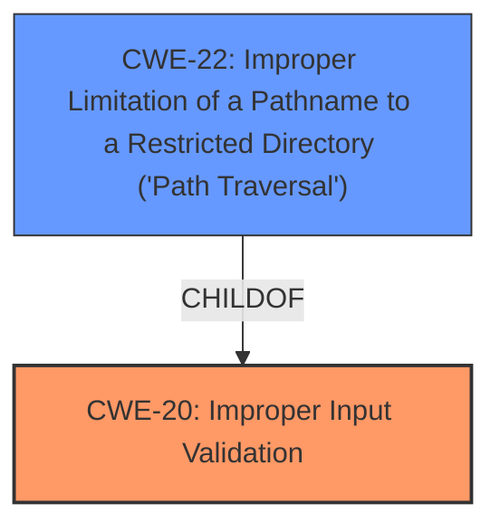

# Analysis Report for CVE-2024-45826

# Vulnerability Analysis Report: CVE-2024-45826

## Description

CVE-2024-45826 IMPACT Due to **improper input validation**, a **path traversal** and remote code execution vulnerability exists when the ThinManager processes a crafted POST request. If exploited, a user can install an executable file.

## Vulnerability Description Key Phrases

- **Rootcause:** improper input validation
- **Weakness:** path traversal
- **Impact:** remote code execution
- **Vector:** crafted POST request
- **Product:** ThinManager

## Analysis (with Relationship Data)

# Summary
| CWE ID | CWE Name | Confidence | CWE Abstraction Level | CWE Vulnerability Mapping Label | CWE-Vulnerability Mapping Notes |
|---|---|---|---|---|---|
| CWE-20 ([CWE-20: Improper Input Validation](https://cwe.mitre.org/data/definitions/20.html)) | Improper Input Validation | 0.9 | Class | Primary | Allowed because it aligns with the described root cause. While discouraged, it is appropriate since no specific input validation flaw is detailed. |
| CWE-22 ([CWE-22: Improper Limitation of a Pathname to a Restricted Directory ('Path Traversal')](https://cwe.mitre.org/data/definitions/22.html)) | Improper Limitation of a Pathname to a Restricted Directory ('Path Traversal') | 0.8 | Base | Secondary | Allowed because it is explicitly mentioned in the vulnerability description, and it results from the improper input validation. |

## Evidence and Confidence

*   **Confidence Score:** 0.85
*   **Evidence Strength:** HIGH

## Relationship Analysis
The primary weakness is **Improper Input Validation (CWE-20)**, which leads to **Path Traversal (CWE-22)**. CWE-22 is a child of CWE-20, meaning that path traversal can often be a result of improper input validation. The abstraction levels were considered, and while more specific CWEs could exist under CWE-20, the available information does not allow for a more precise classification.



## Vulnerability Chain
The vulnerability chain starts with **improper input validation (CWE-20)**. Due to this **lack of validation**, an attacker can perform a **path traversal (CWE-22)**, ultimately leading to remote code execution.

CWE-20 (Improper Input Validation) -> CWE-22 (Path Traversal) -> Remote Code Execution (Impact)

## Summary of Analysis
The analysis is primarily based on the provided vulnerability description and CVE reference links. The vulnerability description explicitly mentions **improper input validation** as the root cause and **path traversal** as a weakness. The CVE reference summary supports these findings.

CWE-20 is chosen as the primary CWE because the description explicitly mentions "**improper input validation**" as a root cause. While CWE-20 is a Class-level CWE and is generally discouraged when more specific CWEs are available, in this case, the description lacks specific details about the type of input validation that is missing. Therefore, CWE-20 is appropriate.

CWE-22 is selected as a secondary CWE because the vulnerability description explicitly mentions "**path traversal**" as a weakness.

Other CWEs were considered but not selected:

*   CWE-73 (External Control of File Name or Path): This is closely related to CWE-22 but focuses on the external control aspect rather than the improper limitation of a pathname. CWE-22 is a more precise description of the vulnerability.
*   CWE-78 (Improper Neutralization of Special Elements used in an OS Command ('OS Command Injection')): While remote code execution is the ultimate impact, the path traversal precedes it, and the root cause is the input validation.
*   CWE-94 (Improper Control of Generation of Code ('Code Injection')): This is a potential impact, but the root cause is the path traversal made possible by improper input validation.
*   CWE-610 (Externally Controlled Reference to a Resource in Another Sphere): Although mentioned in the CVE, it does not accurately reflect the root cause, which is the **improper input validation** leading to path traversal.
*   CWE-138 (Improper Neutralization of Special Elements): This is a more general class, and CWE-22 is more specific.

The selected CWEs are at the optimal level of specificity given the information available in the vulnerability description. Choosing more specific CWEs without sufficient evidence would be inappropriate.


## CWE Relationship Analysis

Current CWEs represent these abstraction levels: .


### Vulnerability Chain Analysis

**Chain starting from CWE-94:**
- 94 (Improper Control of Generation of Code ('Code Injection')) - ROOT


**Chain starting from CWE-610:**
- 610 (Externally Controlled Reference to a Resource in Another Sphere) - ROOT


### CWE Relationship Diagram

```mermaid
graph TD
    classDef primary fill:#f96,stroke:#333,stroke-width:2px
    classDef secondary fill:#69f,stroke:#333
    classDef tertiary fill:#9e9,stroke:#333
```


*Report generated on 2025-07-13 17:03:59*
