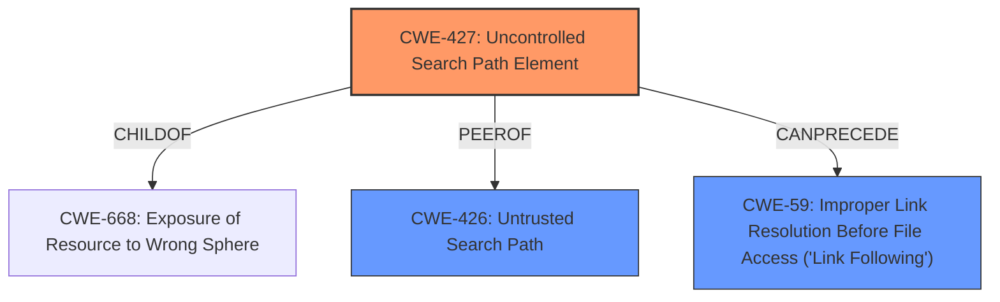

# Enhanced Analysis for CVE-2024-45874

# Summary
| CWE ID | CWE Name | Confidence | CWE Abstraction Level | CWE Vulnerability Mapping Label | CWE-Vulnerability Mapping Notes |
|---|---|---|---|---|---|
| CWE-427 | Uncontrolled Search Path Element | 0.9 | Base | Allowed | Primary CWE |
| CWE-426 | Untrusted Search Path | 0.6 | Base | Allowed | Secondary Candidate |
| CWE-59 | Improper Link Resolution Before File Access ('Link Following') | 0.5 | Base | Allowed | Secondary Candidate |

## Evidence and Confidence

*   **Confidence Score:** 0.9
*   **Evidence Strength:** HIGH

## Relationship Analysis
The primary CWE selected is CWE-427, "Uncontrolled Search Path Element," which reflects the **DLL hijacking** vulnerability where the application searches for DLLs in a path controlled by the attacker. CWE-426 "Untrusted Search Path" and CWE-59 "Improper Link Resolution Before File Access ('Link Following')" were considered as related issues but ultimately deemed less precise. CWE-427 is a base-level CWE, providing a good balance between specificity and generality. There are peer and child relationships to other path-related CWEs, but these do not fit as accurately.



## Vulnerability Chain
The vulnerability chain starts with the **uncontrolled search path element** (CWE-427). This leads to the application loading a malicious DLL controlled by the attacker. The ultimate impact is arbitrary code execution and potential persistence.

CWE-427 (Root Cause: **Uncontrolled Search Path**) -> Malicious DLL Loaded -> Arbitrary Code Execution/Persistence

## Summary of Analysis
The analysis indicates a **DLL hijacking vulnerability** where the application loads DLLs from a directory where an attacker can place a malicious DLL. The primary CWE selected is CWE-427, "Uncontrolled Search Path Element," because it accurately describes the **root cause** of the vulnerability.

The vulnerability description clearly states a **"DLL hijacking vulnerability"** and that attackers can execute arbitrary code by placing a crafted DLL file in the same directory as the executable. The CVE reference section confirms that the application attempts to load DLL files from its working directory without proper verification, allowing attackers to substitute a malicious DLL.

The choice of CWE-427 is based on the evidence that the application uses a search path that includes a location (**the application directory**) controlled by unintended actors (**attackers**). This aligns with the CWE's description: "The product uses a fixed or controlled search path to find resources, but one or more locations in that path can be under the control of unintended actors."

CWE-426 "Untrusted Search Path" was considered because it is closely related to CWE-427. However, CWE-427 is more precise because it specifically refers to an "uncontrolled" element within a search path, whereas CWE-426 refers to the entire search path being untrusted. In this case, the application's search path itself is not inherently untrusted, but becomes vulnerable due to the lack of control over the application directory.

CWE-59 "Improper Link Resolution Before File Access ('Link Following')" was also considered, but this CWE focuses on vulnerabilities related to symbolic links or shortcuts, which is not the primary issue in this case. The vulnerability is about loading a DLL from an **uncontrolled** location, not about following links.

The final selection of CWE-427 is at the base level of abstraction, which is preferred for mapping root causes. The decision is supported by the retriever results, which list CWE-427 as the top candidate.


## CWE Relationship Analysis

Current CWEs represent these abstraction levels: .


### Vulnerability Chain Analysis

**Chain starting from CWE-59:**
- 59 (Improper Link Resolution Before File Access ('Link Following')) - ROOT


**Chain starting from CWE-427:**
- 427 (Uncontrolled Search Path Element) - ROOT


### CWE Relationship Diagram

```mermaid
graph TD
    classDef primary fill:#f96,stroke:#333,stroke-width:2px
    classDef secondary fill:#69f,stroke:#333
    classDef tertiary fill:#9e9,stroke:#333
```