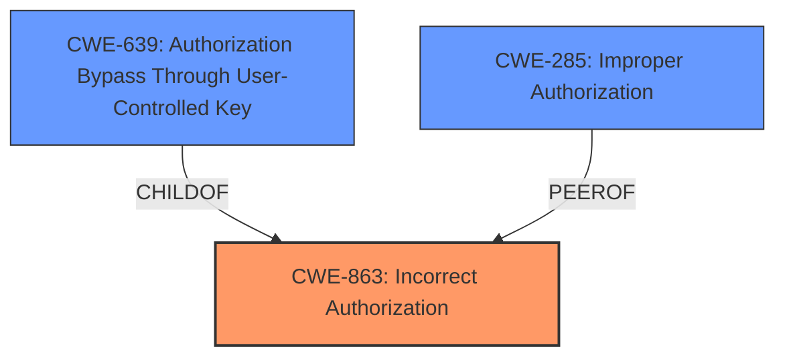

# Analysis Report for CVE-2024-45919

# Vulnerability Analysis Report: CVE-2024-45919

## Description

A security flaw has been discovered in Solvait version 24.4.2 that allows an attacker to elevate their privileges. By manipulating the Request ID and Action Type parameters in /AssignToMe/SetAction, an attacker can bypass approval workflows leading to unauthorized access to sensitive information or approval of fraudulent requests.

## Vulnerability Description Key Phrases

- **Impact:** unauthorized access to sensitive information or approval of fraudulent requests
- **Vector:** manipulating Request ID and Action Type parameters in /AssignToMe/SetAction
- **Product:** Solvait
- **Version:** 24.4.2

## Analysis (with Relationship Data)

# Summary
| CWE ID | CWE Name | Confidence | CWE Abstraction Level | CWE Vulnerability Mapping Label | CWE-Vulnerability Mapping Notes |
|---|---|---|---|---|---|
| CWE-863 | Incorrect Authorization | 0.9 | Class | Primary | Allowed-with-Review |
| CWE-639 | Authorization Bypass Through User-Controlled Key | 0.7 | Base | Secondary | Allowed |
| CWE-285 | Improper Authorization | 0.6 | Class | Secondary | Discouraged |

## Evidence and Confidence

*   **Confidence Score:** 0.8
*   **Evidence Strength:** HIGH

## Relationship Analysis
The primary CWE is CWE-863, "Incorrect Authorization," because the authorization check is present but flawed, allowing unauthorized access. CWE-639, "Authorization Bypass Through User-Controlled Key," is a related weakness as the user-controlled "Request ID" and "Action Type" parameters are used to bypass authorization. CWE-285, "Improper Authorization," is also related but more general, as it encompasses cases where authorization checks are missing or incorrect. Since the vulnerability involves a flawed authorization check relying on modifiable inputs, CWE-863 is the most specific and appropriate choice, with CWE-639 adding further context.



## Vulnerability Chain
The vulnerability chain starts with the **incorrect authorization** logic (CWE-863) in the `SetAction` endpoint. This allows an attacker to **bypass authorization** (CWE-639) by manipulating the Request ID and Action Type parameters. The impact of this is **unauthorized access** to sensitive information and the ability to approve fraudulent requests, effectively leading to privilege escalation.

## Summary of Analysis
The analysis strongly relies on the provided evidence, specifically the "CVE Reference Links Content Summary," which states, "The root cause is an **Improper Access Control** in the `SetAction` endpoint... The application doesn't properly validate if a user is authorized to change the status of a leave request, allowing manipulation of request IDs and action types."

The relationship graph helped to visualize the connection between the different CWEs and choose the most specific one. CWE-863, Incorrect Authorization, is the most accurate because it describes the fundamental flaw in the authorization process. The other CWEs are related but represent either a broader category (CWE-285) or a specific mechanism of exploitation (CWE-639).

CWE-863 is at the Class level, and while the retriever suggested some Base level CWEs, the evidence strongly suggests that the authorization logic is present but flawed, making CWE-863 the most accurate choice.

Relevant CWE Information:

# Enhanced Context (25 CWEs)
The following CWEs were identified as potentially relevant to this vulnerability:

## CWE-266: Incorrect Privilege Assignment
**Abstraction Level**: Base
**Similarity Score**: 0.79
**Source**: dense

**Description**:
A product incorrectly assigns a privilege to a particular actor, creating an unintended sphere of control for that actor.

**Mapping Guidance**:
- Usage: Allowed
- Rationale: This CWE entry is at the Base level of abstraction, which is a preferred level of abstraction for mapping to the root causes of vulnerabilities.

*Not Used:* This CWE does not apply, because the vulnerability is not about assigning the wrong privileges initially, but about bypassing the authorization to elevate privileges.

## CWE-267: Privilege Defined With Unsafe Actions
**Abstraction Level**: Base
**Similarity Score**: 0.78
**Source**: dense

**Description**:
A particular privilege, role, capability, or right can be used to perform unsafe actions that were not intended, even when it is assigned to the correct entity.

**Mapping Guidance**:
- Usage: Allowed
- Rationale: This CWE entry is at the Base level of abstraction, which is a preferred level of abstraction for mapping to the root causes of vulnerabilities.

*Not Used:* This CWE does not apply because the issue is not about a privilege being defined with unsafe actions, but about the **incorrect authorization** that allows bypassing privilege requirements.

## CWE-280: Improper Handling of Insufficient Permissions or Privileges 
**Abstraction Level**: Base
**Similarity Score**: 0.77
**Source**: dense

**Description**:
The product does not handle or incorrectly handles when it has insufficient privileges to access resources or functionality as specified by their permissions. This may cause it to follow unexpected code paths that may leave the product in an invalid state.

**Mapping Guidance**:
- Usage: Allowed
- Rationale: This CWE entry is at the Base level of abstraction, which is a preferred level of abstraction for mapping to the root causes of vulnerabilities.

*Not Used:* This CWE is related but not as precise as CWE-863.

## CWE-274: Improper Handling of Insufficient Privileges
**Abstraction Level**: Base
**Similarity Score**: 0.77
**Source**: dense

**Description**:
The product does not handle or incorrectly handles when it has insufficient privileges to perform an operation, leading to resultant weaknesses.

**Mapping Guidance**:
- Usage: Discouraged
- Rationale: This CWE entry could be deprecated in a future version of CWE.

*Not Used:* This CWE is related but not as precise as CWE-863.

## CWE-472: External Control of Assumed-Immutable Web Parameter
**Abstraction Level**: Base
**Similarity Score**: 0.76
**Source**: dense

**Description**:
The web application does not sufficiently verify inputs that are assumed to be immutable but are actually externally controllable, such as hidden form fields.

**Mapping Guidance**:
- Usage: Allowed
- Rationale: This CWE entry is at the Base level of abstraction, which is a preferred level of abstraction for mapping to the root causes of vulnerabilities.

*Not Used:* While the vulnerability involves external control of parameters, the core issue is the **incorrect authorization**, not the external control itself.

## CWE-668: Exposure of Resource to Wrong Sphere
**Abstraction Level**: Class
**Similarity Score**: 0.75
**Source**: dense

**Description**:
The product exposes a resource to the wrong control sphere, providing unintended actors with inappropriate access to the resource.

**Mapping Guidance**:
- Usage: Discouraged
- Rationale: CWE-668 is high-level and is often misused as a catch-all when lower-level CWE IDs might be applicable. It is sometimes used for low-information vulnerability reports [REF-1287]. It is a level-1 Class (i.e., a child of a Pillar). It is not useful for trend analysis.

*Not Used:* This CWE is too high-level.

## CWE-639: Authorization Bypass Through User-Controlled Key
**Abstraction Level**: Base
**Similarity Score**: 0.75
**Source**: dense

**Description**:
The system's authorization functionality does not prevent one user from gaining access to another user's data or record by modifying the key value identifying the data.

**Mapping Guidance**:
- Usage: Allowed
- Rationale: This CWE entry is at the Base level of abstraction, which is a preferred level of abstraction for mapping to the root causes of vulnerabilities.

*Used as a Secondary CWE:* This CWE applies because the user is able to bypass authorization through the manipulation of the Request ID.

## CWE-807: Reliance on Untrusted Inputs in a Security Decision
**Abstraction Level**: Base
**Similarity Score**: 0.75
**Source**: dense

**Description**:
The product uses a protection mechanism that relies on the existence or values of an input, but the input can be modified by an untrusted actor in a way that bypasses the protection mechanism.

**Mapping Guidance**:
- Usage: Allowed
- Rationale: This CWE entry is at the Base level of abstraction, which is a preferred level of abstraction for mapping to the root causes of vulnerabilities.

*Not Used:* While this is applicable, it is not as precise as CWE-863.

## CWE-41: Improper Resolution of Path Equivalence
**Abstraction Level**: Base
**Similarity Score**: 0.74
**Source**: dense

**Description**:
The product is vulnerable to file system contents disclosure through path equivalence. Path equivalence involves the use of special characters in file and directory names. The associated manipulations are intended to generate multiple names for the same object.

**Mapping Guidance**:
- Usage: Allowed
- Rationale: This CWE entry is at the Base level of abstraction, which is a preferred level of abstraction for mapping to the root causes of vulnerabilities.

*Not Used:* This CWE


## CWE Relationship Analysis

Current CWEs represent these abstraction levels: .


### Vulnerability Chain Analysis

**Chain starting from CWE-274:**
- 274 (Improper Handling of Insufficient Privileges) - ROOT


**Chain starting from CWE-863:**
- 863 (Incorrect Authorization) - ROOT


### CWE Relationship Diagram

```mermaid
graph TD
    classDef primary fill:#f96,stroke:#333,stroke-width:2px
    classDef secondary fill:#69f,stroke:#333
    classDef tertiary fill:#9e9,stroke:#333
```


*Report generated on 2025-07-13 17:16:30*
