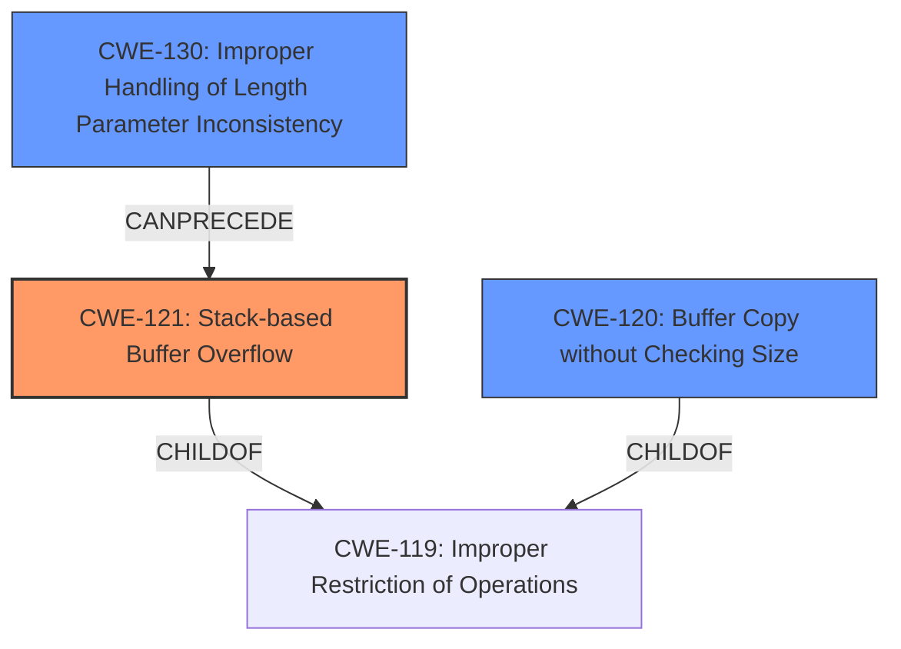

# Analysis for CVE-2024-45970

```markdown
# Summary
| CWE ID  | CWE Name                                                        | Confidence | CWE Abstraction Level | CWE Vulnerability Mapping Label | CWE-Vulnerability Mapping Notes |
| :-------- | :-------------------------------------------------------------- | :--------- | :-------------------- | :------------------------------ | :------------------------------ |
| CWE-121   | Stack-based Buffer Overflow                                     | 1.0        | Base                  | Primary                         | Allowed                       |
| CWE-120   | Buffer Copy without Checking Size of Input ('Classic Buffer Overflow') | 0.7      | Base                  | Secondary                       | Allowed-with-Review           |
| CWE-130   | Improper Handling of Length Parameter Inconsistency           | 0.6        | Base                  | Secondary                       | Allowed                       |

## Evidence and Confidence

*   **Confidence Score:** 0.8
*   **Evidence Strength:** HIGH

## Relationship Analysis
The primary weakness is a stack-based buffer overflow (CWE-121), a specific type of buffer overflow. This relates to the more general CWE-119 (Improper Restriction of Operations within the Bounds of a Memory Buffer), of which both CWE-121 and CWE-120 are children. CWE-120 involves copying a buffer without checking its size, often leading to an out-of-bounds write, which can be a consequence of CWE-121. CWE-130 addresses inconsistencies in handling length parameters, which can precede a buffer overflow if the length is not validated properly.



## Vulnerability Chain
The vulnerability chain begins with potentially **improper handling of the length parameter** (CWE-130), which leads to a **stack-based buffer overflow** (CWE-121) due to **copying data without proper size checks** (CWE-120). The root cause is the **stack-based buffer overflow** (CWE-121), with the other CWEs contributing to the conditions that make the overflow possible.

## Summary of Analysis
The analysis focuses on the provided vulnerability description, which explicitly mentions "**multiple buffer overflows**" and a "**stack-based buffer overflow**" triggered via the "MMS FileDirResponse message". This points directly to **CWE-121: Stack-based Buffer Overflow**. The description also mentions the overflows are caused by a malicious server, suggesting an external influence on the data being processed.

The retriever results strongly support **CWE-121** as the primary weakness, with high scores across multiple keyphrases ("stack-based buffer overflow", "multiple buffer overflows", "MMS FileDirResponse message", "malicious server", "MZ Automation LibIEC61850", "before commit ac925fae8e281ac6defcd630e9dd756264e9c5bc", "MMS Client").

While **CWE-120: Buffer Copy without Checking Size of Input ('Classic Buffer Overflow')** is also relevant, the explicit mention of "stack-based" makes **CWE-121** more specific and appropriate. **CWE-130: Improper Handling of Length Parameter Inconsistency** is considered as a contributing factor, as incorrect handling of length parameters could lead to the buffer overflow.

The final selection prioritizes the most specific CWE (**CWE-121**) while acknowledging related CWEs that describe the conditions or mechanisms involved in the vulnerability.

Relevant CWE Information:
- **CWE-121: Stack-based Buffer Overflow** is a direct match for the described vulnerability.
- **CWE-120: Buffer Copy without Checking Size of Input ('Classic Buffer Overflow')** is a related weakness that could contribute to the overflow, but it is less specific than CWE-121.
- **CWE-130: Improper Handling of Length Parameter Inconsistency** could also contribute to the overflow by not properly validating the size of input, but is a step removed from the direct overflow.
```