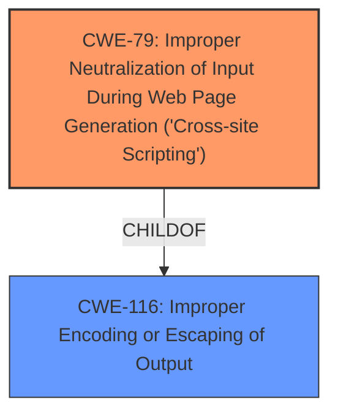

# Raw Analyzer Response for CVE-2024-4623

# Summary
| CWE ID | CWE Name | Confidence | CWE Abstraction Level | CWE Vulnerability Mapping Label | CWE-Vulnerability Mapping Notes |
|---|---|---|---|---|---|
| CWE-79 | Improper Neutralization of Input During Web Page Generation ('Cross-site Scripting') | 1.0 | Base | Allowed | Primary CWE: **Insufficient input sanitization and output escaping** leads directly to this vulnerability. |
| CWE-116 | Improper Encoding or Escaping of Output | 0.7 | Class | Allowed-with-Review | Secondary CWE: Although CWE-79 is the primary, CWE-116 represents the underlying cause of the improper neutralization. |

## Evidence and Confidence

*   **Confidence Score:** 0.9
*   **Evidence Strength:** HIGH

## Relationship Analysis
The primary relationship is that CWE-79 is a specific type of weakness that results from more general encoding/escaping issues represented by CWE-116. CWE-79 is a Base level CWE which is optimal. CWE-116 is a class level, so less specific.

## Vulnerability Chain
The vulnerability chain starts with **insufficient input sanitization and output escaping**, which directly leads to the possibility of injecting arbitrary web scripts, resulting in Stored Cross-Site Scripting (XSS).

Root Cause: **Insufficient Input Sanitization and Output Escaping**
Weakness: Stored Cross-Site Scripting (XSS)
Impact: Arbitrary web script injection and execution

## Summary of Analysis
The vulnerability is a Stored Cross-Site Scripting (XSS) vulnerability in the Blogmentor plugin for WordPress. The root cause is **insufficient input sanitization and output escaping** of the `pagination_style` parameter. This allows authenticated attackers with contributor-level access and above to inject arbitrary web scripts in pages.

The primary CWE is CWE-79, which directly addresses the core issue of improper neutralization of input during web page generation, leading to cross-site scripting. The evidence is clearly stated in the "Vulnerability Description Key Phrases" section: "**rootcause:** **insufficient input sanitization and output escaping**" and "**weakness:** **cross-site scripting**".

The secondary CWE is CWE-116, as the **insufficient input sanitization and output escaping** falls under the umbrella of improper encoding or escaping of output. While CWE-79 is more specific, CWE-116 highlights the underlying technical flaw.

The Retriever Results also suggest CWE-79 as a strong candidate, with a high score. The "Complete CWE Specifications" confirm that CWE-79 is at the Base level of abstraction, making it an appropriate choice.

CWEs considered but not used:
- CWE-352: Cross-Site Request Forgery (CSRF) - Not applicable as the vulnerability is Stored XSS, not CSRF.
- CWE-89: Improper Neutralization of Special Elements used in an SQL Command ('SQL Injection') - Not applicable as the vulnerability involves script injection, not SQL injection.
- CWE-434: Unrestricted Upload of File with Dangerous Type - Not applicable as the vulnerability does not involve file uploads.
- CWE-425: Direct Request ('Forced Browsing') - Not applicable as the vulnerability does not involve bypassing authorization to access restricted resources.
- CWE-94: Improper Control of Generation of Code ('Code Injection') - Not applicable as the vulnerability involves injecting code into a web page, not directly controlling the generation of code.
- CWE-1336: Improper Neutralization of Special Elements Used in a Template Engine - While this could be related, the description is about overall sanitization and escaping of the output.
- CWE-138: Improper Neutralization of Special Elements - This is a Class level CWE.
- CWE-472: External Control of Assumed-Immutable Web Parameter - This is not related to assuming immutable parameters.
- CWE-639: Authorization Bypass Through User-Controlled Key - This is not related to authorization bypass.

Relevant CWE Information:

# Enhanced Context (25 CWEs)
The following CWEs were identified as potentially relevant to this vulnerability:

## CWE-352: Cross-Site Request Forgery (CSRF)
**Abstraction Level**: Compound
**Similarity Score**: 0.75
**Source**: dense

**Description**:
The web application does not, or can not, sufficiently verify whether a well-formed, valid, consistent request was intentionally provided by the user who submitted the request.

**Mapping Guidance**:
- Usage: Allowed
- Rationale: This is a well-known Composite of multiple weaknesses that must all occur simultaneously, although it is attack-oriented in nature.

## CWE-472: External Control of Assumed-Immutable Web Parameter
**Abstraction Level**: Base
**Similarity Score**: 0.71
**Source**: dense

**Description**:
The web application does not sufficiently verify inputs that are assumed to be immutable but are actually externally controllable, such as hidden form fields.

**Mapping Guidance**:
- Usage: Allowed
- Rationale: This CWE entry is at the Base level of abstraction, which is a preferred level of abstraction for mapping to the root causes of vulnerabilities.

## CWE-425: Direct Request ('Forced Browsing')
**Abstraction Level**: Base
**Similarity Score**: 0.71
**Source**: dense

**Description**:
The web application does not adequately enforce appropriate authorization on all restricted URLs, scripts, or files.

**Mapping Guidance**:
- Usage: Allowed
- Rationale: This CWE entry is at the Base level of abstraction, which is a preferred level of abstraction for mapping to the root causes of vulnerabilities.

## CWE-80: Improper Neutralization of Script-Related HTML Tags in a Web Page (Basic XSS)
**Abstraction Level**: Variant
**Similarity Score**: 0.70
**Source**: dense

**Description**:
The product receives input from an upstream component, but it does not neutralize or incorrectly neutralizes special characters such as "<", ">", and "&" that could be interpreted as web-scripting elements when they are sent to a downstream component that processes web pages.

**Mapping Guidance**:
- Usage: Allowed
- Rationale: This CWE entry is at the Variant level of abstraction, which is a preferred level of abstraction for mapping to the root causes of vulnerabilities.

## CWE-116: Improper Encoding or Escaping of Output
**Abstraction Level**: Class
**Similarity Score**: 0.70
**Source**: dense

**Description**:
The product prepares a structured message for communication with another component, but encoding or escaping of the data is either missing or done incorrectly. As a result, the intended structure of the message is not preserved.

**Mapping Guidance**:
- Usage: Allowed-with-Review
- Rationale: This CWE entry is a Class and might have Base-level children that would be more appropriate

## CWE-434: Unrestricted Upload of File with Dangerous Type
**Abstraction Level**: Base
**Similarity Score**: 0.70
**Source**: dense

**Description**:
The product allows the upload or transfer of dangerous file types that are automatically processed within its environment.

**Mapping Guidance**:
- Usage: Allowed
- Rationale: This CWE entry is at the Base level of abstraction, which is a preferred level of abstraction for mapping to the root causes of vulnerabilities.

## CWE-138: Improper Neutralization of Special Elements
**Abstraction Level**: Class
**Similarity Score**: 0.69
**Source**: dense

**Description**:
The product receives input from an upstream component, but it does not neutralize or incorrectly neutralizes special elements that could be interpreted as control elements or syntactic markers when they are sent to a downstream component.

**Mapping Guidance**:
- Usage: Discouraged
- Rationale: This CWE entry is a level-1 Class (i.e., a child of a Pillar). It might have lower-level children that would be more appropriate

## CWE-96: Improper Neutralization of Directives in Statically Saved Code ('Static Code Injection')
**Abstraction Level**: Base
**Similarity Score**: 0.69
**Source**: dense

**Description**:
The product receives input from an upstream component, but it does not neutralize or incorrectly neutralizes code syntax before inserting the input into an executable resource, such as a library, configuration file, or template.

**Mapping Guidance**:
- Usage: Allowed
- Rationale: This CWE entry is at the Base level of abstraction, which is a preferred level of abstraction for mapping to the root causes of vulnerabilities.

## CWE-1336: Improper Neutralization of Special Elements Used in a Template Engine
**Abstraction Level**: Base
**Similarity Score**: 0.69
**Source**: dense

**Description**:
The product uses a template engine to insert or process externally-influenced input, but it does not neutralize or incorrectly neutralizes