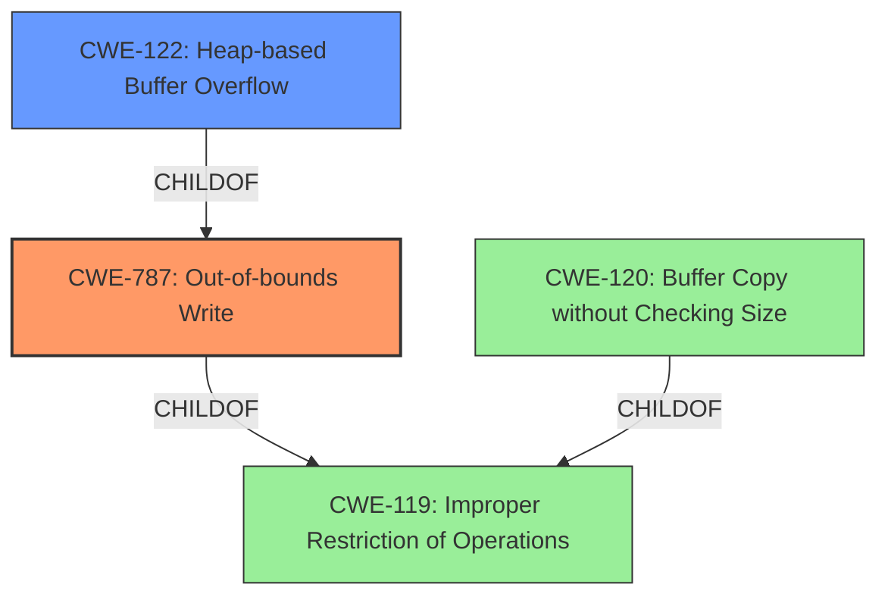

# Enhanced Analysis for CVE-2024-46274

# Summary
| CWE ID  | CWE Name                                                     | Confidence | CWE Abstraction Level | CWE Vulnerability Mapping Label | CWE-Vulnerability Mapping Notes |
| ------- | ------------------------------------------------------------ | ---------- | ----------------------- | ------------------------------- | ------------------------------- |
| CWE-787 | Out-of-bounds Write                                          | 1          | Base                    | Primary                         | Allowed                       |
| CWE-122 | Heap-based Buffer Overflow                                   | 0.7        | Variant                 | Secondary                       | Allowed                       |

## Evidence and Confidence

*   **Confidence Score:** 0.9
*   **Evidence Strength:** HIGH

## Relationship Analysis
The primary weakness is CWE-787 Out-of-bounds Write, which is a base CWE. CWE-122 Heap-based Buffer Overflow is a variant of a buffer overflow that occurs on the heap. CWE-787 is a parent of CWE-124 Buffer Underwrite ('Buffer Underflow'). CWE-120 Buffer Copy without Checking Size of Input ('Classic Buffer Overflow') is a peer of CWE-787.



## Vulnerability Chain
The vulnerability chain starts with the **heap buffer overflow** in the `cp_stored()` function, leading to an out-of-bounds write. This can then cause memory corruption, potentially leading to arbitrary code execution.
  - Root cause: **Heap buffer overflow** in the `cp_stored()` function
  - Weakness: Out-of-bounds write
  - Impact: Memory corruption, arbitrary code execution

## Summary of Analysis
The primary weakness is a **heap buffer overflow**, specifically an out-of-bounds write in the `cp_stored()` function. The vulnerability description and the CVE Reference Links Content Summary both mention the **heap buffer overflow** as the root cause. The CVE Reference Links Content Summary provides more detail, stating that it is a read access out-of-bounds in the `cp_stored` function at line 543 of `cute_png.h` due to a `memcpy` operation reading beyond the allocated buffer.

CWE-787 Out-of-bounds Write is selected as the primary CWE because it is a more specific description of the weakness than CWE-119 Improper Restriction of Operations within the Bounds of a Memory Buffer.

CWE-122 Heap-based Buffer Overflow is a secondary candidate because it specifies that the buffer overflow occurs on the heap.

The retriever results listed several CWEs that were considered but not ultimately selected:

*   CWE-119: Improper Restriction of Operations within the Bounds of a Memory Buffer - This is a broader category that doesn't specifically describe the out-of-bounds write.
*   CWE-190: Integer Overflow or Wraparound - This is not related to the described vulnerability.
*   CWE-193: Off-by-one Error - There is no evidence of an off-by-one error in the description.
*   CWE-125: Out-of-bounds Read - While the CVE summary mentions a read access out-of-bounds, the main issue is the heap buffer overflow caused by the memcpy.
*   CWE-121: Stack-based Buffer Overflow - This is not relevant since the buffer overflow occurs on the heap.
*   CWE-195: Signed to Unsigned Conversion Error - This is not related to the described vulnerability.
*   CWE-126: Buffer Over-read - While similar to CWE-125, it does not fully capture the write aspect of the heap overflow.
*   CWE-674: Uncontrolled Recursion - This is not related to the described vulnerability.
*   CWE-128: Wrap-around Error - This is not related to the described vulnerability.
*   CWE-131: Incorrect Calculation of Buffer Size - This could be a contributing factor but there is insufficient evidence.
*   CWE-789: Memory Allocation with Excessive Size Value - This could be a contributing factor but there is insufficient evidence.
*   CWE-129: Improper Validation of Array Index - This does not apply since there is no array index validation.

Relevant CWE Information:

## CWE-789: Memory Allocation with Excessive Size Value
**Abstraction Level**: Variant
**Similarity Score**: 0.70
**Source**: dense

**Description**:
The product allocates memory based on an untrusted, large size value, but it does not ensure that the size is within expected limits, allowing arbitrary amounts of memory to be allocated.

**Mapping Guidance**:
- Usage: Allowed
- Rationale: This CWE entry is at the Variant level of abstraction, which is a preferred level of abstraction for mapping to the root causes of vulnerabilities.

## CWE-129: Improper Validation of Array Index
**Abstraction Level**: Variant
**Similarity Score**: 0.70
**Source**: dense

**Description**:
The product uses untrusted input when calculating or using an array index, but the product does not validate or incorrectly validates the index to ensure the index references a valid position within the array.

**Mapping Guidance**:
- Usage: Allowed
- Rationale: This CWE entry is at the Variant level of abstraction, which is a preferred level of abstraction for mapping to the root causes of vulnerabilities.

## CWE-131: Incorrect Calculation of Buffer Size
**Abstraction Level**: Base
**Similarity Score**: 0.69
**Source**: dense

**Description**:
The product does not correctly calculate the size to be used when allocating a buffer, which could lead to a buffer overflow.

**Mapping Guidance**:
- Usage: Allowed
- Rationale: This CWE entry is at the Base level of abstraction, which is a preferred level of abstraction for mapping to the root causes of vulnerabilities.

## CWE-125: Out-of-bounds Read
**Abstraction Level**: Base
**Similarity Score**: 0.69
**Source**: dense

**Description**:
The product reads data past the end, or before the beginning, of the intended buffer.

**Mapping Guidance**:
- Usage: Allowed
- Rationale: This CWE entry is at the Base level of abstraction, which is a preferred level of abstraction for mapping to the root causes of vulnerabilities.

## CWE-193: Off-by-one Error
**Abstraction Level**: Base
**Similarity Score**: 0.69
**Source**: dense

**Description**:
A product calculates or uses an incorrect maximum or minimum value that is 1 more, or 1 less, than the correct value.

**Mapping Guidance**:
- Usage: Allowed
- Rationale: This CWE entry is at the Base level of abstraction, which is a preferred level of abstraction for mapping to the root causes of vulnerabilities.

## CWE-126: Buffer Over-read
**Abstraction Level**: Variant
**Similarity Score**: 0.68
**Source**: dense

**Description**:
The product reads from a buffer using buffer access mechanisms such as indexes or pointers that reference memory locations after the targeted buffer.

**Mapping Guidance**:
- Usage: Allowed
- Rationale: This CWE entry is at the Variant level of abstraction, which is a preferred level of abstraction for mapping to the root causes of vulnerabilities.

## CWE-122: Heap-based Buffer Overflow
**Abstraction Level**: Variant
**Similarity Score**: 0.68
**Source**: dense

**Description**:
A heap overflow condition is a buffer overflow, where the buffer that can be overwritten is allocated in the heap portion of memory, generally meaning that the buffer was allocated using a routine such as malloc().

**Mapping Guidance**:
- Usage: Allowed
- Rationale: This CWE entry is at the Variant level of abstraction, which is a preferred level of abstraction for mapping to the root causes of vulnerabilities.

## CWE-212: Improper Removal of Sensitive Information Before Storage or Transfer
**Abstraction Level**: Base
**Similarity Score**: 0.67
**Source**: dense

**Description**:
The product stores, transfers, or shares a resource that contains sensitive information, but it does not properly remove that information before the product makes the resource available to unauthorized actors.

**Mapping Guidance**:
- Usage: Allowed
- Rationale: This CWE entry is at the Base level of abstraction, which is a preferred level of abstraction for mapping to the root causes of vulnerabilities.

## CWE-190


## CWE Relationship Analysis

Current CWEs represent these abstraction levels: .


### Vulnerability Chain Analysis

**Chain starting from CWE-121:**
- 121 (Stack-based Buffer Overflow) - ROOT


**Chain starting from CWE-128:**
- 128 (Wrap-around Error) - ROOT


### CWE Relationship Diagram

```mermaid
graph TD
    classDef primary fill:#f96,stroke:#333,stroke-width:2px
    classDef secondary fill:#69f,stroke:#333
    classDef tertiary fill:#9e9,stroke:#333
```