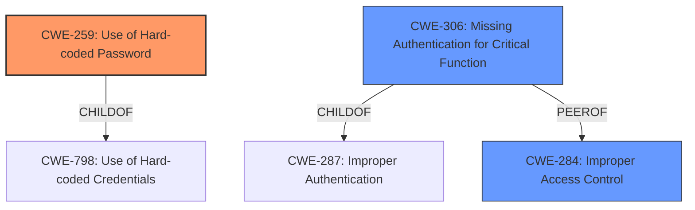

# Raw Analyzer Response for CVE-2024-46280

# Summary
| CWE ID | CWE Name | Confidence | CWE Abstraction Level | CWE Vulnerability Mapping Label | CWE-Vulnerability Mapping Notes |
|---|---|---|---|---|---|
| CWE-259 | Use of Hard-coded Password | 0.9 | Variant | Allowed | Primary CWE. Matches the **weak credentials** used for Telnet access. |
| CWE-306 | Missing Authentication for Critical Function | 0.7 | Base | Allowed | Secondary CWE. While the vulnerability description highlights **weak credentials**, the Telnet service having any authentication at all implies that the core issue might be that authentication is missing for a critical function. |
| CWE-284 | Improper Access Control | 0.6 | Class | Discouraged | Secondary CWE. Initially, the description states "**Improper Access Control**". However, due to the availability of more specific CWEs like CWE-259 and CWE-306, CWE-284 is a less preferred mapping. |

## Evidence and Confidence

*   **Confidence Score:** 0.8
*   **Evidence Strength:** MEDIUM

## Relationship Analysis

The primary relationship impacting the decision is the hierarchical structure of CWEs related to authentication and access control.

*   CWE-259 is a variant of CWE-798 (Use of Hard-coded Credentials) and relates directly to the use of **weak credentials** in the Telnet service.
*   CWE-306, while not a direct parent or child of CWE-259, represents a related issue where authentication is missing for a critical function, further weakening the system's security.
*   CWE-284 is a high-level class encompassing general access control problems, making it less specific than CWE-259 and CWE-306.

## Vulnerability Chain

The vulnerability chain involves the following sequence:

1.  **Root Cause:** Developers misconfigure the firmware, leading to **weak default credentials** for Telnet access (CWE-259).
2.  The Telnet service is enabled with these **weak credentials**, without the possibility of changing them, which could also be interpreted as missing authentication for such a critical function (CWE-306).
3.  **Impact:** Root access to the device via the local network, allowing attackers to perform administrative tasks.

The primary weakness is the use of **hard-coded passwords** (CWE-259), which directly leads to the **improper access control** (CWE-284). The missing ability to change the credentials exacerbates the problem, potentially indicating missing authentication (CWE-306).

## Summary of Analysis

The initial assessment considered "**Improper Access Control**" (CWE-284) as a potential mapping due to its presence in the vulnerability description. However, the core issue is the presence of **weak, hard-coded credentials** (CWE-259) for the Telnet service, which allows unauthorized root access. This makes CWE-259 the more specific and appropriate primary mapping.

The "**weak credentials**" and "Misconfiguration in the firmware by the developers, leading to weak default credentials for Telnet access." support the selection of CWE-259. The Telnet service using these credentials to allow root access indicates an authentication flaw and could be argued as missing authentication (CWE-306). However, since authentication is present, albeit with very weak credentials, the core issue is the **hard-coded password**.

The graph relationships helped refine the selection by emphasizing the hierarchical structure of authentication-related CWEs. CWE-259 is a variant that focuses specifically on **hard-coded passwords**, making it more precise than the broader CWE-284.

The selected CWEs are at the optimal level of specificity because they directly address the root cause (CWE-259) and related authentication issues (CWE-306) while avoiding the more general category of access control problems (CWE-284).

Relevant CWE Information:

*   **CWE-259: Use of Hard-coded Password**
    *   **Technical Explanation:** The device firmware contains a hard-coded password for the Telnet service, meaning the password is baked directly into the software's code and cannot be easily changed by the user.
    *   **Security Implications:** An attacker with knowledge of the hard-coded password can gain unauthorized root access to the device, potentially compromising its functionality and the network it's connected to.
    *   **Relationship Analysis:** CWE-259 is a variant of CWE-798 (Use of Hard-coded Credentials), making it a more specific representation of the vulnerability.
    *   **Primary/Secondary:** Primary.
    *   **MITRE Mapping Guidance:** Allowed. This CWE is at the Variant level of abstraction, which is a preferred level of abstraction for mapping to the root causes of vulnerabilities.

*   **CWE-306: Missing Authentication for Critical Function**
    *   **Technical Explanation:** While not entirely missing, the authentication provided by the hard-coded password is so weak as to be practically non-existent.
    *   **Security Implications:** An attacker can bypass intended security restrictions by simply using the **hard-coded password**, gaining privileged access without proper authorization.
    *   **Relationship Analysis:** CWE-306 falls under the broader category of authentication issues (CWE-287).
    *   **Primary/Secondary:** Secondary.
    *   **MITRE Mapping Guidance:** Allowed. This CWE is at the Base level of abstraction, which is a preferred level of abstraction for mapping to the root causes of vulnerabilities.

*   **CWE-284: Improper Access Control**
    *   **Technical Explanation:** The product does not adequately control access to resources or functionality, allowing unauthorized users to perform actions they should not be allowed to do. This can stem from various issues, including missing authentication, improper authorization, or insecure default settings.
    *   **Security Implications:** **Improper access control** can lead to various security issues, including data breaches, privilege escalation, and denial of service.
    *   **Relationship Analysis:** CWE-284 is a class-level CWE, representing a broad category of access control issues. More specific CWEs, like CWE-306 (Missing Authentication) or CWE-862 (Missing Authorization), are preferred when the root cause is known.
    *   **Primary/Secondary:** Secondary.
    *   **MITRE Mapping Guidance:** Discouraged. It should be avoided if a more specific child CWE is appropriate.